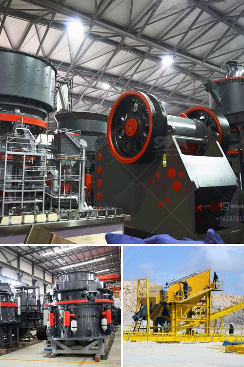

<h3>difference between ball mill and roller mill</h3>
Ball mill and roller mill are both comminution equipment that reduce materials into fine powder or particles. They are often used in grinding, or mixing materials for both industrial and laboratory use. However, the difference between the two is what distinguishes them.

Ball mills have a horizontal cylindrical shell, in which the grinding medium moves freely. They are typically rotating cylinders with diameters from 1.5 to 4.5 meters and lengths up to 12 meters. Roller mills, on the other hand, have cylindrical rollers that crush materials between them, resulting in smaller particles.

One of the fundamental differences between ball mills and roller mills is their ability to grind materials. For example, the high energy ball mill e max is capable of dealing with materials as small as 0.1 micrometers, while the roller mill can grind materials down to 5 micrometers. This lower range is attractive for industries and research laboratories where grinding to such small sizes is needed.

The operating principle of ball mills and roller mills is different. In a ball mill, the material is crushed and mixed by the impact force between the grinding medium and the cylinder walls. In a roller mill, the material is crushed and ground by the friction force between the rollers and the grinding table.

Another difference between ball mills and roller mills is the speed at which they rotate. A ball mill is a slow-speed mill that rotates at about 30-40 revolutions per minute. However, a roller mill is specifically designed to rotate at a higher speed, typically between 150-300 revolutions per minute. This difference in speed allows the roller mill to grind materials to a finer particle size.

The final major difference between ball mills and roller mills is the shape of the grinding media. In a ball mill, the spherical balls used are also called grinding media. The inner ring and outer ring of the spherical balls are convex, while the grinding sides are concave. In contrast, grinding rollers used in roller mills are cylindrical in shape with a flat top. This difference in shape allows for a more efficient grinding process, as the cylindrical rollers create a larger contact area with the material being ground.

Overall, while both ball mills and roller mills serve the same purpose of reducing materials to smaller sizes, there are several differences that distinguish them. The ball mill is slower, can grind to a smaller size, and employs spherical grinding media. The roller mill, on the other hand, rotates at a higher speed, multiple times faster than the ball mill, and uses cylindrical grinding rollers. Understanding the differences between the two can lead to more efficient and effective use of these comminution equipment in various industries and scientific research.
<h3>Contact us</h3><ul><li><strong>Whatsapp:&nbsp;<a href="https://wa.me/8613661969651">+8613661969651</a></strong></li><li><a href="https://swt.shibang-china.com/?git&amp;zhl&amp;difference between ball mill and roller mill"><strong>Online Service(chat now)</strong></a></li></ul><h3>Related</h3><ul><li><a href='feldspar mining process.md'>feldspar mining process</a></li><li><a href='used sand screening equipment for sale.md'>used sand screening equipment for sale</a></li><li><a href='gold processing mecury sales gauteng.md'>gold processing mecury sales gauteng</a></li><li><a href='dolomite powder mill.md'>dolomite powder mill</a></li><li><a href='double rotor impact hammer crusher.md'>double rotor impact hammer crusher</a></li></ul>