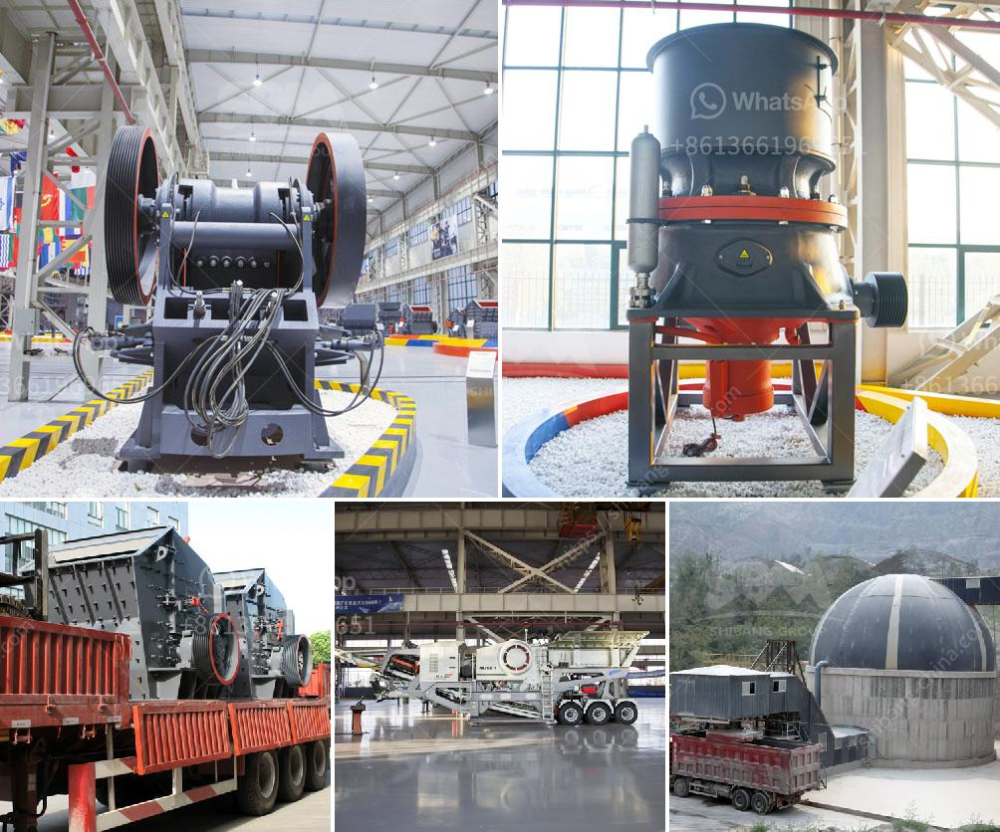

<h3>different types of coal pulverizing ball mills</h3>
Coal pulverizing ball mills are crucial equipment for grinding materials in the production of power plants, cement plants, mines, and other industrial plants. Understanding the distinct types of ball mills available and their characteristics can help plant operators to efficiently deploy their resources and optimize the overall performance.

One common type of ball mill is the grate discharge ball mill, which has a grid at the discharge end to control the flow of pulverized coal out of the mill. These types of mills have a high grinding capacity. The pulverized coal stays in the mill for a longer residence time, resulting in a finer product for better combustion and heat transfer.

Other types of ball mills include the ball tube mill, hammer mill, ball and race mill, and roll and ring mill. Coal Pulverizer Purpose. Irrespective of the machine used to pulverize the coal, all coal pulverizers have a similar purpose. Coal pulverizers are used to dry, grind, and classify the coal particles before combustion in the steam generator furnace. Different types of pulverizers are regularly utilized including the following types:

1. Ball Tube Mills: These mills use balls of varying sizes to pulverize coal. They move the pulverized coal out of the mill and into the furnace where it is burned.

2. Hammer Mills: These mills contain swinging hammers that impact the coal against a high-speed rotating rotor. The pulverized coal is blown into the combustion chamber of the boiler.

3. Ball and Race Mills: In this mill design, the grinding balls are stationary while the grinding rings spin around them.

4. Roll and Ring Mills: Roll and ring mills are also known as bowl mills or vertical roller mills. They grind coal between a rotating roller and a stationary grinding ring.

Understanding the different types of coal pulverizing ball mills can help plant operators to make the right decisions and optimize their overall performance. Selecting the appropriate type of ball mill ultimately depends on the type of coal being used, the desired size fraction required, and the process conditions prevailing within the plant. With proper selection and operation, coal pulverizing ball mills can deliver consistent and reliable performance, ensuring efficient combustion and optimum power generation.
<h3>Contact us</h3><ul><li><strong>Whatsapp:&nbsp;<a href="https://wa.me/8613661969651">+8613661969651</a></strong></li><li><a href="https://swt.shibang-china.com/?git&amp;zhl&amp;different types of coal pulverizing ball mills"><strong>Online Service(chat now)</strong></a></li></ul><h3>Related</h3><ul><li><a href='calcite mining plant.md'>calcite mining plant</a></li><li><a href='project cost estimation for iron ore pellet plant.md'>project cost estimation for iron ore pellet plant</a></li><li><a href='crusher power consumption.md'>crusher power consumption</a></li><li><a href='gold crusher plant for sale australia.md'>gold crusher plant for sale australia</a></li><li><a href='feldspar mining process.md'>feldspar mining process</a></li></ul>