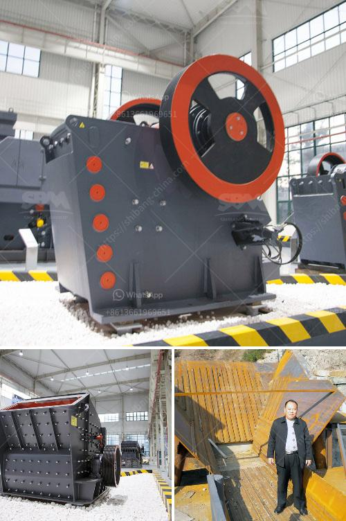

<h3>distributor of crushing machines in malaysia</h3>
Title: The Reliable Distributor of Crushing Machines in Malaysia: Catering to the Growing Industry Needs

As Malaysia positions itself as a leading industrialized nation, the demand for raw materials and resources to support its flourishing construction and mining sectors continues to rise. In response to this growing industry need, entrepreneurs have stepped forward to serve as distributors of essential machinery, such as crushing machines. One such prominent player in the market is the trusted distributor, committed to delivering top-quality crushing machines to facilitate effective and efficient materials processing in Malaysia.

Crushing machines play a crucial role in the mining and construction industries, as they are designed to break down large rocks and stones into smaller fragments or granules. These granules are then further processed for various applications, including road and building construction, concrete production, and aggregate formations. The efficiency and reliability of crushing machines contribute significantly to the productivity, cost-effectiveness, and overall success of any construction or mining project.

With a commitment to delivering the best machinery solutions to its customers, the distributor of crushing machines in Malaysia has established a reputation for excellence. The distributor works closely with reputable manufacturers worldwide to source high-quality crushing machines that meet strict industry standards.

The distributor offers a wide range of crushing machines to cater to the diverse requirements of its customers. It provides jaw crushers, cone crushers, impact crushers, and even multi-cylinder hydraulic cone crushers. Each of these machines is designed to handle various types of materials, ensuring versatility and suitability for different applications.

The distributor prioritizes quality assurance, ensuring that all crushing machines go through rigorous testing and inspection before they are delivered to customers. By partnering with reputable manufacturers, the distributor maintains strict quality control protocols, ensuring that only machines of the highest standards are supplied.

Understanding the critical importance of effective technical support and after-sales service, the distributor extends its dedication beyond the sale of the machines. It provides comprehensive support, including installation guidance, training programs, and maintenance services to empower its customers with the necessary knowledge and expertise to leverage the full potential of their crushing machines.

By consistently delivering reliable, high-quality, and cost-effective crushing machines, the distributor aims to build strong and long-lasting relationships with its customers. It prioritizes customer satisfaction and focuses on understanding specific needs and requirements, thereby recommending the most appropriate crushing machines and solutions.

As Malaysia's construction and mining industries thrive, the demand for crushing machines continues to soar. Recognizing this need, the reliable distributor of crushing machines in Malaysia has emerged as a trusted partner for industry players. With a wide range of high-quality products, stringent quality control measures, and exceptional technical support, the distributor is committed to providing the machinery needed to drive the nation's growth. By forging lasting partnerships with customers, the distributor ensures that Malaysia's construction and mining sectors continue to flourish, backed by reliable and efficient crushing machines.
<h3>Contact us</h3><ul><li><strong>Whatsapp:&nbsp;<a href="https://wa.me/8613661969651">+8613661969651</a></strong></li><li><a href="https://swt.shibang-china.com/?git&amp;zhl&amp;distributor of crushing machines in malaysia"><strong>Online Service(chat now)</strong></a></li></ul><h3>Related</h3><ul><li><a href='machine for limestone river gravel stone.md'>machine for limestone river gravel stone</a></li><li><a href='price mobile crusher.md'>price mobile crusher</a></li><li><a href='steel slag cement manufacture process ppt.md'>steel slag cement manufacture process ppt</a></li><li><a href='gold processing machinery in china.md'>gold processing machinery in china</a></li><li><a href='vibrating screens for material crusher.md'>vibrating screens for material crusher</a></li></ul>