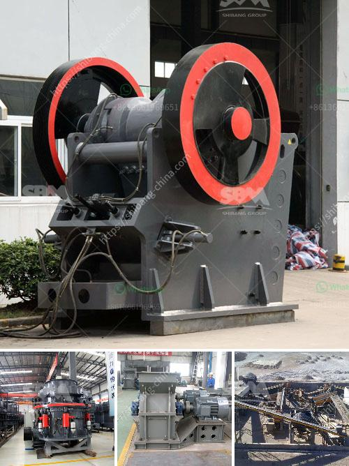

<h3>dolomite crushing machine</h3>
Dolomite is a calcium magnesium carbonate mineral that has many characteristics similar to calcite. In places where access to limestone is not available or more costly, dolomites are used as a substitute. Dolomite is a sedimentary rock that is composed of the mineral dolomite, a mineral that is very similar to limestone. Dolomite is used in the construction industry, as it is a useful aggregate for concrete and asphalt. It is also used as a soil conditioner and feed additive for livestock.

To process dolomite, firstly dolomite is burnt, hardened and then made into small pellets and heated again. These pellets of dolomite are then used in the manufacture of blocks of dolomite that are used as building material. Hardened dolomite is also used as a base material for asphalt, concrete and railroad ballast.

Dolomite is a sedimentary rock that has many mineral components. In terms of composition, it can be compared to limestone. The two rocks have similar properties and are often considered to be the same rock type. However, dolomite is more resistant to weathering and erosion than limestone. This makes it a preferred choice for construction projects in areas that are prone to erosion.

Dolomite crushing machines are widely used to process dolomite rock, stone or ores into fine particles. To powder, is a widely used production technique. In powder production, selection of crushing machine is crucial. It is determined by the hardness, maximum block size, and capacity. The decision of processing dolomite can be broken down into several stages crushing, grinding, size classification, and powder processing.

Dolomite crushers are jaw crusher and impact crusher. In the case of coarse crushing, jaw crusher is used for primary crushing. After crushing to a reasonable size, it is transferred to the impact crusher for secondary crushing via conveyor belt. Then, the crushed dolomite should be sieved by vibrating screen. The qualified dolomite powder will be classified by a spiral classifier or high-frequency screen.

Dolomite powder can be used as raw material to produce glass vessels, medicine bottles and optical glass. Also, it can be used as filler in paint to make the paint film more solid, improve the durability of the coating, and reduce the amount of organic solvent. Moreover, it can also be used to produce refractory bricks, cement raw materials, and chemical raw materials.

In conclusion, dolomite is a versatile mineral that is widely used in various industries due to its unique properties. The process of crushing dolomite produces different particle sizes, which can be used in various applications. When dolomite is crushed, heated, and shaped into pellets, it can be used as a building material or as a base material for asphalt and concrete. Additionally, dolomite powder can be used in the production of glass, paint, and other chemical products. With the right crushing machine, the potential of dolomite can be fully realized, making it an important mineral resource for various industries.
<h3>Contact us</h3><ul><li><strong>Whatsapp:&nbsp;<a href="https://wa.me/8613661969651">+8613661969651</a></strong></li><li><a href="https://swt.shibang-china.com/?git&amp;zhl&amp;dolomite crushing machine"><strong>Online Service(chat now)</strong></a></li></ul><h3>Related</h3><ul><li><a href='mobile coal cone crusher provider malaysia.md'>mobile coal cone crusher provider malaysia</a></li><li><a href='what is the cost of limestone crushing process.md'>what is the cost of limestone crushing process</a></li><li><a href='mobile crawler crusher price.md'>mobile crawler crusher price</a></li><li><a href='crusher processing plant malaysia.md'>crusher processing plant malaysia</a></li><li><a href='second hand german jaw crusher for sale.md'>second hand german jaw crusher for sale</a></li></ul>