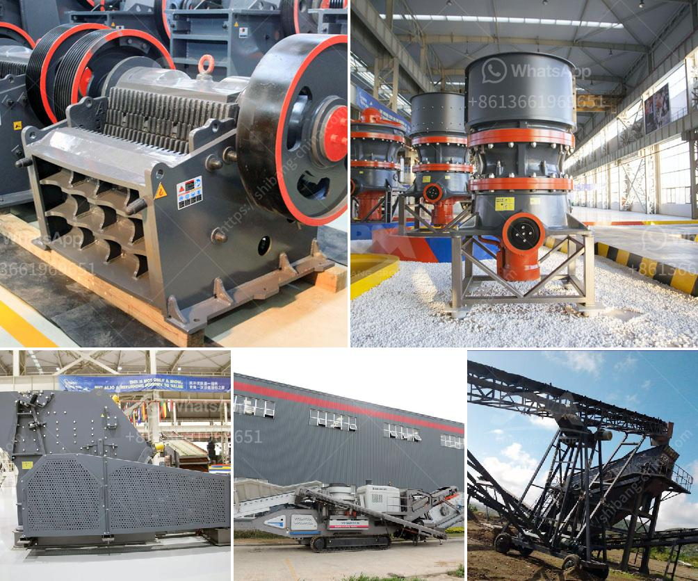

<h3>dolomite grinding upmesh plant ih india</h3>
Dolomite is a naturally occurring mineral composed of calcium and magnesium carbonate. It is widely used in various industries such as construction, agriculture, and manufacturing. One of the primary uses of dolomite is in the production of cement and steel. However, before it can be utilized, it needs to be processed through grinding.

Grinding dolomite to produce upmesh is a critical process in the mining industry. Upmesh refers to the particle size of dolomite powder, typically ranging from 200 to 325 meshes. The upmesh size determines the quality and usefulness of dolomite powder in different applications.

India, being one of the largest dolomite producers in the world, has several dolomite grinding plants to cater to the growing demand for dolomite powder. These grinding plants use advanced machinery and equipment to convert raw dolomite into fine powder of the desired mesh size.

The process of dolomite grinding involves crushing, grinding, and classification. After the dolomite ore is mined, it is crushed into small particles using jaw crushers or cone crushers. The crushed dolomite is then ground in ball mills or Raymond mills to produce a fine powder.

Next, the fine powder is classified using air separators or vibrating screens to separate the powder into different size fractions. This classification process ensures that the dolomite powder produced meets the required mesh size specifications.

The dolomite grinding upmesh plant in India employs advanced technology and efficient machinery to ensure high-quality dolomite powder production. These plants are equipped with state-of-the-art dust collection systems to minimize environmental pollution and maintain a clean working environment.

The demand for dolomite powder in India is driven by the construction industry, which uses it for the production of cement, concrete, and mortar. Dolomite powder is also used in agriculture as a soil conditioner and pH regulator. Additionally, the manufacturing industry utilizes dolomite powder in the production of glass, ceramics, and detergents.

In conclusion, the dolomite grinding upmesh plant in India plays a crucial role in mining operations by producing high-quality dolomite powder. This powder finds applications in various industries, including construction, agriculture, and manufacturing. With the use of advanced technology and efficient machinery, these grinding plants are able to meet the growing demand for dolomite powder in India.
<h3>Contact us</h3><ul><li><strong>Whatsapp:&nbsp;<a href="https://wa.me/8613661969651">+8613661969651</a></strong></li><li><a href="https://swt.shibang-china.com/?git&amp;zhl&amp;dolomite grinding upmesh plant ih india"><strong>Online Service(chat now)</strong></a></li></ul><h3>Related</h3><ul><li><a href='best crushers for manufactured sand.md'>best crushers for manufactured sand</a></li><li><a href='stone ball mill suppler kenya.md'>stone ball mill suppler kenya</a></li><li><a href='trackmounted equipment.md'>track-mounted equipment</a></li><li><a href='stone quarry crusher companies in ghana.md'>stone quarry crusher companies in ghana</a></li><li><a href='limestone small crusher machine.md'>limestone small crusher machine</a></li></ul>