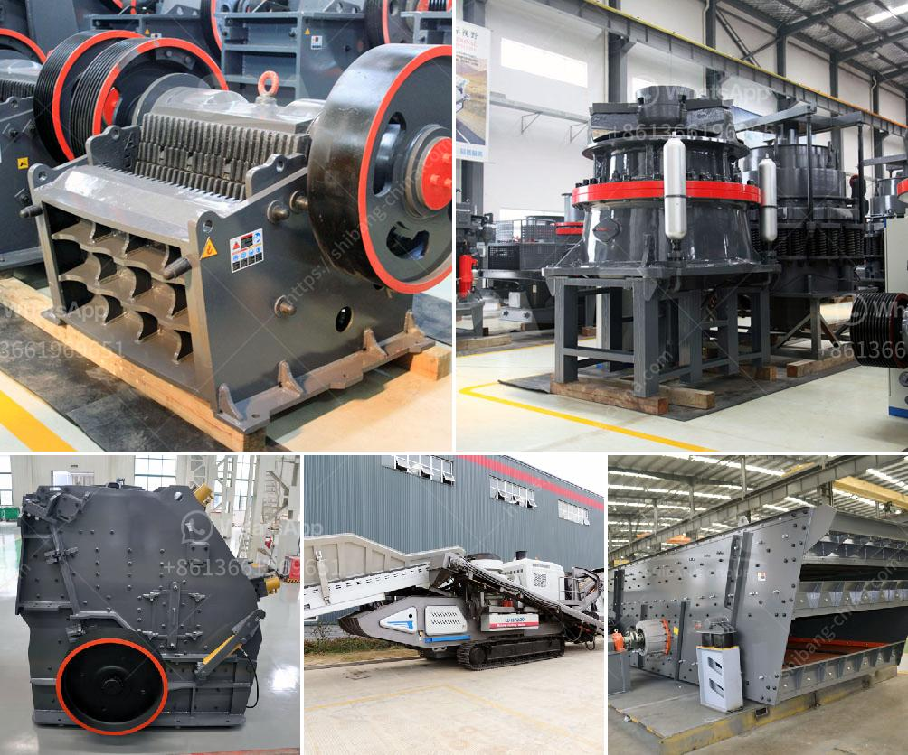

<h3>dolomite mining plant in ethiopia</h3>
Dolomite is one of Ethiopia's abundant mineral resources. It is found in various parts of the country, particularly in the Rift Valley region. Dolomite is used for a wide range of purposes, including the production of cement, agricultural lime, and building stones.

Ethiopia is indeed a land of plenty, with resources found in abundance throughout its huge and diverse landmass. With a population of over 110 million people, the demand for various minerals is constantly on the rise. The mining sector in the country has been growing steadily over the years, contributing significantly to the economy.

One of the minerals that has been discovered and exploited in Ethiopia is dolomite. It is an important rock-forming mineral that is commonly found in sedimentary rocks. Dolomite is mainly composed of calcium magnesium carbonate, with the chemical formula CaMg(CO3)2. It is often used as a construction material, due to its hardness and durability.

Dolomite mining in Ethiopia is a significant contributor to the country's economy. The mined dolomite is mostly used for manufacturing cement and producing agricultural lime. Potential for dolomite extraction exists in parts of the Rift Valley region, where volcanic activity has led to the formation of extensive deposits of the mineral.

The mining plant at Ethio Dolomite PLC in Dange village in the Bako district of Ethiopia has the capacity to produce 150,000 tonnes of dolomite annually. The plant is equipped with a state-of-the-art crushing, milling, and calcination system, allowing it to produce high-quality dolomite for various industrial applications.

The mining process begins with the extraction of dolomite ore from underground mines. The ore is then transported to the crushing plant, where it is crushed into smaller particles using jaw crushers. After crushing, the ore undergoes milling to further reduce its size.

Once the dolomite ore has been reduced to the desired size, it undergoes calcination. Calcination is the process of heating the dolomite to a high temperature to remove impurities and convert it into a more stable form. The calcined dolomite can then be used for various applications, such as cement production and agricultural lime.

The dolomite mining plant in Ethiopia not only creates job opportunities for the local community but also contributes to the country's economic development. The plant produces dolomite products for both domestic and international markets, thereby earning valuable foreign exchange for the country.

Moreover, the dolomite mining plant in Ethiopia adheres to strict environmental regulations and best practices. Efforts are made to minimize negative impacts on the surrounding environment and ensure sustainable mining practices. This includes implementing effective dust control measures and adopting responsible water management practices.

In conclusion, the dolomite mining plant in Ethiopia is an important investment for the country's economy. It provides employment opportunities and stimulates economic growth. Moreover, it meets the growing demand for construction materials and agricultural lime. With proper management and adherence to environmental standards, the dolomite mining plant contributes to Ethiopia's sustainable development efforts.
<h3>Contact us</h3><ul><li><strong>Whatsapp:&nbsp;<a href="https://wa.me/8613661969651">+8613661969651</a></strong></li><li><a href="https://swt.shibang-china.com/?git&amp;zhl&amp;dolomite mining plant in ethiopia"><strong>Online Service(chat now)</strong></a></li></ul><h3>Related</h3><ul><li><a href='materials hammer mill.md'>materials hammer mill</a></li><li><a href='slag crusher machine project products.md'>slag crusher machine project products</a></li><li><a href='gold screening machines south africa.md'>gold screening machines south africa</a></li><li><a href='the process of limestone to cement.md'>the process of limestone to cement</a></li><li><a href='stone crushers in malaysia.md'>stone crushers in malaysia</a></li></ul>