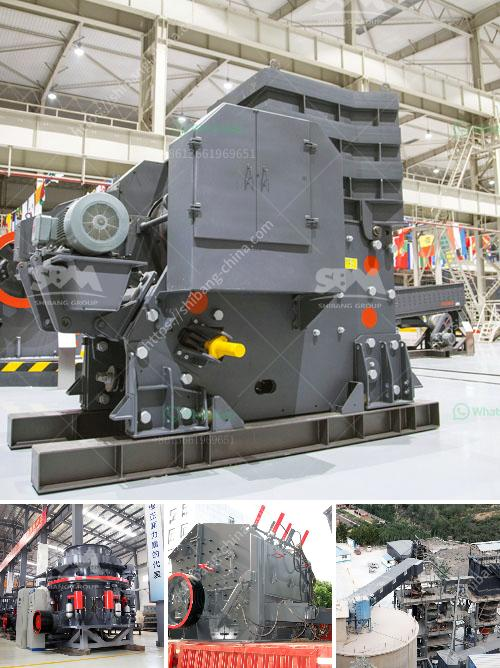

<h3>dolomite plant powder</h3>
When it comes to gardening, every gardener strives for healthy, thriving plants. Whether you are an experienced gardener or just starting out, you may have come across Dolomite plant powder as a soil amendment. This multi-purpose mineral has gained popularity due to its numerous benefits for plants, making it a must-have for every gardener.

Dolomite plant powder is derived from a naturally occurring rock, known as dolomite. This rock is rich in essential nutrients like calcium and magnesium, which play a vital role in plant growth and development. The powder is made by grinding and pulverizing the dolomite rock into a fine consistency, making it easy to incorporate into your garden soil.

One of the primary benefits of using Dolomite plant powder is its ability to raise soil pH levels. Most garden plants prefer slightly acidic to neutral soil, and when the pH is too low, it can inhibit nutrient uptake. Dolomite powder acts as a natural pH buffer, helping to neutralize acidic soil conditions and create a more favorable environment for plant growth.

Another advantage of Dolomite powder is its calcium and magnesium content. These two minerals are essential for plant health and development. Calcium helps strengthen plant cell walls, leading to improved plant structure and disease resistance. Magnesium plays a crucial role in chlorophyll production, allowing plants to efficiently convert sunlight into energy through photosynthesis. By adding Dolomite powder to your soil, you can ensure that your plants have an ample supply of these vital nutrients.

Moreover, Dolomite plant powder is known to enhance nutrient availability in the soil. It works as a natural slow-release fertilizer, gradually releasing nutrients into the soil over time. This slow-release action prevents nutrient imbalances and promotes more consistent plant growth. Additionally, Dolomite powder assists in improving nutrient absorption by plants, leading to better overall plant health and vigor.

Aside from its direct benefits for plants, Dolomite powder also improves soil structure. It helps reduce compaction, allowing for better water drainage and root penetration. Moreover, the powder's fine texture helps to improve soil aeration, preventing stagnant soil conditions and promoting healthy root development.

Whether you are growing vegetables, flowers, or even indoor plants, Dolomite plant powder can be beneficial. It is easy to use – simply sprinkle the powder evenly over your garden beds or mix it into your potting soil. Remember to follow the recommended application rates for your specific plants, as overdosing can have adverse effects.

In conclusion, Dolomite plant powder is a versatile solution for all your gardening needs. As a natural pH buffer and rich nutrient source, it provides essential minerals for plant growth while improving soil structure. With its numerous benefits and easy application, Dolomite powder is the secret ingredient to help your plants thrive. So, why wait? Give your garden the boost it deserves and join the ranks of satisfied gardeners harnessing the power of Dolomite plant powder.
<h3>Contact us</h3><ul><li><strong>Whatsapp:&nbsp;<a href="https://wa.me/8613661969651">+8613661969651</a></strong></li><li><a href="https://swt.shibang-china.com/?git&amp;zhl&amp;dolomite plant powder"><strong>Online Service(chat now)</strong></a></li></ul><h3>Related</h3><ul><li><a href='gold crusher plant for sale australia.md'>gold crusher plant for sale australia</a></li><li><a href='iron crusher in mexico.md'>iron crusher in mexico</a></li><li><a href='gold screening machines south africa.md'>gold screening machines south africa</a></li><li><a href='portable jaw crushers.md'>portable jaw crushers</a></li><li><a href='gypsum powder factory feasibility study.md'>gypsum powder factory feasibility study</a></li></ul>