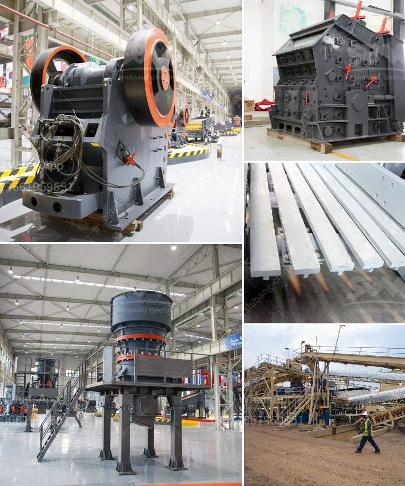

<h3>dolomite powder mesh</h3>
Dolomite powder is a mineral that has gained popularity in various industries over the years due to its diverse range of applications. One of its most common uses is in the construction industry, where it is used as a filler and extender in the production of different building materials. Dolomite powder with a mesh size of 300-500 is particularly sought after for its exceptional properties and versatility.

The mesh size of dolomite powder refers to the number of openings per linear inch in a sieve through which the particles can pass. A finer mesh size indicates smaller particle size, which in turn results in improved fineness and higher surface area. Dolomite powder with a mesh size of 300-500 offers several benefits when used in construction applications.

First and foremost, dolomite powder with such fine mesh size enhances the durability and strength of cement and concrete. When used as a replacement for a portion of cement, it acts as a binder, providing better cohesiveness and reducing the risk of cracking and shrinkage. This results in stronger and more durable structures.

Furthermore, dolomite powder with a mesh size of 300-500 improves the workability of concrete. Fine particles fill the voids between larger aggregates, making the mixture more cohesive and easier to handle. This leads to better flow and reduced segregation, allowing for smoother and more efficient placement.

In addition, finer dolomite powder enhances the chemical resistance of concrete. Its high surface area promotes better adhesion with cement and other ingredients, resulting in a more uniform distribution of chemical additives. This improves the resistance to aggressive chemicals, such as acids and alkalis, making the concrete more suitable for challenging environments.

Apart from concretes and cements, dolomite powder with a mesh size of 300-500 is also extensively used in the production of asphalt mixtures. It acts as a filler, improving the stability and strength of the mix while reducing the permeability of moisture. This helps in preventing premature pavement failure and enhances the overall lifespan of roads and pavements.

Another noteworthy application of dolomite powder with fine mesh size is in the manufacturing of paints and coatings. Dolomite acts as a functional filler, providing opacity, rheology control, and improved performance properties. Its fine particle size allows for better dispersion and uniform coverage, resulting in a smoother and more durable finish.

Moreover, dolomite powder with a mesh size of 300-500 finds application in the agricultural industry as a soil conditioner. It helps to raise the pH of acidic soils, promoting healthy plant growth and improving nutrient availability. This improves the overall fertility and productivity of the soil.

In summary, dolomite powder with a mesh size of 300-500 offers numerous advantages in the construction, asphalt, paint, and agricultural industries. Its fine particle size enhances the strength, workability, and chemical resistance of cement and concrete. As a filler, it improves the stability and lifespan of asphalt mixtures. In paints and coatings, it provides opacity and improved performance properties. Lastly, dolomite powder acts as a soil conditioner, boosting soil fertility and productivity. Thus, the versatility and exceptional properties of dolomite powder with a mesh size of 300-500 make it an invaluable resource across various industries.
<h3>Contact us</h3><ul><li><strong>Whatsapp:&nbsp;<a href="https://wa.me/8613661969651">+8613661969651</a></strong></li><li><a href="https://swt.shibang-china.com/?git&amp;zhl&amp;dolomite powder mesh"><strong>Online Service(chat now)</strong></a></li></ul><h3>Related</h3><ul><li><a href='stone crusher for gold mining in south africa.md'>stone crusher for gold mining in south africa</a></li><li><a href='hammer mill for sale philippines.md'>hammer mill for sale philippines</a></li><li><a href='mobile gold processing plants 1 ton per.md'>mobile gold processing plants 1 ton per</a></li><li><a href='limestone mines in ethiopia.md'>limestone mines in ethiopia</a></li><li><a href='cement clinker ball mill.md'>cement clinker ball mill</a></li></ul>