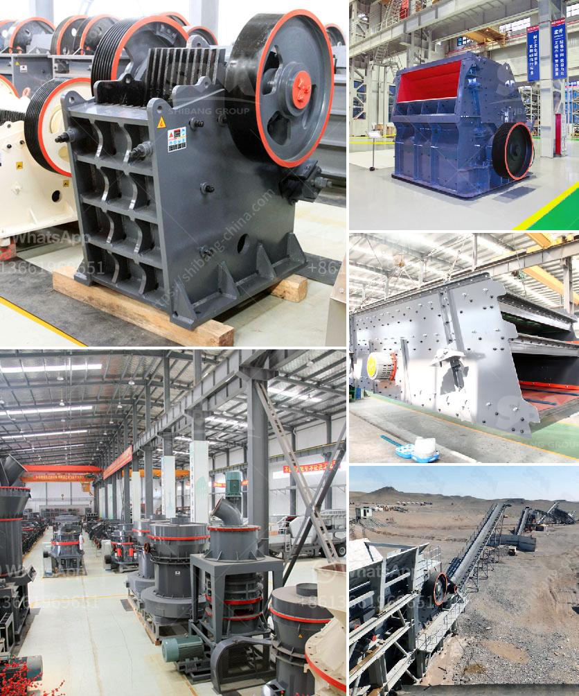

<h3>dolomite powder mill</h3>
Dolomite is a naturally occurring mineral that provides numerous benefits when used as a powder. One of the most common uses of dolomite powder is its incorporation into building materials, including ceramics and concrete. Dolomite powder is also used in agriculture to improve soil fertility and pH balance.

The dolomite powder mill, introduced by Clirik Machinery, is composed of efficient dolomite grinding mill, ultrafine mill, and high-pressure hanging roller mill. These three mills are successfully used in dolomite powder processing. Besides, the fineness of dolomite powder can be adjusted between 325-3000 mesh, making it easier to apply the powder in various industries.

One of the key advantages of the dolomite powder mill is its ability to grind and process an extensive variety of materials. With its powerful grinding capabilities, this mill can effectively handle materials with different hardness levels, including dolomite, limestone, calcite, and more. The finely processed dolomite powder has a wide range of applications, from building materials to agricultural use.

Not only does the dolomite powder mill produce fine powders, but it also offers energy-saving and environmental protection benefits. The high-efficiency grinding technology used in this mill helps reduce energy consumption, making it an eco-friendly choice. Additionally, the dolomite powder mill is equipped with advanced dust removal systems to ensure a clean and healthy work environment.

The dolomite powder mill not only provides a reliable solution for industries, but it also brings numerous benefits to individuals. For instance, dolomite powder can be used as a dietary supplement, as it contains essential minerals like calcium and magnesium. Consuming this powder can help support bone health and relieve symptoms of certain ailments.

In conclusion, the dolomite powder mill is a powerful ally that unlocks the natural power of dolomite. With its exceptional grinding capabilities and wide range of applications, it is a valuable asset for industries and individuals alike. Whether used in construction, agriculture, or even as a dietary supplement, dolomite powder offers a multitude of benefits. Embracing this versatile powder can lead to a more sustainable and healthier future.
<h3>Contact us</h3><ul><li><strong>Whatsapp:&nbsp;<a href="https://wa.me/8613661969651">+8613661969651</a></strong></li><li><a href="https://swt.shibang-china.com/?git&amp;zhl&amp;dolomite powder mill"><strong>Online Service(chat now)</strong></a></li></ul><h3>Related</h3><ul><li><a href='how much crusher plant cost.md'>how much crusher plant cost</a></li><li><a href='ball mills zenith china.md'>ball mills zenith china</a></li><li><a href='fly ash introduction in cement ball mill.md'>fly ash introduction in cement ball mill</a></li><li><a href='chromite ore crushing machine.md'>chromite ore crushing machine</a></li><li><a href='silica sand mining process equipment in south africa.md'>silica sand mining process equipment in south africa</a></li></ul>