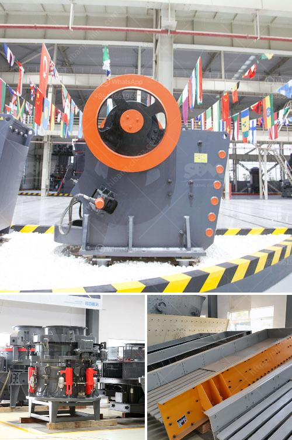

<h3>dolomite processing plant in mexico</h3>
Dolomite is a mineral that is commonly found in sedimentary rocks. It is a calcium magnesium carbonate with a chemical composition of CaMg(CO3)2. Dolomite is widely used in various industries such as construction, ceramics, glass, and agriculture. In Mexico, there is a growing demand for dolomite products, leading to the establishment of dolomite processing plants.

One notable dolomite processing plant in Mexico is the Dolomite Grinding Plant located in Veracruz. The plant was built in 2012 and has the capacity to produce dolomite products suitable for use in agriculture, construction, and other industries. The plant is equipped with state-of-the-art machinery and advanced technology to ensure the production of high-quality dolomite products.

The process of manufacturing dolomite products at the plant begins with the extraction of dolomite ore from nearby mines. The ore is then crushed, ground, and screened to the desired size. The finely ground dolomite is then transported to the processing plant where it undergoes various processes including drying, calcination, and grinding.

The drying process removes any moisture present in the dolomite, preventing the formation of lumps during grinding. Calcination is a process that involves heating the dolomite at a high temperature to remove impurities and enhance its chemical properties. The calcined dolomite is then further ground to a specific particle size using specialized grinding mills.

Once the dolomite has been processed and ground to the desired size, it is packed and ready for distribution. Dolomite products from the processing plant in Veracruz are shipped not only within Mexico but also exported to other countries. The high-quality dolomite products manufactured at the plant are known for their excellent chemical and physical properties.

The establishment of dolomite processing plants in Mexico has not only catered to the growing domestic demand but also contributed to the country's economy by generating employment opportunities and promoting industrial growth. With the increasing demand for dolomite worldwide, the Mexican dolomite processing plants are well-positioned to meet the needs of various industries and continue to contribute to the development of the economy.
<h3>Contact us</h3><ul><li><strong>Whatsapp:&nbsp;<a href="https://wa.me/8613661969651">+8613661969651</a></strong></li><li><a href="https://swt.shibang-china.com/?git&amp;zhl&amp;dolomite processing plant in mexico"><strong>Online Service(chat now)</strong></a></li></ul><h3>Related</h3><ul><li><a href='granite crusher price in nigeria.md'>granite crusher price in nigeria</a></li><li><a href='price three roll mill machinery.md'>price three roll mill machinery</a></li><li><a href='rock crusher companies.md'>rock crusher companies</a></li><li><a href='diagram of hammer mill machine.md'>diagram of hammer mill machine</a></li><li><a href='stone crusher plant for sale in saudi.md'>stone crusher plant for sale in saudi</a></li></ul>