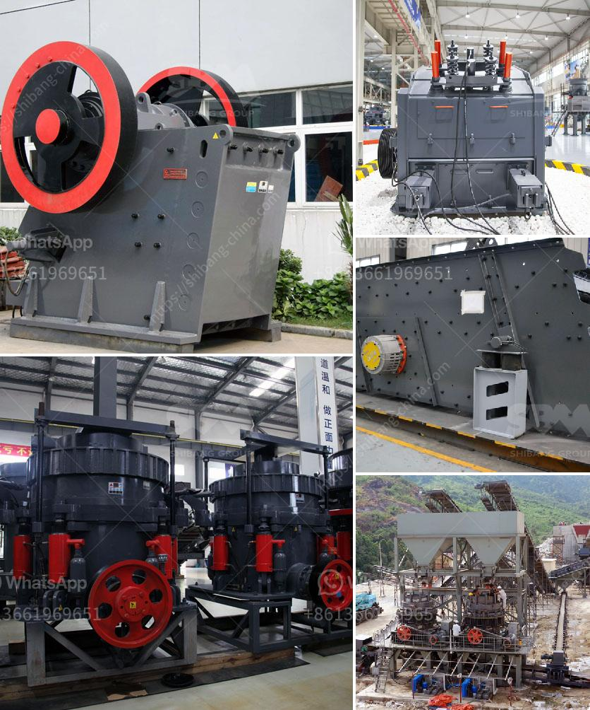

<h3>donesia lowongan kerja kuwait cement plant</h3>
Indonesia continues to play a significant role in labor migration, with many individuals seeking employment opportunities overseas. The demand for overseas jobs, such as those in the Middle East, remains high due to the promise of better salaries and improved living conditions. One such opportunity for Indonesians looking for work is the lowongan kerja Kuwait cement plant.

With a growing construction industry, Kuwait has witnessed a surge in demand for cement, making the cement plant sector an attractive option for job seekers. Many cement plants in Kuwait are actively recruiting workers from various countries, including Indonesia, to fill positions and meet labor requirements.

The lowongan kerja Kuwait cement plant refers to job vacancies available in Kuwait's cement plants. These positions can vary significantly, ranging from technical roles such as engineers, technicians, and production managers to non-technical roles including administrative personnel, sales representatives, and maintenance staff.

Working at a cement plant in Kuwait offers a range of benefits for Indonesian workers. Firstly, the remuneration package is generally more lucrative compared to the wages offered in Indonesia. This can provide an opportunity for workers to support their families back home more effectively and contribute to the local economy through remittances. Additionally, Kuwait offers an attractive environment for expatriates, providing access to modern amenities, quality healthcare, and a diverse cultural experience.

However, individuals considering the lowongan kerja Kuwait cement plant should be aware of certain factors. Firstly, language proficiency in English is crucial for most positions as it is the language predominantly used in the workplace. Therefore, those lacking English skills might struggle to communicate effectively with colleagues and managers. It is advisable to improve English proficiency before applying for these positions to enhance employment prospects.

Moreover, potential candidates should be prepared for the challenges associated with working in a foreign country. Adapting to a new work environment, cultural norms, and potentially unfamiliar industry practices can be daunting. However, with an open mind and willingness to adapt, Indonesians can thrive in Kuwait's cement plant sector.

One must also ensure that they have the necessary qualifications and work experience relevant to the position they are applying for. Cement plant jobs usually require technical skills and knowledge in fields such as engineering or production. Upgrading one's skills or obtaining certifications specific to the cement industry can increase the chances of securing a job offer.

In conclusion, the lowongan kerja Kuwait cement plant offers an enticing opportunity for Indonesians to work overseas. The promise of better salaries, improved living conditions, and exposure to a different culture make it an attractive option for job seekers. However, it is essential to consider the challenges of working in a foreign country and ensure that one has the necessary qualifications and skills required for the job. By preparing adequately, candidates can seize the opportunities available and contribute positively to Kuwait's cement industry while supporting their families back home.
<h3>Contact us</h3><ul><li><strong>Whatsapp:&nbsp;<a href="https://wa.me/8613661969651">+8613661969651</a></strong></li><li><a href="https://swt.shibang-china.com/?git&amp;zhl&amp;donesia lowongan kerja kuwait cement plant"><strong>Online Service(chat now)</strong></a></li></ul><h3>Related</h3><ul><li><a href='design calculation of jaw crusher pdf.md'>design calculation of jaw crusher pdf</a></li><li><a href='harga mobile stone crusher surabaya.md'>harga mobile stone crusher surabaya</a></li><li><a href='mobile mining gold equipment.md'>mobile mining gold equipment</a></li><li><a href='for sale stone crusher in sri lanka.md'>for sale stone crusher in sri lanka</a></li><li><a href='200tph stone hammer mill.md'>200tph stone hammer mill</a></li></ul>