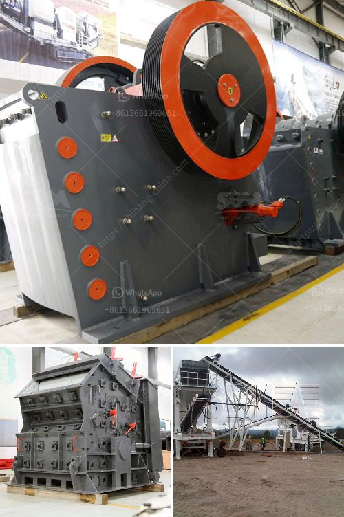

<h3>double rotor impact hammer crusher</h3>
The double rotor impact hammer crusher is a machine designed to crush brittle materials such as limestone, dolomite, and coal with compressive strength less than 250MPa. It has dual rotors, double tangent speed impact, crushes materials instantly.

The materials are transported into the crusher, crushed by the high-speed impact of the hammer heads, and immediately hit the crushed materials that are flowing at a high speed under the action of the hammer heads. Finally, the required finished product size is obtained. The size of the discharge particle size can be adjusted by changing the gap between the counterattack plate and the rotor. The structure and working principle of this crusher are simple and it has the advantages of low energy consumption, high output, and even grain shape.

The double rotor impact hammer crusher is composed of horizontal chain crusher, two rotor impact crusher, and other equipment. The chain crusher has a wide range of applications, especially for crushing various materials with high hardness, such as limestone, slag, coke, coal and other materials in the cement, chemical, electric power, metallurgical and other industrial sectors. It has high crushing efficiency and can easily crush the materials without heating or blocking.

The two-row rotor impact crusher has the following three types according to the rotor structure: integral type, semicircular type, and separate type. The integral type is a combination of two rotor impact crushers, and this kind of structure is suitable for crushing materials with high water content and high viscosity. The semicircular type has two separate rotor impact crushers that work independently, which is suitable for crushing materials with medium hardness. The separate type has two separate rotor impact crushers and two feed ports, which can be changed independently according to the different needs of users.

1. The material optimization design and reasonable combination that has been patented ensures the optimized size and shape of the machine.

2. The high-speed impact and collision of the materials with the hammer heads ensure the high efficiency of crushing and the excellent shape of the finished products.

3. The unique design of the two rotors with large diameter and small length ensures the materials are crushed evenly and effectively.

4. The use of high-quality high-chromium plate hammer and wear-resistant counterattack lining greatly improves the service life of the impact hammer crusher.

In conclusion, the double rotor impact hammer crusher is a practical, efficient, and low-cost crushing machine. It is a new type of machine based on the impact crusher and other crushing equipment. It adopts advanced rotor technology and unique protective lining plate, which increases the life of the machine. By adjusting the gap between the counterattack plate and the rotor, the size of the finished product can be controlled. The machine is widely used in industries such as mining, metallurgy, building materials, highways, railways, water conservancy, and chemical.
<h3>Contact us</h3><ul><li><strong>Whatsapp:&nbsp;<a href="https://wa.me/8613661969651">+8613661969651</a></strong></li><li><a href="https://swt.shibang-china.com/?git&amp;zhl&amp;double rotor impact hammer crusher"><strong>Online Service(chat now)</strong></a></li></ul><h3>Related</h3><ul><li><a href='prices for cement processing machines.md'>prices for cement processing machines</a></li><li><a href='new crushing machines in oman.md'>new crushing machines in oman</a></li><li><a href='crusher power consumption.md'>crusher power consumption</a></li><li><a href='small scale miners tonnes hour crushing machines.md'>small scale miners tonnes hour crushing machines</a></li><li><a href='lime dolomite plant processing.md'>lime dolomite plant processing</a></li></ul>