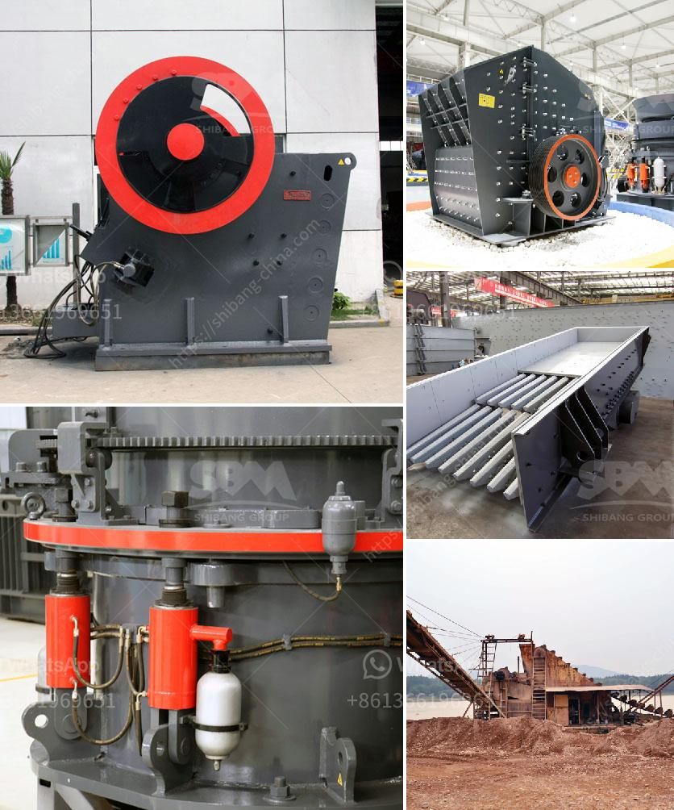

<h3>drawing for sand washing machines crusher mill</h3>
Drawing is an essential process in the design and development of machinery, particularly sand washing machines. These machines play a crucial role in the mining and construction industries, as they remove impurities and ensure clean sand for various applications. The success of these machines heavily relies on accurate and detailed drawings, which serve as a roadmap for engineers and manufacturers.

In the context of sand washing machines, a drawing refers to a technical illustration that represents the physical structure, dimensions, and specifications of the machine. It showcases the intricate design elements and components that make up the machine, such as the motor, gears, pumps, and filters. These drawings are typically created using computer-aided design (CAD) software, allowing for easy modification and precise measurements.

One of the main purposes of these drawings is to facilitate communication between engineers, designers, and manufacturers. By providing a comprehensive visual representation, drawings help ensure that everyone involved in the production process understands the machine's intended design and functionality. Additionally, drawings allow engineers to identify any potential flaws or challenges in the design, enabling them to make necessary modifications before the manufacturing stage.

Drawing sand washing machines also aids in the scaling and standardization of the manufacturing process. Through accurate and detailed drawings, manufacturers can ensure consistency in the production of these machines, resulting in reliable and high-quality products. Drawings provide essential information, such as the materials and dimensions needed for each component, which helps streamline the manufacturing process and reduce errors.

Furthermore, drawings serve as a reference for maintenance and repair purposes. By having a detailed visual representation of the sand washing machine, technicians and operators can easily identify and troubleshoot any issues that may arise. They can refer to the drawings to understand how each component functions, how they are interconnected, and how they should be maintained or replaced.

In conclusion, drawing is a critical part of the design and production process for sand washing machines. These machines play a vital role in ensuring clean and quality sand for various industries, and accurate drawings are essential for their successful development and manufacturing. Drawings facilitate communication between engineers, designers, and manufacturers, enable scaling and standardization, and serve as a reference for maintenance and repair. Without proper drawings, the production of sand washing machines would be significantly impaired, leading to inefficiencies and potential flaws in the final products.
<h3>Contact us</h3><ul><li><strong>Whatsapp:&nbsp;<a href="https://wa.me/8613661969651">+8613661969651</a></strong></li><li><a href="https://swt.shibang-china.com/?git&amp;zhl&amp;drawing for sand washing machines crusher mill"><strong>Online Service(chat now)</strong></a></li></ul><h3>Related</h3><ul><li><a href='marble paving making machinry price.md'>marble paving making machinry price</a></li><li><a href='cement making machinery for whole cement plant.md'>cement making machinery for whole cement plant</a></li><li><a href='stearic acid coating machine for calcium carbonate.md'>stearic acid coating machine for calcium carbonate</a></li><li><a href='price of a large mobile crusher.md'>price of a large mobile crusher</a></li><li><a href='suppliers of ball mill in bhopal.md'>suppliers of ball mill in bhopal</a></li></ul>