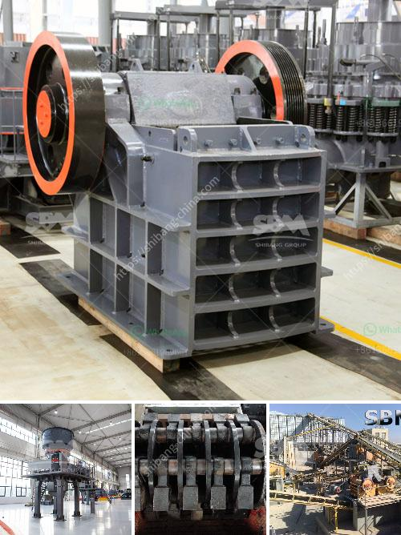

<h3>dry grinding mill</h3>
A dry grinding mill is a must-have piece of equipment in many industries. This versatile machine is used for many purposes, including grinding minerals, creating powders, and even manufacturing food products. With its ability to handle a wide range of materials, the dry grinding mill is an essential tool for many businesses.

One of the primary uses of a dry grinding mill is in the mining industry. It is commonly used to grind minerals such as ore into fine particles, which can then be separated from the waste material. This process is essential in extracting valuable minerals from the earth, as it enables efficient separation and processing.

In addition to mining, dry grinding mills are also used in the cement industry. Cement production involves grinding raw materials such as limestone, clay, and other minerals into a fine powder. This powder is then mixed with water to form a slurry, which is heated to produce cement. The dry grinding mill plays a crucial role in this process by ensuring the proper size and consistency of the raw materials.

Another industry that benefits from dry grinding mills is the chemical industry. Many chemicals need to be processed into fine powders before they can be used in various applications. This is where a dry grinding mill becomes invaluable, as it can achieve the desired particle size and consistency required for chemical reactions and manufacturing processes.

Food manufacturers also rely on dry grinding mills for various purposes. In the food industry, dry grinding mills are used to create powders from ingredients such as grains, spices, and herbs. These powders are then used in the production of seasonings, flavorings, and food additives. The ability to precisely grind and control the particle size is crucial for achieving the desired taste, texture, and quality of the final product.

One of the significant advantages of dry grinding mills is their versatility. These machines can handle a wide range of materials, from hard minerals to soft food products. They can also be customized to achieve different particle sizes, allowing businesses to meet specific requirements for their products. Additionally, dry grinding mills offer efficient and cost-effective solutions, helping businesses save time and resources in the production process.

In conclusion, a dry grinding mill is a must-have piece of equipment for various industries. Whether in mining, cement production, chemical processing, or food manufacturing, these machines offer a versatile and efficient solution for grinding materials into fine powders or achieving specific particle sizes. With their ability to handle a diverse range of materials and customize the final product, dry grinding mills have become essential tools for businesses seeking quality and efficiency in their operations.
<h3>Contact us</h3><ul><li><strong>Whatsapp:&nbsp;<a href="https://wa.me/8613661969651">+8613661969651</a></strong></li><li><a href="https://swt.shibang-china.com/?git&amp;zhl&amp;dry grinding mill"><strong>Online Service(chat now)</strong></a></li></ul><h3>Related</h3><ul><li><a href='carbon black processing machine in delhi.md'>carbon black processing machine in delhi</a></li><li><a href='ore grinding mills china.md'>ore grinding mills china</a></li><li><a href='the cost of the stone crusher machine.md'>the cost of the stone crusher machine</a></li><li><a href='stone crusher buatan indonesia.md'>stone crusher buatan indonesia</a></li><li><a href='powder making machinery.md'>powder making machinery</a></li></ul>