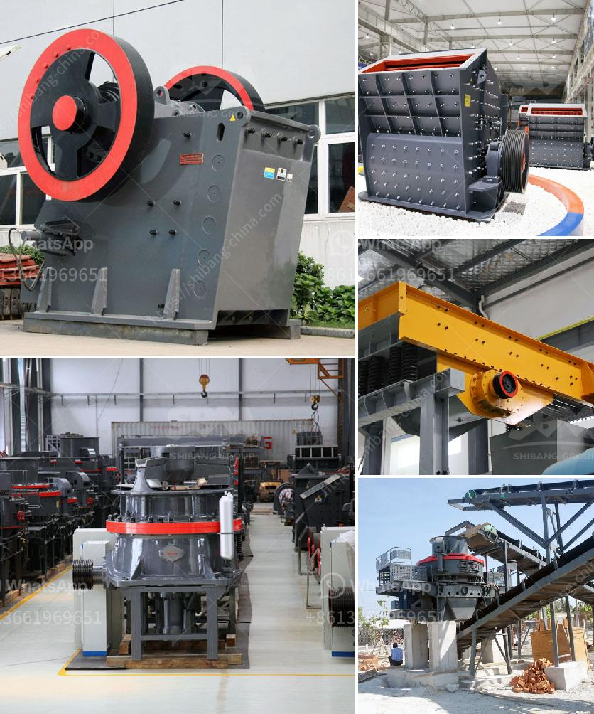

<h3>dry grinding rod mill</h3>
Dry grinding rod mills are a commonly used piece of equipment in mineral processing operations. They are primarily designed to grind materials down to a size where liberation of particles in the desired range is achieved. With dry grinding, these mills often work in a closed cycle, resulting in higher efficiency.

One of the key advantages of dry grinding rod mills is that they produce a narrow size distribution. This is beneficial as it allows for maximum grinding efficiency when dealing with materials that have varying hardness and grindability. The narrow size distribution also means that the final product is consistent in size, which is crucial for downstream processes such as flotation or leaching.

The design of dry grinding rod mills is quite similar to the design of wet grinding mills. However, dry grinding mills are typically larger, meaning they can handle higher capacities. This makes them suitable for industrial grinding applications where large quantities of material need to be processed.

The grinding kinetics in dry grinding rod mills is influenced by various factors, such as the feed size, ore hardness, and mill speed. These factors impact the residence time of the material in the mill and ultimately determine the grinding efficiency. It is important to regularly optimize these parameters to ensure optimal performance of the mill.

When operating a dry grinding rod mill, it is crucial to monitor the mill’s power consumption. This can provide valuable information about the grinding efficiency. High power consumption may suggest that the mill is being overloaded, which can lead to reduced grinding efficiency and increased wear on the mill liners.

Mill liners play a crucial role in dry grinding rod mills. They protect the mill shell from wear and also provide lift to the grinding media, ensuring efficient grinding. Regular inspections of the mill liners are necessary to identify any signs of wear or damage. Prompt replacement of worn or damaged liners is essential to maintain optimal mill performance.

In conclusion, dry grinding rod mills are an integral part of mineral processing operations. They offer several advantages, including a narrow size distribution and high grinding efficiency. Regular optimization of mill parameters and monitoring of power consumption is essential to maximize mill performance. Additionally, maintaining mill liners in good condition is crucial for optimal grinding efficiency. By following these best practices, operators can ensure that their dry grinding rod mills operate efficiently and reliably.
<h3>Contact us</h3><ul><li><strong>Whatsapp:&nbsp;<a href="https://wa.me/8613661969651">+8613661969651</a></strong></li><li><a href="https://swt.shibang-china.com/?git&amp;zhl&amp;dry grinding rod mill"><strong>Online Service(chat now)</strong></a></li></ul><h3>Related</h3><ul><li><a href='hammer mill machine 20hp.md'>hammer mill machine 20hp</a></li><li><a href='cement mill vertical price in india.md'>cement mill vertical price in india</a></li><li><a href='china processing plants for sale.md'>china processing plants for sale</a></li><li><a href='stone crushing machine in dubai.md'>stone crushing machine in dubai</a></li><li><a href='double rotor impact hammer crusher.md'>double rotor impact hammer crusher</a></li></ul>