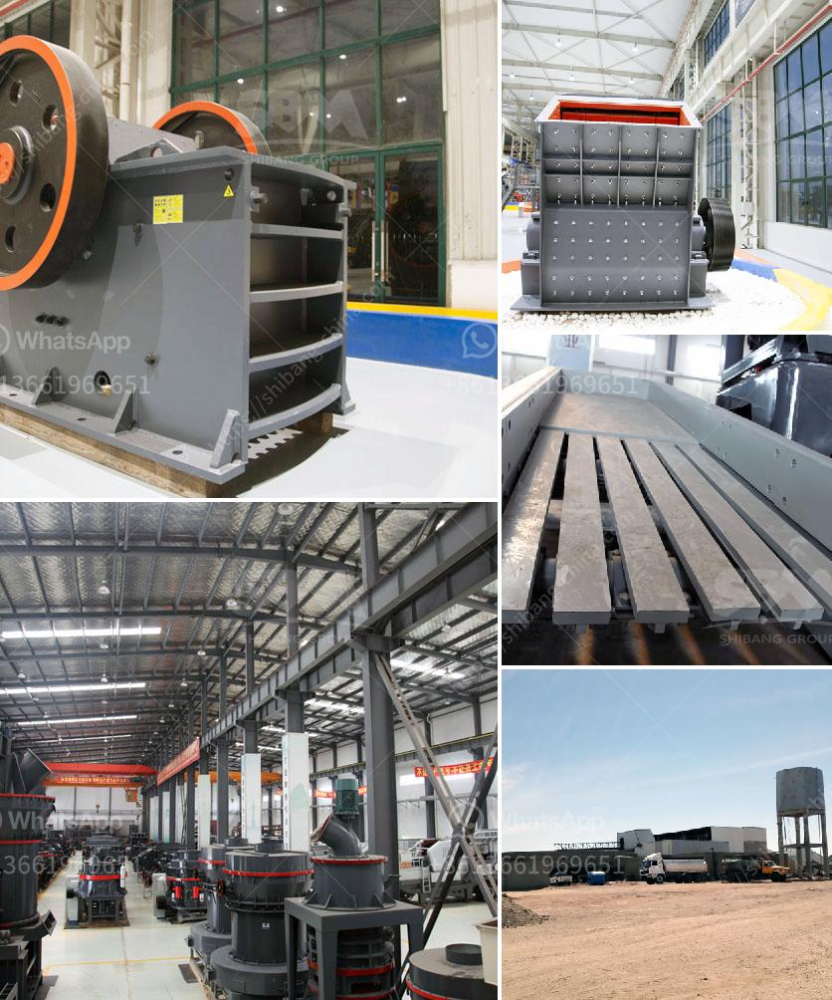

<h3>dry process of cement</h3>
The dry process of cement production is a popular and efficient method of creating cement. This process differs from the wet method as it does not require water to mix the ingredients. Instead, the raw materials are ground into a dry powder and fed into a kiln where extreme heat is applied. 

To begin the dry process, the limestone and clay are crushed into a powder, mixed together, and transported to a kiln. The kiln is a large metal cylinder that rotates slowly and is heated to temperatures above 1,400 degrees Celsius. The mixture is fed into the kiln, where it undergoes a series of chemical reactions. As the material moves through the kiln, it heats up and begins to melt. At this stage, it is known as the clinker.

The clinker is then cooled and ground into a fine powder, which is the final product of cement. This powder is commonly referred to as Portland cement, and it is used in a variety of construction applications.

The dry process of cement production has several advantages over the wet method. Firstly, it is more energy-efficient. As no water is used, there is no need to evaporate it, reducing energy consumption. Additionally, the dry process allows for better control over the composition and quality of the cement. This results in a more consistent and reliable product.

Despite its benefits, the dry process also poses some challenges. Since no water is used, dust can be a significant issue, leading to pollution and health concerns for workers. Proper dust control measures must be in place to mitigate these risks. Additionally, the dry process requires more energy to heat the kiln to such high temperatures. This can lead to higher fuel consumption and increased carbon emissions.

In conclusion, the dry process of cement production is an efficient and widely used method. It eliminates the need for water, resulting in energy and cost savings. However, proper dust control measures must be implemented to address environmental and health concerns. Overall, the dry process has played a crucial role in the cement industry and continues to be a prevalent method.
<h3>Contact us</h3><ul><li><strong>Whatsapp:&nbsp;<a href="https://wa.me/8613661969651">+8613661969651</a></strong></li><li><a href="https://swt.shibang-china.com/?git&amp;zhl&amp;dry process of cement"><strong>Online Service(chat now)</strong></a></li></ul><h3>Related</h3><ul><li><a href='harga vibrating screen.md'>harga vibrating screen</a></li><li><a href='500mm vertical mill stones price.md'>500mm vertical mill stones price</a></li><li><a href='limestone small crusher machine.md'>limestone small crusher machine</a></li><li><a href='jaw crusher 150 250 para la venta.md'>jaw crusher 150 250 para la venta</a></li><li><a href='price 100 tph crusher plant.md'>price 100 tph crusher plant</a></li></ul>