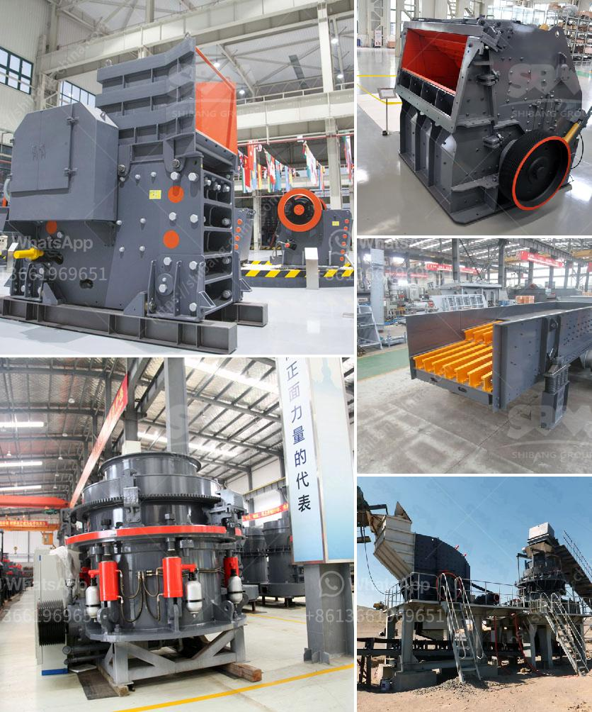

<h3>dry processing of coal in south africa</h3>
Coal has been a key resource in the South African energy landscape for many years. However, the conventional wet processing of coal has posed serious environmental and health concerns, prompting the need for alternative methods. Dry processing of coal has emerged as a sustainable solution that not only mitigates these challenges but also offers significant economic benefits.

The traditional wet coal processing involves the use of large amounts of water, leading to water scarcity issues in an already water-stressed country like South Africa. Additionally, the slurry produced during this process contains various pollutants, such as heavy metals and sulphur, which can contaminate nearby water bodies and pose a risk to human health. These environmental and health concerns have prompted the South African government to seek more environmentally friendly and resource-efficient coal processing methods.

Dry coal processing, also known as "dry beneficiation," offers a multitude of benefits compared to the conventional wet processing methods. Firstly, it eliminates the need for water, reducing the environmental impact on water resources and alleviating water scarcity concerns. Furthermore, the dry process produces a higher yield of coal compared to wet processing methods, resulting in greater energy production from the same amount of mined coal. This increased efficiency contributes to a more sustainable and economical energy sector in South Africa.

The dry beneficiation process involves separating coal particles from impurities using various techniques, such as density-based separation, air jigs, or pneumatic tables. These methods rely on the differences in the physical and chemical properties of coal and its impurities to facilitate separation. The resulting clean coal is then ready for combustion or further refinement, depending on its intended use.

Dry coal processing has gained traction in South Africa, with several pilot plants and commercial-scale operations already in place. The country's abundance of coal reserves and the need for sustainable energy production make it an ideal candidate for the adoption of dry beneficiation technologies. In fact, the South African Coal Roadmap, a government-led initiative, promotes the development and implementation of dry coal processing technologies across the country.

Apart from environmental benefits, dry coal processing also offers economic advantages. By reducing water usage, mining companies can lower their operational costs and improve their bottom line. Additionally, the higher coal yield achieved during dry processing translates into higher revenue for the companies involved, promoting economic growth in the coal mining sector. This increased profitability supports local job creation and stimulates the South African economy.

In conclusion, the adoption of dry processing technologies for coal beneficiation in South Africa proves to be a sustainable and economically viable solution. This method eliminates the environmental and health concerns associated with traditional wet processing, while also offering increased energy production and economic benefits. As the country strives to meet its energy demands while minimizing its impact on the environment, dry coal processing emerges as a key component of South Africa's sustainable energy future.
<h3>Contact us</h3><ul><li><strong>Whatsapp:&nbsp;<a href="https://wa.me/8613661969651">+8613661969651</a></strong></li><li><a href="https://swt.shibang-china.com/?git&amp;zhl&amp;dry processing of coal in south africa"><strong>Online Service(chat now)</strong></a></li></ul><h3>Related</h3><ul><li><a href='belt cost conveyor.md'>belt cost conveyor</a></li><li><a href='used sand screening equipment for sale.md'>used sand screening equipment for sale</a></li><li><a href='aggregates plant for construction.md'>aggregates plant for construction</a></li><li><a href='crusher for crushing limestone.md'>crusher for crushing limestone</a></li><li><a href='density of 2mm 1mm aggregate and river crusher sand.md'>density of 2mm 1mm aggregate and river crusher sand</a></li></ul>