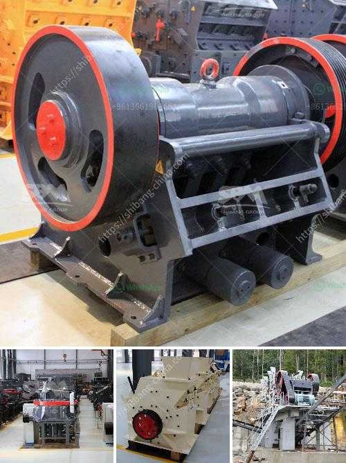

<h3>dust control for crushing plants</h3>
Dust control for crushing plants is becoming more and more important in today's industrial landscape. As the demand for fine particles and process optimization continues to increase, organizations are looking for reliable solutions to control dust. Dust emissions can cause a variety of problems, including environmental pollution, health issues, and equipment wear. Therefore, implementing an effective dust control strategy is vital for both operational and regulatory compliance purposes.

Crushing plants, which transform large rocks into various sizes of gravel, ore, or other materials, are particularly prone to generating significant amounts of dust. This occurs during the breaking, crushing, and screening stages. Given the high volume of material processed, it is essential to address dust control in these environments.

One of the most common methods employed to control dust is the use of water. Spraying water on dusty areas reduces airborne particles, thereby minimizing the release of dust into the surrounding environment. Water spray systems are often installed at key points throughout the crushing plant to suppress dust. These systems typically consist of a series of nozzles mounted on equipment or conveyor belts, strategically positioned to target the areas of concern.

Using water as a dust control measure is effective, but it also comes with challenges. For instance, excessive water application can lead to clogging and material buildup on conveyors, resulting in reduced productivity and equipment damage. To mitigate these risks, it is crucial to strike the right balance by applying the appropriate amount of water without compromising operational efficiency.

In addition to water sprays, ventilating the crushing plant is another effective approach. By ensuring adequate ventilation, the concentration of dust particles in the air is reduced, limiting their dispersal and potential harm to workers or the environment. Properly designed and maintained ventilation systems often incorporate air filtration mechanisms to further enhance dust control.

Furthermore, investing in the latest technologies can greatly improve dust control in crushing plants. For instance, dust suppression systems that utilize misting cannons or fogging machines can help to control dust at the source. These machines produce a fine mist that binds with airborne particles, weighing them down and preventing their dispersion. This approach is particularly useful in outdoor environments where water spray systems may not be feasible.

Regular maintenance and cleaning of crushing equipment is also essential for effective dust control. Machinery that is poorly maintained can produce more dust due to worn-out components and poor sealing. Therefore, establishing a regular maintenance program, including equipment inspection and repair, can significantly reduce the risk of dust emissions.

Lastly, organizations should prioritize employee training and awareness regarding dust control. Educating workers about the potential risks associated with dust exposure and the preventive measures in place helps ensure a safe working environment. Additionally, providing appropriate personal protective equipment (PPE), such as respirators and dust masks, is crucial to minimize the inhalation of harmful particles.

In conclusion, dust control for crushing plants is a critical consideration in today’s industry. Implementing effective dust control measures not only promotes environmental and regulatory compliance but also enhances worker safety and prolongs equipment lifespan. By employing a comprehensive strategy that includes water sprays, ventilation, advanced technologies, regular maintenance, and employee training, organizations can effectively control dust emissions and maintain a healthy and productive working environment.
<h3>Contact us</h3><ul><li><strong>Whatsapp:&nbsp;<a href="https://wa.me/8613661969651">+8613661969651</a></strong></li><li><a href="https://swt.shibang-china.com/?git&amp;zhl&amp;dust control for crushing plants"><strong>Online Service(chat now)</strong></a></li></ul><h3>Related</h3><ul><li><a href='used jaw mobile crusher in uae.md'>used jaw mobile crusher in uae</a></li><li><a href='the cost of the stone crusher machine.md'>the cost of the stone crusher machine</a></li><li><a href='cone crusher for salae used.md'>cone crusher for salae used</a></li><li><a href='mill ore grind size passing 200 mesh.md'>mill ore grind size passing 200 mesh</a></li><li><a href='jaw crusher for chrome ore for sale.md'>jaw crusher for chrome ore for sale</a></li></ul>