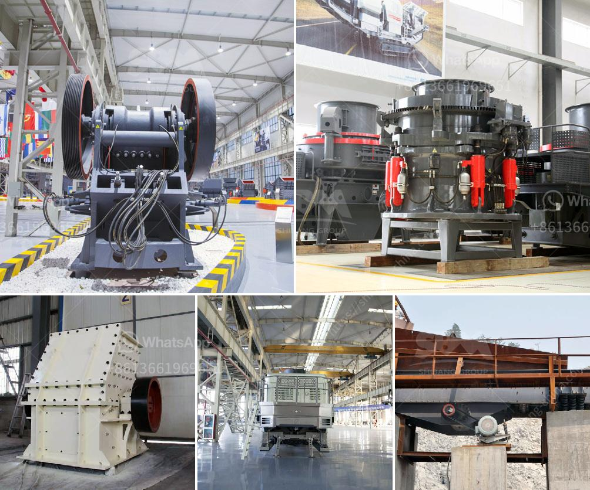

<h3>ecotec line for grinding of calcium carbonate</h3>
The Ecotec line for grinding of calcium carbonate is a remarkable innovation in the field of grinding technologies. Calcium carbonate is a mineral compound found abundantly in nature, and it is widely used in various industries including plastics, rubber, paper, paints, and coatings.

Grinding calcium carbonate is a complex process that requires skill and precision. The traditional grinding methods used in the past involve using heavy machinery such as ball mills, hammer mills, and vertical mills. However, these methods are not only time-consuming but also have a high energy consumption, which makes them less favorable in today's fast-paced world where efficiency is key.

Enter Ecotec, a cutting-edge grinding technology that has revolutionized the way calcium carbonate is ground. Developed by a team of engineers and experts in the field, the Ecotec line offers a range of grinding machines that are not only efficient and productive but also environment-friendly.

One of the key features of the Ecotec line is its use of state-of-the-art technology that optimizes the grinding process. The machines are equipped with advanced control systems that monitor and adjust parameters such as grinding speed, pressure, and temperature in real-time. This ensures that the grinding process is precise and consistent, resulting in high-quality calcium carbonate particles.

In addition to its precision, the Ecotec line is also known for its energy efficiency. The machines are designed to minimize energy consumption by utilizing innovative grinding techniques. This not only reduces operating costs for businesses but also helps in conserving energy and reducing carbon emissions, making it an environmentally responsible choice.

Furthermore, the Ecotec line offers a wide range of grinding machines that can be customized to meet specific requirements. Whether it is fine grinding for paper industry applications or coarse grinding for plastics and rubber industry applications, the Ecotec line can cater to diverse needs. The machines are also capable of handling large capacities, ensuring productivity and efficiency even in high-demand scenarios.

Maintenance and servicing are also made hassle-free with the Ecotec line. The machines are designed for easy access to critical components, minimizing downtime and maximizing operational uptime. This reduces the overall maintenance costs and ensures minimal disruption to production.

The Ecotec line for grinding of calcium carbonate is truly a game-changer in the industry. With its precision, energy efficiency, versatility, and low maintenance requirements, it is the perfect solution for businesses looking to optimize their grinding processes. Moreover, its environmentally friendly features make it an ideal choice for companies that prioritize sustainability.

In conclusion, the Ecotec line for grinding of calcium carbonate is a remarkable innovation that brings efficiency, precision, and environmental responsibility to the grinding process. With its advanced technology, energy efficiency, customizable options, and easy maintenance, it is a reliable and sustainable choice for businesses across various industries.
<h3>Contact us</h3><ul><li><strong>Whatsapp:&nbsp;<a href="https://wa.me/8613661969651">+8613661969651</a></strong></li><li><a href="https://swt.shibang-china.com/?git&amp;zhl&amp;ecotec line for grinding of calcium carbonate"><strong>Online Service(chat now)</strong></a></li></ul><h3>Related</h3><ul><li><a href='cement plant in assam.md'>cement plant in assam</a></li><li><a href='gold mining equipment suppliers.md'>gold mining equipment suppliers</a></li><li><a href='small mobile rock pulverizer.md'>small mobile rock pulverizer</a></li><li><a href='specification for pe 250x400 jaw crusher.md'>specification for pe 250x400 jaw crusher</a></li><li><a href='stone transport belt conveyor.md'>stone transport belt conveyor</a></li></ul>