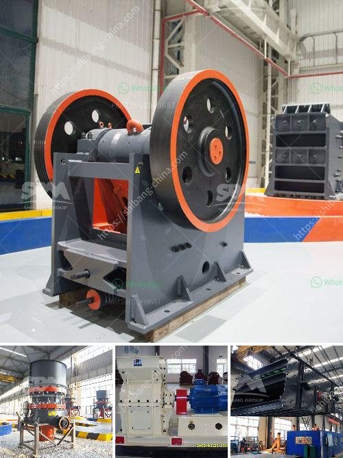

<h3>efficiency energetic efficiency of roller mill</h3>
The efficiency of roller mills in the milling industry has proven to be a crucial factor for maximizing productivity and reducing energy consumption. These mills are instrumental in grinding grains, such as wheat, corn, rice, barley, and oats, into refined flours used in various food products.

One of the primary advantages of roller mills is their high energy efficiency. Unlike traditional stone mills, roller mills employ multiple pairs of rollers that crush and grind the grains, ensuring an even distribution of particles and a uniform final product. This design allows for a more efficient extraction of flour, reducing energy waste and increasing overall productivity.

Furthermore, roller mills utilize advanced technology to regulate the grain feed rate and adjust the pressure between rollers. This mechanism optimizes the grinding process, minimizing energy loss and heat generation. In addition, the streamlined design of roller mills reduces friction, resulting in lower power consumption compared to other milling methods.

Another key aspect contributing to the energetic efficiency of roller mills is the utilization of pneumatic systems for grain transportation. These systems enable a smooth and continuous flow of grains from one process to another, eliminating the need for manual handling and reducing energy expenditure.

Moreover, roller mills often incorporate innovative features such as automatic cleaning systems, which help maintain optimal conditions for milling and prevent clogging or material build-up. By minimizing interruptions and allowing for continuous operation, these systems enhance the overall energetic efficiency of the mill.

Overall, roller mills have proven to be an excellent choice for achieving high energetic efficiency in the milling industry. Their advanced design, utilization of pneumatic systems, and incorporation of innovative features contribute to reduced energy consumption, increased productivity, and improved product quality. As the demand for sustainable and cost-effective milling solutions continues to rise, roller mills remain at the forefront of providing efficient and reliable solutions for grain processing.
<h3>Contact us</h3><ul><li><strong>Whatsapp:&nbsp;<a href="https://wa.me/8613661969651">+8613661969651</a></strong></li><li><a href="https://swt.shibang-china.com/?git&amp;zhl&amp;efficiency energetic efficiency of roller mill"><strong>Online Service(chat now)</strong></a></li></ul><h3>Related</h3><ul><li><a href='iron ore crushing.md'>iron ore crushing</a></li><li><a href='gold mining equipment for sale at malaysia.md'>gold mining equipment for sale at malaysia</a></li><li><a href='talc processing plant.md'>talc processing plant</a></li><li><a href='production process clinker zurich switzerland.md'>production process clinker zurich switzerland</a></li><li><a href='ballast crushing machinery.md'>ballast crushing machinery</a></li></ul>