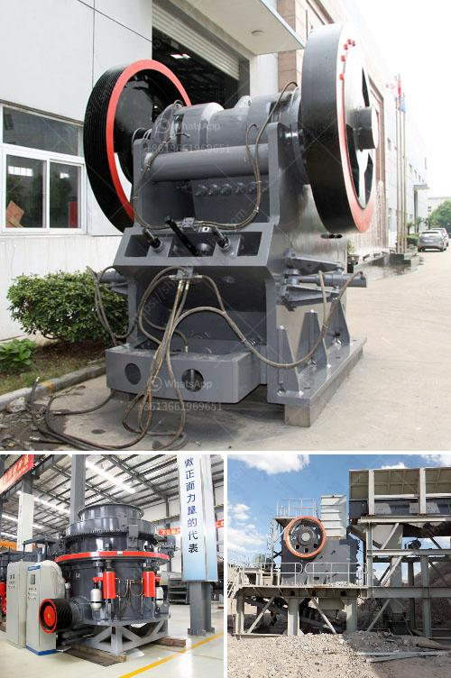

<h3>egypt gold prospecting equipment manufacturers</h3>
Egypt, the land of pharaohs and ancient wonders, has a rich history of gold mining. From the time of the ancient Egyptians to the present day, gold has been one of the country's most valuable resources. With the increasing demand for gold, there is a need for reliable and efficient equipment to aid in gold prospecting. Fortunately, Egypt is the home to several reputable gold prospecting equipment manufacturers, who wield their expertise to develop high-quality machinery for gold exploration.

One such esteemed manufacturer is Desert Fox. Based in Cairo, Desert Fox is renowned in the industry for its top-notch gold prospecting equipment. They offer a range of products designed to enhance the efficiency of gold exploration. Some of their popular offerings include gold pans, sluice boxes, and dredges. These tools are crafted with precision and built to withstand the challenging conditions of gold mining.

Desert Fox's gold pans are a must-have for any gold prospector. These pans are specifically designed to efficiently separate gold from sediment and sand. With their unique spiral riffles, the pans enable users to capture even the finest particles of gold. The sturdy construction ensures durability, allowing for extended use over a long period of time.

For those seeking to extract gold on a larger scale, Desert Fox offers a line of robust sluice boxes. These boxes are ideal for processing larger quantities of sediment and separating gold from the waste material. Made from high-grade materials, the sluice boxes are built to withstand the harshest conditions, ensuring a productive and efficient gold prospecting experience.

In addition to pans and sluice boxes, Desert Fox manufactures cutting-edge dredges. These machines are designed to extract gold from riverbeds, lakes, and other bodies of water. Equipped with powerful suction pumps, these dredges are capable of sucking up large amounts of sediment and separating the gold from the debris. With their advanced technology and superior engineering, Desert Fox's dredges have become a popular choice among gold prospectors in Egypt.

Another key player in the industry is Pharaohs Gold Prospecting Equipment. Established in Luxor, this manufacturer offers a diverse range of gold prospecting equipment to cater to varying needs. Their product lineup includes metal detectors, rock crushers, and drywashers, among others. Pharaohs Gold Prospecting Equipment prioritizes innovation and uses advanced technology to develop equipment that maximizes the chances of finding gold.

Their metal detectors are renowned for their accuracy and sensitivity, allowing users to detect even the smallest traces of gold. The rock crushers provided by Pharaohs Gold Prospecting Equipment enable prospectors to crush rocks and ores, making it easier to identify potential gold-bearing materials. Additionally, the drywashers offered by the company efficiently separate gold from dry sediments, making them an essential tool for prospecting in arid regions.

Egypt, with its rich history and abundant resources, offers immense potential for gold prospecting. Thanks to the dedicated efforts of manufacturers like Desert Fox and Pharaohs Gold Prospecting Equipment, prospectors in Egypt have access to high-quality and reliable equipment. With these cutting-edge tools at their disposal, prospectors can explore the country's gold-rich regions with confidence and increase their chances of striking gold. Whether it's the simplicity of a gold pan or the advanced technology of a dredge, the wide range of equipment provided by these manufacturers ensures that every prospector can find the perfect tool for their needs.
<h3>Contact us</h3><ul><li><strong>Whatsapp:&nbsp;<a href="https://wa.me/8613661969651">+8613661969651</a></strong></li><li><a href="https://swt.shibang-china.com/?git&amp;zhl&amp;egypt gold prospecting equipment manufacturers"><strong>Online Service(chat now)</strong></a></li></ul><h3>Related</h3><ul><li><a href='flow sheet diagram for ceramic industry.md'>flow sheet diagram for ceramic industry</a></li><li><a href='equipments of copper processing.md'>equipments of copper processing</a></li><li><a href='dry grinding mill.md'>dry grinding mill</a></li><li><a href='spare parts dealer of crusher plant in odisha.md'>spare parts dealer of crusher plant in odisha</a></li><li><a href='aggregate concrete plant.md'>aggregate concrete plant</a></li></ul>