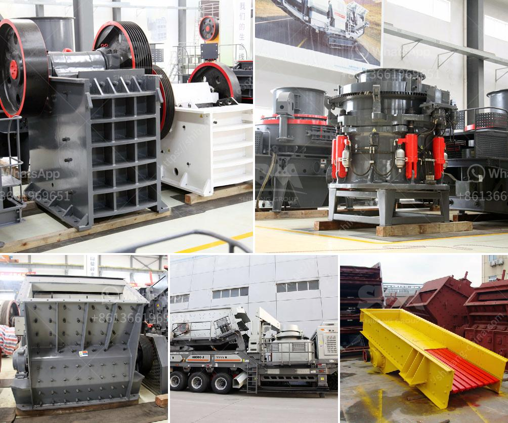

<h3>enquiry about crusher</h3>
Are you currently in the market for a new crusher? Maybe you are expanding your business and require additional equipment to meet the growing demand. Or perhaps you are in the process of replacing an outdated crusher that no longer meets your production requirements. Whatever the reason may be, choosing the right crusher is crucial to ensure efficient and cost-effective operations. In this article, we will discuss the key factors you need to consider when enquiring about a crusher.

First and foremost, it is important to understand the specific requirements of your business. What kind of materials do you need to crush? Are they hard or soft? Are they large or small? Having a clear understanding of your material characteristics will help you determine the type of crusher that is most suitable for your needs.

There are various crusher types available in the market, each designed for different applications. Jaw crushers, for instance, are commonly used for primary crushing as they can handle large rocks and have a high reduction ratio. On the other hand, cone crushers are ideal for secondary and tertiary crushing, offering excellent particle shape and uniformity.

Another important consideration is the desired output size. Different crushers produce different-sized materials. If you require a specific size range for your end product, it is essential to choose a crusher that can deliver the desired results. Some crushers come with adjustable settings, making it easier to control the final product size.

Crushing capacity is also a crucial factor to consider. Depending on your production requirements, you may need a crusher with higher capacity to ensure smooth and uninterrupted operations. Factors such as feed size, material hardness, and the desired output will determine the capacity you need. It is essential to evaluate your projected production needs accurately to avoid any bottleneck situations.

When enquiring about a crusher, it is important to consider the overall cost of ownership. Beyond the initial purchase price, you should also factor in operational costs, including energy consumption, maintenance, and wear part replacement. Some crushers are more energy-efficient than others, which can lead to significant savings in the long run. Similarly, opting for a crusher with durable and high-quality wear parts can reduce maintenance costs and downtime.

Additionally, it is crucial to enquire about after-sales support and services. A reliable and reputable manufacturer or supplier should provide comprehensive support, including installation, training, and ongoing technical assistance. You should also inquire about the availability and delivery times of spare parts to ensure minimal disruption in case of machinery breakdown.

Lastly, before finalizing your enquiry, it is recommended to seek expert advice. Consult with professionals in the field who have experience in crusher selection. They can assess your specific requirements and recommend the most suitable crusher for your needs.

In summary, enquiring about a crusher requires careful consideration of various factors, including material characteristics, desired output size, crushing capacity, cost of ownership, and after-sales support. Taking the time to evaluate these factors will help you make an informed decision and find the right crusher that enhances your operations and contributes to your business's success.
<h3>Contact us</h3><ul><li><strong>Whatsapp:&nbsp;<a href="https://wa.me/8613661969651">+8613661969651</a></strong></li><li><a href="https://swt.shibang-china.com/?git&amp;zhl&amp;enquiry about crusher"><strong>Online Service(chat now)</strong></a></li></ul><h3>Related</h3><ul><li><a href='impact crusher 500tph spcfication.md'>impact crusher 500tph spcfication</a></li><li><a href='coal washing plant drawing.md'>coal washing plant drawing</a></li><li><a href='crusher machine 200 ton per hours.md'>crusher machine 200 ton per hours</a></li><li><a href='process of river rock crushing to make cement.md'>process of river rock crushing to make cement</a></li><li><a href='ball mill manufacturing manufacturing process.md'>ball mill manufacturing manufacturing process</a></li></ul>