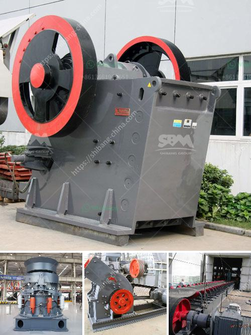

<h3>enquiry stone crusher</h3>
A stone crusher, also known as rock crusher, is one of the most commonly used mining crushers. It is designed to reduce large rocks into smaller rocks, gravel, or rock dust for construction purposes. These machines are typically used in various industries such as mining, metallurgy, building materials, and chemical industries for crushing different types of materials, including ores, stones, coal, and other substances.

With increasing demands for construction materials, the demand for stone crushers has also grown significantly. Quarries and mines around the world are utilizing stone crushers to fulfill their operations' crushing needs. These crushers are vital equipment that plays a pivotal role in the stone processing industry. One such crusher that has gained significant popularity is the enquiry stone crusher.

The enquiry stone crusher is known for its exceptional performance, durability, and ease of operation. It is a versatile machine that can be used in various applications and settings. Whether it is a quarry or a mine, the enquiry stone crusher can effectively process a wide range of materials. This includes limestone, granite, basalt, dolomite, and even harder materials like iron ore or copper ore.

One of the standout features of the enquiry stone crusher is its powerful crushing capacity. Equipped with high-quality blades, it can effectively break down large rocks into smaller pieces, making it easier to handle and transport. This feature is highly desirable for quarries and mines dealing with massive quantities of stones or rocks.

Furthermore, the enquiry stone crusher is designed with user-friendliness in mind. Its simple and intuitive controls allow operators to operate the machine efficiently, reducing the chances of human error. Additionally, the crusher is equipped with safety mechanisms to prevent accidents and ensure the well-being of the operators.

Another advantage offered by the enquiry stone crusher is its easy maintenance and upkeep. The machine is designed with accessible components, allowing for swift repairs and replacements. Regular maintenance can be carried out with minimal effort, extending the lifespan of the machine and ensuring continuous operations.

In conclusion, the enquiry stone crusher is an indispensable tool for quarries and mines worldwide. Its exceptional performance, durability, and ease of use make it a must-have machine for any stone processing operation. Whether it is crushing rocks or ores, this versatile machine delivers excellent results. Furthermore, with its user-friendly design and easy maintenance, the enquiry stone crusher offers a hassle-free experience for operators. With the increasing demand for construction materials, this machine is paving the way for efficient and sustainable stone crushing operations.
<h3>Contact us</h3><ul><li><strong>Whatsapp:&nbsp;<a href="https://wa.me/8613661969651">+8613661969651</a></strong></li><li><a href="https://swt.shibang-china.com/?git&amp;zhl&amp;enquiry stone crusher"><strong>Online Service(chat now)</strong></a></li></ul><h3>Related</h3><ul><li><a href='aggregates plant for construction.md'>aggregates plant for construction</a></li><li><a href='rumus perhitungan kapasitas jaw crusher.md'>rumus perhitungan kapasitas jaw crusher</a></li><li><a href='stone crushing business in zimbabwe.md'>stone crushing business in zimbabwe</a></li><li><a href='quartz crusher machine.md'>quartz crusher machine</a></li><li><a href='tons a hour wash plant.md'>tons a hour wash plant</a></li></ul>