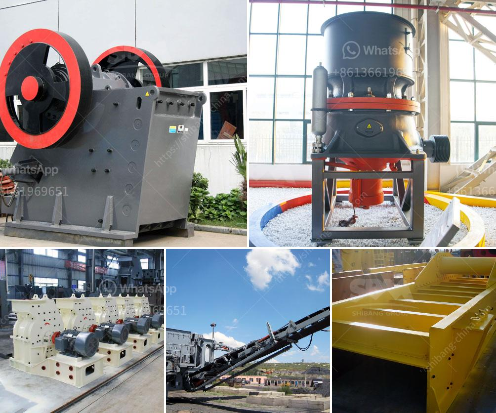

<h3>equipment perlite mining</h3>
Perlite mining is a lucrative industry that involves the extraction and processing of perlite ore, a naturally occurring volcanic glass material. Perlite is known for its unique properties, including lightweight, porous structure, and excellent insulation capabilities. These characteristics make perlite widely used in construction, horticulture, filtration, and several other industries.

To conduct perlite mining effectively, specialized equipment is required. The mining process begins with the exploration and identification of perlite deposits. Once a suitable deposit is located, mining operations can commence. The equipment used in perlite mining varies depending on the scale of the operation and the desired end product.

In large-scale perlite mining operations, heavy machinery such as bulldozers, scrapers, and loaders are used to clear the overburden (the top layer of soil and rock covering the deposit). This process exposes the perlite ore bed, allowing it to be extracted. After extraction, the ore is transported to a processing plant where it undergoes crushing, screening, and grinding to achieve the desired particle size.

The use of specialized equipment is crucial for efficient and safe perlite mining. Crushers and grinders help break down the ore into smaller pieces, enabling easier handling and processing. Conveyors and bucket elevators are used to transport the ore within the processing plant. Additionally, cyclones and classifiers are employed to separate different grades of perlite based on size and density.

Safety is a top priority in perlite mining operations, and specialized equipment helps ensure the well-being of workers. Personal protective equipment, such as hard hats, goggles, and gloves, is essential for protecting against potential hazards. Efficient ventilation systems are also installed to maintain air quality in underground mining operations.

In conclusion, perlite mining requires specialized equipment to efficiently extract and process perlite ore. The equipment used may vary depending on the scale of the operation and the desired end product. From heavy machinery for clearing overburden to crushers and grinders for ore processing, every step of the perlite mining process relies on specialized equipment. By utilizing this equipment, perlite mining operations can be conducted safely and effectively, ensuring the supply of perlite for various industries.
<h3>Contact us</h3><ul><li><strong>Whatsapp:&nbsp;<a href="https://wa.me/8613661969651">+8613661969651</a></strong></li><li><a href="https://swt.shibang-china.com/?git&amp;zhl&amp;equipment perlite mining"><strong>Online Service(chat now)</strong></a></li></ul><h3>Related</h3><ul><li><a href='used portable crusher for sale south africa.md'>used portable crusher for sale south africa</a></li><li><a href='vsi crusher manufacturer.md'>vsi crusher manufacturer</a></li><li><a href='nepal crushing crusher.md'>nepal crushing crusher</a></li><li><a href='silica sand grinding machine.md'>silica sand grinding machine</a></li><li><a href='hammer mill mesin impor china.md'>hammer mill mesin impor china</a></li></ul>