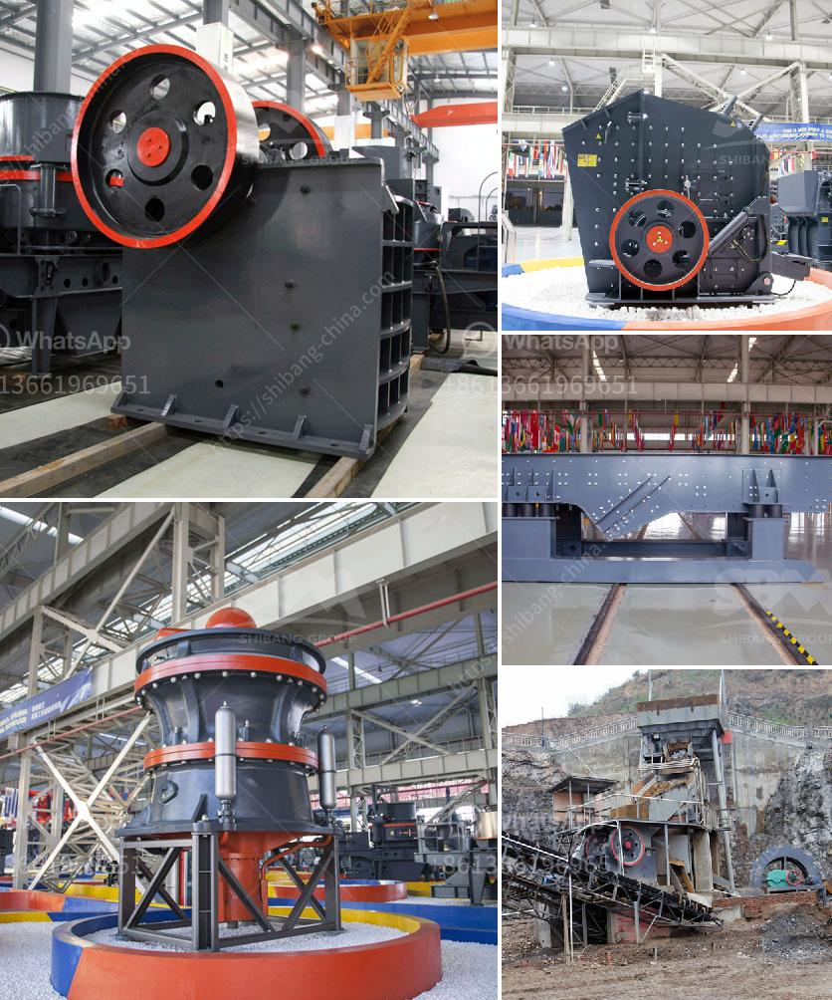

<h3>equipments of copper processing</h3>
Copper processing is a complex and intricate industrial process that involves various steps and requires different types of equipment to carry out each stage efficiently. From mining to smelting and refining, here are the key equipments involved in copper processing:

1. Mining equipment: Copper ore is extracted from underground or open-pit mines using drilling and blasting techniques. Heavy-duty machinery such as trucks, loaders, and drill rigs are used to extract the ore and transport it to the surface.

2. Crushing and grinding equipment: Once the ore is brought to the surface, it is crushed into smaller pieces to facilitate further processing. Crushing equipment, including jaw crushers and cone crushers, reduces the size of the ore particles. Grinding equipment, such as ball mills and SAG mills, further breaks down the ore into fine particles to enhance the copper extraction process.

3. Concentration equipment: After crushing and grinding, the next stage is to separate copper from the gangue (unwanted materials). Concentration equipment, including flotation cells and magnetic separators, is used to separate copper minerals from other minerals in the ore.

4. Smelting equipment: Smelting is the process of heating and melting the concentrated copper ore to remove impurities and produce a pure copper cathode. Furnaces, such as reverberatory furnaces and electric furnaces, are used for this purpose. The molten copper is then cast into molds to form ingots or transferred directly to the next stage of refining.

5. Refining equipment: To achieve the highest level of purity, the copper undergoes further refining. Electrorefining and fire refining are the two main methods used to remove remaining impurities and produce high-grade copper. Electrorefining cells and electrolytic tanks are used in the electrorefining process, while fire refining involves traditional smelting techniques.

6. Environmental control equipment: Copper processing can generate effluents and emissions that need to be carefully controlled to minimize their impact on the environment. Equipment such as scrubbers, filters, and dust collectors are used to capture and treat harmful substances released during various stages of copper processing.

In conclusion, copper processing relies on a range of specialized equipment to extract, separate, and refine copper ore efficiently while minimizing environmental impacts. From extraction to refining, each stage requires specific machinery designed for precise functionalities, ensuring the copper produced meets the desired quality standards.
<h3>Contact us</h3><ul><li><strong>Whatsapp:&nbsp;<a href="https://wa.me/8613661969651">+8613661969651</a></strong></li><li><a href="https://swt.shibang-china.com/?git&amp;zhl&amp;equipments of copper processing"><strong>Online Service(chat now)</strong></a></li></ul><h3>Related</h3><ul><li><a href='mobile gold processing plants 1 ton per.md'>mobile gold processing plants 1 ton per</a></li><li><a href='limestone manufacturer supplier egypt.md'>limestone manufacturer supplier egypt</a></li><li><a href='portable rock crushers bangalore.md'>portable rock crushers bangalore</a></li><li><a href='calculation of crushing plant.md'>calculation of crushing plant</a></li><li><a href='limestone ball mill machine.md'>limestone ball mill machine</a></li></ul>