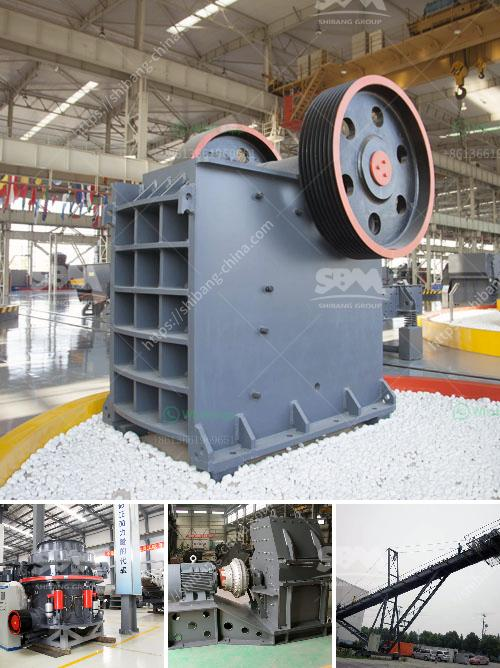

<h3>estimate cost simple stone crusher plant</h3>
Stone crushing plants are essential to the construction industry, as they produce the following materials which are required at various stages of construction:

The usage of stone crushing plants not only ensures that the construction sector keeps pace with the growing economy, but also promotes environmental conservation by preventing the depletion of natural resources. Therefore, it is important to estimate the cost of setting up a stone crusher plant.

To start a stone crusher plant, it is necessary to follow specific guidelines to ensure proper collection of dust and noise pollution control:

- Dust emitted during the crushing process can be harmful to the workers, their health, and the environment.

- Noise produced by the crushing machinery can disrupt the everyday activities of the surrounding population.

- Raw materials and supplies: These would include truckloads of rock, gravel, or sand to be used for the construction projects, as well as the machinery required for the process.

- Permit fees: Depending on the location, obtaining the necessary permits and licenses for the crusher plant may entail fees for processing and approval.

- Labor costs: Hiring skilled laborers and operators to run and maintain the stone crusher plant is essential. It is important to consider both the initial hiring expenses as well as the ongoing labor costs.

- Operational expenses: Regular maintenance, repairs, and fuel consumption should be considered in the estimate.

- Electricity and water supply: The plant would require a consistent supply of electricity and water to operate effectively. Determining these costs is vital for estimating the overall budget.

In conclusion, setting up a stone crusher plant requires careful planning and a well-executed budget. To ensure success, both environmental and economic factors must be taken into consideration. By estimating the costs beforehand, it is possible to get an idea of the required investment and avoid any financial setbacks in the future. Investing in a stone crusher plant can be a profitable venture if managed properly.
<h3>Contact us</h3><ul><li><strong>Whatsapp:&nbsp;<a href="https://wa.me/8613661969651">+8613661969651</a></strong></li><li><a href="https://swt.shibang-china.com/?git&amp;zhl&amp;estimate cost simple stone crusher plant"><strong>Online Service(chat now)</strong></a></li></ul><h3>Related</h3><ul><li><a href='stone crashers price in south africa.md'>stone crashers price in south africa</a></li><li><a href='clay processing techniques.md'>clay processing techniques</a></li><li><a href='jaw crusher for chrome ore for sale.md'>jaw crusher for chrome ore for sale</a></li><li><a href='rock crusher in dubai.md'>rock crusher in dubai</a></li><li><a href='pf trituradora de impacto.md'>pf trituradora de impacto</a></li></ul>