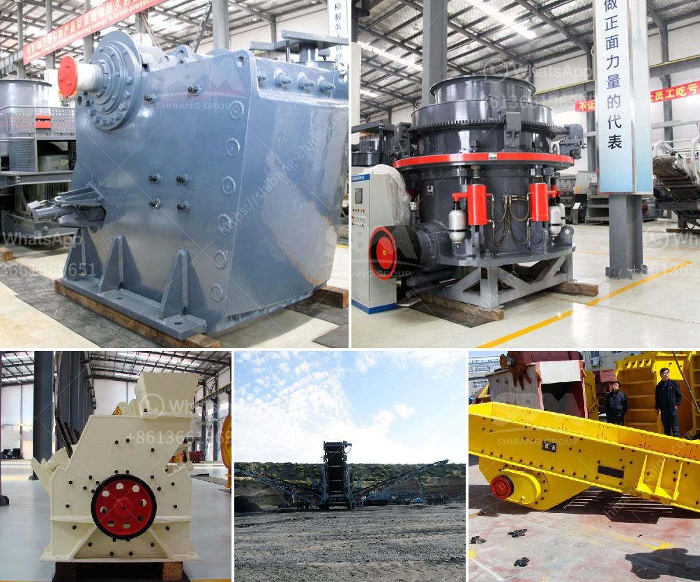

<h3>ethiopia gypsum machinery supplier</h3>
Ethiopia Gypsum Machinery Supplier: Driving Economic Growth through Construction and Mining Industries

Ethiopia, known for its rich history and diverse culture, has recently emerged as one of Africa's fastest-growing economies. This growth is largely attributed to the country's booming construction and mining industries. With a rising demand for infrastructure development and the presence of abundant natural resources, Ethiopia has become a prime market for machinery and equipment suppliers, including gypsum machinery.

Gypsum, a soft sulfate mineral, is widely used in the construction industry for its fire-resistant and sound-proofing properties. It is also a key ingredient in cement production, making it an essential material for infrastructure development. With Ethiopia's rapid urbanization and ambitious plans for industrialization, the demand for gypsum and related machinery has soared in recent years.

In response to this growing demand, many gypsum machinery suppliers have established their presence in Ethiopia, offering a wide range of machinery and equipment for gypsum mining, processing, and manufacturing. These suppliers play a crucial role in supporting the country's construction and mining industries, providing the necessary tools and technology to extract and process gypsum efficiently.

One such prominent supplier is [Supplier Name], a trusted name in the gypsum machinery industry. With years of experience and expertise, [Supplier Name] has been serving the needs of Ethiopian businesses involved in gypsum mining and manufacturing. They offer a comprehensive range of machinery, including crushers, mills, calciners, and dryers, designed to optimize gypsum processing operations.

By partnering with reliable gypsum machinery suppliers, Ethiopian businesses can benefit from advanced technology and equipment, leading to improved productivity and efficiency. The introduction of modern machinery also enhances safety standards, reducing the risk of accidents and ensuring a healthier working environment for employees.

Moreover, the presence of locally available gypsum reserves ensures a steady supply of raw materials for manufacturing gypsum-based products. This, in turn, stimulates the growth of downstream industries, such as the production of plasterboards, cement, and fertilizers. These industries contribute significantly to Ethiopia's economy, creating job opportunities and fueling economic growth.

In addition to supporting the construction and mining sectors, gypsum machinery suppliers also contribute to Ethiopia's sustainable development goals. Many suppliers prioritize environmental sustainability by offering advanced machinery that minimizes energy consumption and waste generation. This aligns with Ethiopia's commitment to reducing its carbon footprint and promoting eco-friendly practices.

Furthermore, gypsum machinery suppliers play a vital role in transferring technological know-how and expertise to local businesses. By providing training and support, they empower Ethiopian entrepreneurs to develop their skills and become self-sufficient in the long run. This knowledge transfer fosters innovation and enables local companies to compete internationally, promoting Ethiopia's economic development on a global scale.

In conclusion, Ethiopia's construction and mining industries are flourishing, creating a robust market for gypsum machinery suppliers. These suppliers not only meet the growing demand for gypsum and related machinery but also contribute to the country's economic growth, job creation, and sustainable development. By investing in advanced technology and local capacity building, Ethiopia is poised to become a regional powerhouse in the gypsum industry.
<h3>Contact us</h3><ul><li><strong>Whatsapp:&nbsp;<a href="https://wa.me/8613661969651">+8613661969651</a></strong></li><li><a href="https://swt.shibang-china.com/?git&amp;zhl&amp;ethiopia gypsum machinery supplier"><strong>Online Service(chat now)</strong></a></li></ul><h3>Related</h3><ul><li><a href='cement cement grinding ball mill.md'>cement cement grinding ball mill</a></li><li><a href='fly ash introduction in cement ball mill.md'>fly ash introduction in cement ball mill</a></li><li><a href='gypsum plant feasibility study.md'>gypsum plant feasibility study</a></li><li><a href='mobile crusher datasheet.md'>mobile crusher datasheet</a></li><li><a href='used gold mill for sale south africa.md'>used gold mill for sale south africa</a></li></ul>