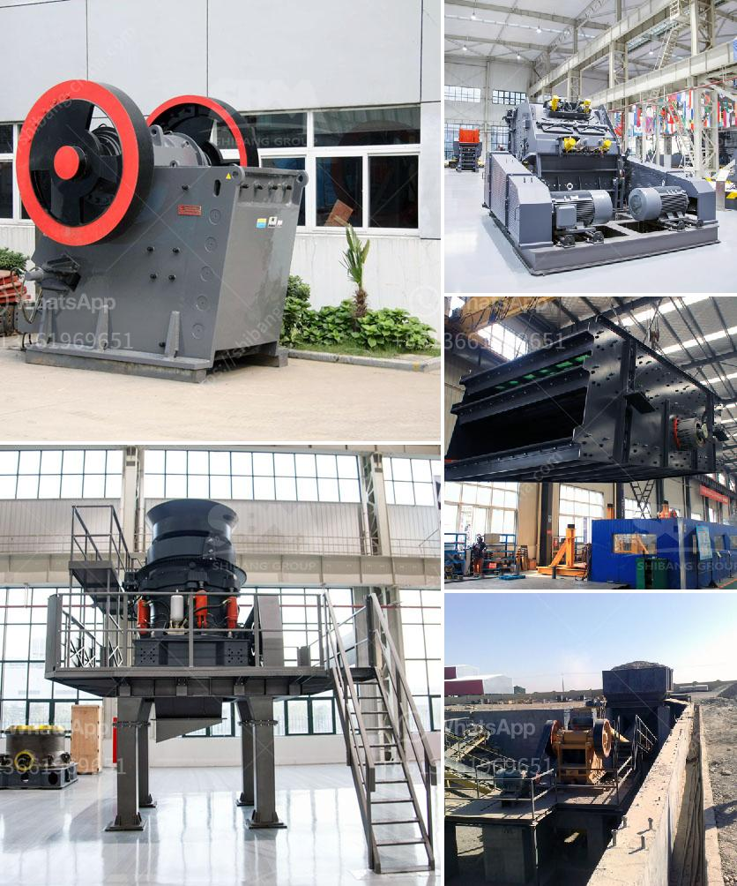

<h3>ethiopia widely used rock breaking</h3>
Ethiopia is a country known for its rich history, stunning landscapes, and diverse culture. However, one aspect that often goes unnoticed is the unique and traditional method of rock breaking widely used in the country.

Rock breaking in Ethiopia is a practice that has been passed down through generations and is still used extensively today. The technique involves breaking rocks manually using hand tools such as hammers, chisels, and wedges. The process requires immense physical strength, precision, and skill.

This traditional method of rock breaking is widely used for various purposes in Ethiopia. One of the key applications is in the construction industry. Ethiopians have mastered the art of breaking rocks into smaller pieces for building houses, roads, and other infrastructure projects. The rocks are broken into suitable sizes by skilled laborers, ensuring they fit perfectly into the required construction needs.

Additionally, this technique is also utilized in the mining industry. Ethiopia is known for its rich mineral deposits, and rock breaking is vital for extracting valuable minerals from the earth. Whether it is gold, marble, or other precious stones, the manual rock breaking method plays a significant role in obtaining these resources.

What makes this practice even more fascinating is the efficiency and speed at which the workers can break rocks. With years of experience behind them, these artisans demonstrate impressive dexterity and accuracy. They can break rocks with incredible precision, ensuring minimal wastage and maximum usability.

Moreover, the rock breaking technique in Ethiopia has become a part of the country's cultural heritage. It has been an integral part of the daily lives of many communities for centuries, showcasing their skills and resilience.

While modern technology and machinery have made their way into the construction and mining sectors, the traditional manual rock breaking method in Ethiopia continues to hold its place. The artisans take great pride in their work and consider it as an essential part of their identity and heritage.

In conclusion, Ethiopia's widely used rock breaking method is a testament to the country's rich history and cultural practices. This traditional technique showcases the skill, strength, and ingenuity of Ethiopian artisans. As the country continues to develop and modernize, it is crucial to preserve and appreciate this age-old practice, which represents the true essence of Ethiopia's heritage.
<h3>Contact us</h3><ul><li><strong>Whatsapp:&nbsp;<a href="https://wa.me/8613661969651">+8613661969651</a></strong></li><li><a href="https://swt.shibang-china.com/?git&amp;zhl&amp;ethiopia widely used rock breaking"><strong>Online Service(chat now)</strong></a></li></ul><h3>Related</h3><ul><li><a href='suppliers of ball mill in bhopal.md'>suppliers of ball mill in bhopal</a></li><li><a href='used complete tantalum processing plant for sale.md'>used complete tantalum processing plant for sale</a></li><li><a href='best crushers for manufactured sand.md'>best crushers for manufactured sand</a></li><li><a href='chrome wash plant for sale.md'>chrome wash plant for sale</a></li><li><a href='ball mill to crusher carbon charcoal.md'>ball mill to crusher carbon charcoal</a></li></ul>