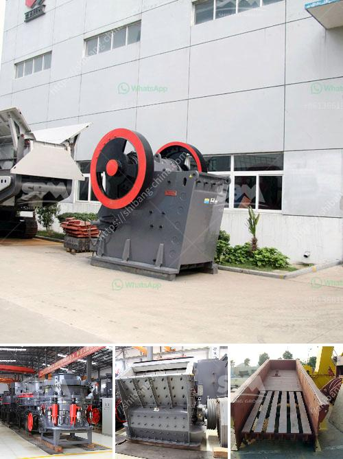

<h3>feasibility report on block making industry in nigeria</h3>
Nigeria, located in West Africa, is known for its bustling economy and growing infrastructure. Despite facing various challenges, such as poor road networks and inadequate housing options, the country presents significant opportunities for businesses in the construction sector. One such lucrative venture in Nigeria is the block making industry, which involves manufacturing and selling concrete blocks used for construction purposes. This article aims to provide a feasibility report on the block making industry in Nigeria, outlining its potential, challenges, and steps to establish a successful business in the sector.

The block making industry in Nigeria holds immense potential due to the country's rapid urbanization and population growth. As more people migrate from rural to urban areas, the demand for housing and infrastructure increases exponentially. Concrete blocks are widely used in various construction projects, including residential buildings, commercial spaces, and public infrastructure. This demand opens up excellent opportunities for entrepreneurs looking to invest in the block making industry.

However, like any business venture, starting a block making business in Nigeria comes with its share of challenges. The first challenge is securing adequate startup capital for equipment, raw materials, and manpower. Investing in block-making machinery, such as moulders and mixers, can require a significant initial investment. Entrepreneurs must carefully analyze their financial capabilities and consider obtaining bank loans or seeking investors to fund their ventures.

Another major challenge faced by the block making industry is the procurement of quality raw materials. The quality of concrete blocks depends on the ingredients used, such as cement, sand, and aggregates. Therefore, it is essential to establish relationships with reliable suppliers and ensure the consistent availability of high-quality materials to maintain the production standards.

Furthermore, competition in the block making industry can be intense. Many well-established players already dominate the market, making it necessary for new entrants to differentiate themselves. Entrepreneurs should focus on providing higher quality blocks, offering competitive prices, and delivering exceptional customer service to gain a competitive edge and establish a loyal customer base.

Establishing a successful block making business in Nigeria requires careful planning and execution. The following steps can guide entrepreneurs in establishing a feasible block making venture:

1. Conduct thorough market research: Understand the demand for blocks in your target area and analyze your potential customers' preferences, pricing patterns, and buying behavior.

2. Develop a comprehensive business plan: Outline the company's objectives, financial projections, marketing strategies, and operational plans. This plan will serve as a roadmap for your block making business and help attract potential investors.

3. Secure finances: Evaluate your financial capacities and explore various funding options, such as bank loans, grants, or partnerships, to obtain the necessary capital for equipment, raw materials, and operational expenses.

4. Acquire necessary equipment: Purchase efficient block-making machinery, such as moulders, mixers, and curing chambers, to ensure consistent and efficient production.

5. Establish reliable supply chains: Establish relationships with reputable suppliers for high-quality raw materials to maintain the production standards of your blocks.

6. Define a marketing strategy: Develop a robust marketing and advertising plan to reach potential customers and create awareness about your products. Leverage online platforms, social media, and targeted traditional marketing techniques to maximize your reach.

7. Monitor and evaluate: Constantly track your business's performance, customer satisfaction levels, and market trends. Regularly assess and revise your strategies to adapt to market variations and ensure the long-term success of your block making venture.

In conclusion, the block making industry in Nigeria presents significant opportunities for entrepreneurs looking to invest in the construction sector. Despite challenges related to financing, raw material procurement, and competition, success can be achieved by careful planning, securing reliable supply chains, offering high-quality products, and implementing effective marketing strategies. With proper feasibility analysis and diligent execution, starting a block making business in Nigeria can lead to long-term profitability and contribute to the country's infrastructure development.
<h3>Contact us</h3><ul><li><strong>Whatsapp:&nbsp;<a href="https://wa.me/8613661969651">+8613661969651</a></strong></li><li><a href="https://swt.shibang-china.com/?git&amp;zhl&amp;feasibility report on block making industry in nigeria"><strong>Online Service(chat now)</strong></a></li></ul><h3>Related</h3><ul><li><a href='tanzania stone crusher machine.md'>tanzania stone crusher machine</a></li><li><a href='design drawings of a hammer mill.md'>design drawings of a hammer mill</a></li><li><a href='process of mining silica rock crusher.md'>process of mining silica rock crusher</a></li><li><a href='stamp mill manufactures in south africa.md'>stamp mill manufactures in south africa</a></li><li><a href='crusher dimensions crusher conica.md'>crusher dimensions crusher conica</a></li></ul>