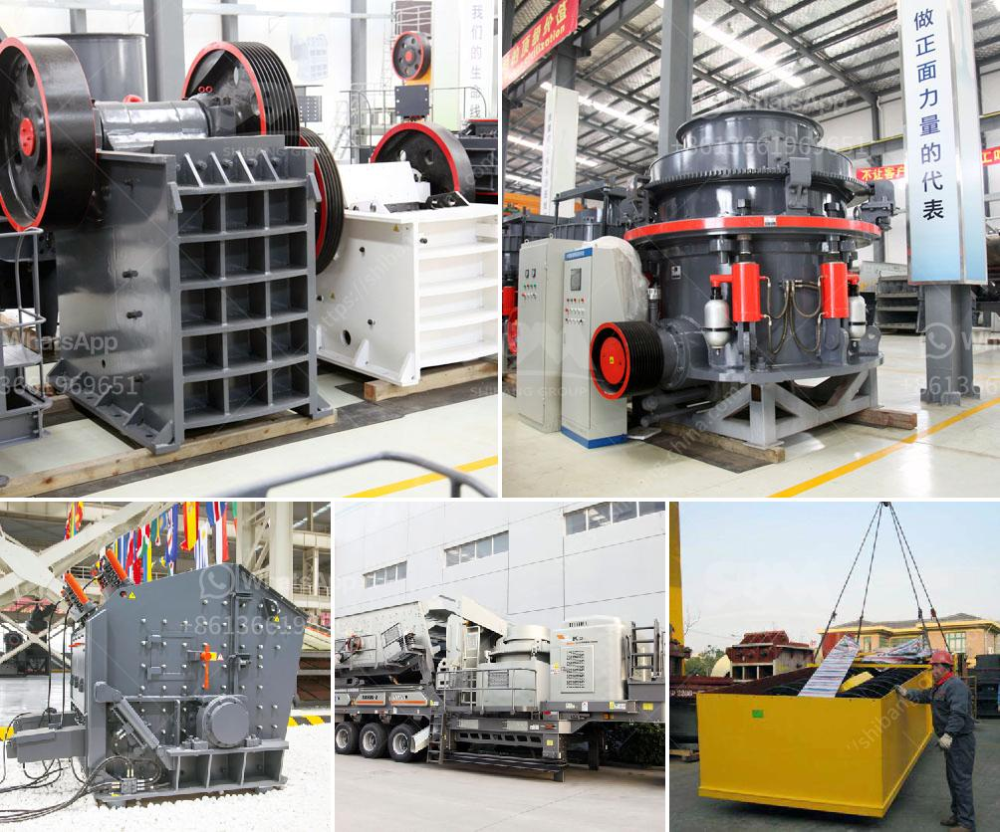

<h3>feldpar powder mill manufature</h3>
Feldspar powder mill manufacture plays a crucial role in the production of ceramics, glass, and various industrial applications. Feldspar, a widely abundant mineral found in the Earth's crust, contains a significant amount of alumina and alkalis like potassium and sodium. This composition makes it an essential ingredient in numerous manufacturing processes.

The process of manufacturing feldspar powder begins with mining the mineral from quarries. Once extracted, it undergoes various processes, including crushing, grinding, and milling, to obtain the desired particle size. This finely ground feldspar powder is then used in different industries, contributing to the production of an array of products.

The ceramic industry relies heavily on feldspar due to its unique properties. Feldspar acts as a fluxing agent, lowering the melting temperature of the ceramics and allowing the materials to fuse together more efficiently. This enhances the strength, durability, and color of ceramic products. Whether it's tiles, sanitary ware, or porcelain, feldspar plays a vital role in the overall quality of the finished goods.

Glass manufacturing also benefits from feldspar powder mill manufacture. Feldspar acts as a fluxing agent, reducing the melting temperature of the glass, enabling it to be molded easily. Moreover, the addition of feldspar also improves the chemical resistance and thermal stability of glass products. Its presence ensures that glass is more resistant to harsh environmental conditions, making it suitable for various applications such as bottles, windows, and tableware.

Industrial applications of feldspar extend beyond ceramics and glass. Feldspar powder is utilized as an ingredient in paints, rubber, and other polymer-based products. Its incorporation helps enhance the strength and adhesive properties of these materials, improving their overall performance. Feldspar also finds use in the construction industry, where it is mixed with cement to enhance its workability and durability.

Considering the wide range of applications and the crucial role it plays in manufacturing processes, the quality of feldspar powder mill manufacture becomes paramount. Reliable manufacturers focus on using high-grade feldspar ores and employ advanced milling techniques to ensure a product that meets industry standards and customer requirements.

To conclude, feldspar powder mill manufacture is an integral part of various industries, contributing to the production of ceramics, glass, and other industrial products. Its unique properties and ability to enhance material performance make it an essential mineral component in countless manufacturing processes. With quality control and optimizing manufacturing techniques, reliable manufacturers can continue to meet the growing demand for feldspar powder, driving advancements in various sectors around the world.
<h3>Contact us</h3><ul><li><strong>Whatsapp:&nbsp;<a href="https://wa.me/8613661969651">+8613661969651</a></strong></li><li><a href="https://swt.shibang-china.com/?git&amp;zhl&amp;feldpar powder mill manufature"><strong>Online Service(chat now)</strong></a></li></ul><h3>Related</h3><ul><li><a href='cold roll mills in turkey.md'>cold roll mills in turkey</a></li><li><a href='material composition for coal screen.md'>material composition for coal screen</a></li><li><a href='mtm trapezium grinder mill.md'>mtm trapezium grinder mill</a></li><li><a href='harga pe jc jaw crusher dan harga.md'>harga pe jc jaw crusher dan harga</a></li><li><a href='ball mill grinder canada.md'>ball mill grinder canada</a></li></ul>