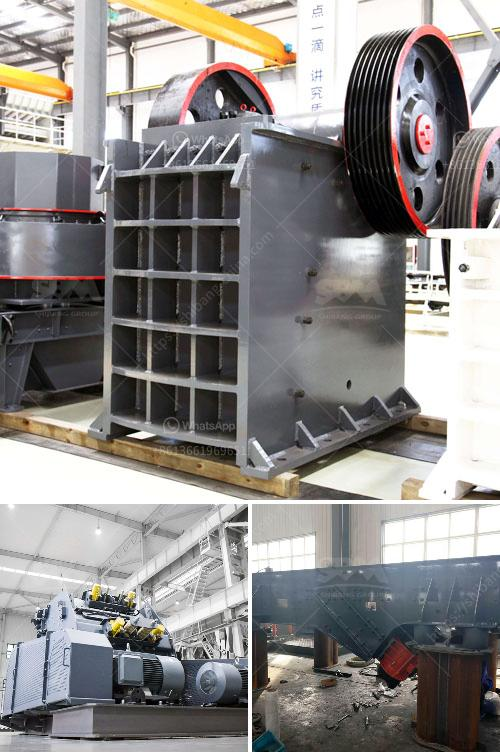

<h3>feldspar ball mill in kenya</h3>
Feldspar is an abundant mineral found in the earth's crust. It forms a major component of igneous, sedimentary, and metamorphic rocks, providing valuable insights into the Earth's geological history. The versatility of feldspar makes it a crucial raw material in various industries, including ceramics, glass manufacturing, and construction.

In Kenya, the demand for feldspar is growing due to the thriving construction industry and the increasing use of ceramics in various applications. To meet this demand, the feldspar ball mill in Kenya has been developed. This grinding equipment is a necessary tool for grinding different types of materials, such as feldspar, limestone, clay, and other minerals.

The feldspar ball mill is equipped with steel balls of different sizes to grind various fineness of materials, from coarse to fine. The discharge granularity can be adjusted by adjusting the rotation speed of the mill, thus obtaining the desired fineness of the ground material. Additionally, the feldspar ball mill in Kenya features a reliable structure and easy operation, making it highly efficient and user-friendly.

The use of the feldspar ball mill in Kenya enhances the performance of the final product. The high-quality surface finish and precise dimensions achieved through grinding lead to improved aesthetics and functional properties of ceramics, making them more desirable to consumers. Moreover, the feldspar ball mill contributes to cost savings as it reduces the need for manual grinding and ensures consistent results.

The feldspar ball mill can be used in both wet and dry grinding processes, and it can be applied to a wide range of materials, making it widely used in various industrial sectors. Its adaptability and efficiency make it an indispensable tool in the production of feldspar-based products in Kenya.

In conclusion, the feldspar ball mill in Kenya is a critical piece of equipment for grinding feldspar in various industries. Its efficiency and versatility contribute to the production of high-quality products while reducing production costs. As Kenya's construction and ceramics industries continue to grow, the feldspar ball mill is expected to play a vital role in meeting the increasing demands of these sectors.
<h3>Contact us</h3><ul><li><strong>Whatsapp:&nbsp;<a href="https://wa.me/8613661969651">+8613661969651</a></strong></li><li><a href="https://swt.shibang-china.com/?git&amp;zhl&amp;feldspar ball mill in kenya"><strong>Online Service(chat now)</strong></a></li></ul><h3>Related</h3><ul><li><a href='vibrating screen made in the philippines.md'>vibrating screen made in the philippines</a></li><li><a href='donesia lowongan kerja kuwait cement plant.md'>donesia lowongan kerja kuwait cement plant</a></li><li><a href='crush granite to powder.md'>crush granite to powder</a></li><li><a href='crushing plants south africa.md'>crushing plants south africa</a></li><li><a href='stone quarry drill machine crushers prices.md'>stone quarry drill machine crushers prices</a></li></ul>