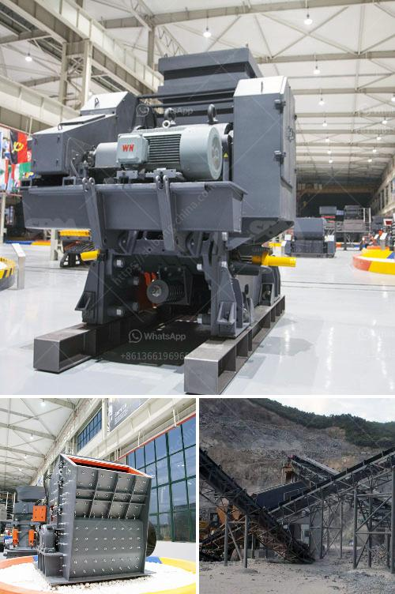

<h3>feldspar crusher cost</h3>
Feldspar is a common mineral found in igneous, metamorphic, and sedimentary rocks. It is widely used as a flux in the manufacturing of glass, ceramics, and porcelain. Additionally, it is used as an abundant source of aluminum, which is an essential component in the production of various household and industrial products.

To obtain feldspar powder, the ore material is first crushed by jaw crusher and then finely ground using a fine crusher or cone crusher. After crushing, the feldspar fragments are ground to the desired size, which is then mixed with other materials to create a variety of products.

The cost of feldspar crusher has always been one of the key issues that customers need to consider. Generally speaking, the cost of a feldspar crusher mainly includes three aspects: the cost of the machine itself, the cost of the supporting equipment, and the processing and wear parts costs. In terms of equipment price, different machine manufacturers have different production costs due to their different manufacturing processes, raw material costs, and profit margins. Therefore, the price of feldspar crusher in the market may vary.

The cost of supporting equipment includes the cost of conveyors, vibrating feeders, screening equipment, and other auxiliary equipment. These machines are required to transport the crushed feldspar material and ensure the smooth operation of the production line. The cost of supporting equipment can vary depending on the production capacity and specific requirements of the customer.

The processing and wear parts costs are also an important factor to consider. Feldspar crushers are subject to wear and tear during operation, and the vulnerable parts need to be replaced frequently. The cost of these parts will affect the overall operating cost of the crusher. Therefore, customers should choose a reliable and reputable manufacturer that provides high-quality and durable wear parts to reduce the cost of maintenance and replacement.

In addition to the above factors, the cost of feldspar crusher also depends on other factors such as transportation costs, market demand, and regional differences. For example, if the production site is far away from the processing plant, the transportation cost will increase, and vice versa. Similarly, if the demand for feldspar is high in a region, the price may be higher due to market forces.

To obtain an accurate and reasonable cost estimation for a feldspar crusher, it is recommended to consult multiple suppliers and compare their prices and services. A comprehensive analysis of various factors and careful consideration of specific requirements will help customers make an informed decision.

In conclusion, the cost of a feldspar crusher involves multiple factors, including the machine price, supporting equipment costs, and processing and wear parts costs. To make an informed decision, customers should carefully assess these factors, conduct market research, and consult multiple suppliers. By doing so, they can select a cost-effective feldspar crusher that meets their production needs while minimizing overall operating costs.
<h3>Contact us</h3><ul><li><strong>Whatsapp:&nbsp;<a href="https://wa.me/8613661969651">+8613661969651</a></strong></li><li><a href="https://swt.shibang-china.com/?git&amp;zhl&amp;feldspar crusher cost"><strong>Online Service(chat now)</strong></a></li></ul><h3>Related</h3><ul><li><a href='price of crushing machine.md'>price of crushing machine</a></li><li><a href='stone crusher machine price in ethiopia.md'>stone crusher machine price in ethiopia</a></li><li><a href='calcium carbonate production.md'>calcium carbonate production</a></li><li><a href='list iron ore pellet plants in india.md'>list iron ore pellet plants in india</a></li><li><a href='crusher hammer material grade.md'>crusher hammer material grade</a></li></ul>