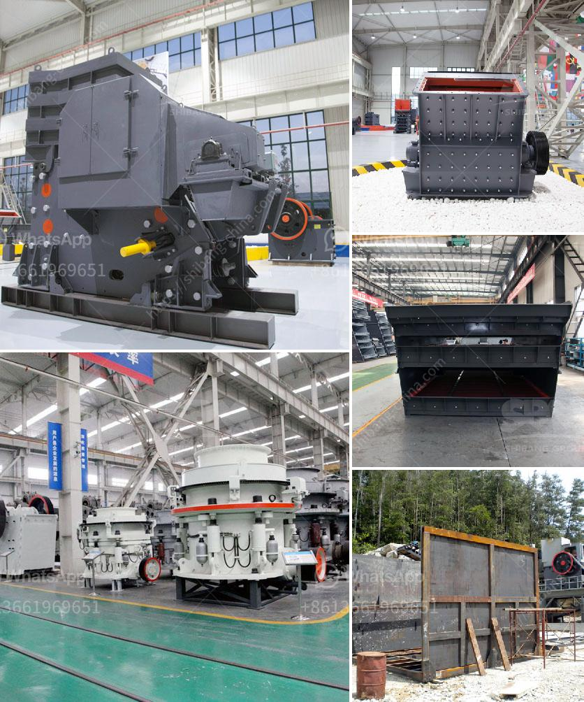

<h3>feldspar grinding ball mill</h3>
Feldspar is a common raw material used in glassmaking, ceramics, and to some extent as a filler and extender in paint, plastics, and rubber. In the glassmaking industry, feldspar is used as a flux to lower the melting temperature of the raw materials used, while in ceramics, feldspar is used as a flux to control the viscosity and improve the strength of the finished product. To prepare feldspar for use in various industries, it is often necessary to grind it into fine powder.

One of the most common ways to grind feldspar is with a ball mill, a highly efficient machine that uses grinding media to break down and refine the material. The ball mill consists of a rotating drum filled with grinding media, such as ceramic or metal balls, that grind the material into the desired size. As the drum rotates, the grinding media collide with each other and with the feldspar particles, breaking them down into smaller sizes.

There are several advantages to using a ball mill for grinding feldspar. Firstly, the machine is versatile and can easily handle a wide range of materials. Secondly, the machine has a large capacity that allows it to process large quantities of feldspar in a relatively short time. This makes it suitable for industrial-scale production. Thirdly, the ball mill can be operated at different speeds, allowing for precise control over the grinding process and the final product size.

In addition to these advantages, the ball mill is also cost-effective. The initial investment required to purchase and install the machine is relatively low, especially when compared to other grinding equipment. Furthermore, the operating costs are also minimal, as the machine does not require a lot of power or maintenance.

However, there are also some challenges associated with using a ball mill for feldspar grinding. The main challenge is the high energy consumption required for the process. This is especially true for large-scale production, where a significant amount of power is needed to drive the machine. Moreover, the ball mill tends to produce a narrow size distribution, limiting the range of particle sizes that can be efficiently achieved.

To overcome these challenges, various techniques have been developed to optimize the efficiency of the ball mill for grinding feldspar. For example, the grinding media can be selected to minimize wear and maximize efficiency. Additionally, the addition of certain chemicals during the grinding process can enhance the efficiency of the machine. These chemicals, known as grinding aids, can improve the flow properties of the material and reduce the energy consumption of the mill.

In conclusion, the ball mill is a versatile and efficient machine that is capable of grinding a variety of materials, including feldspar, for industrial purposes. The main advantages of the ball mill are its low initial cost, its large capacity, and its ability to be operated at different speeds. However, the high energy consumption and narrow size distribution are challenges that need to be addressed for optimal performance. Overall, the ball mill remains a widely used tool in the grinding industry, including for feldspar grinding.
<h3>Contact us</h3><ul><li><strong>Whatsapp:&nbsp;<a href="https://wa.me/8613661969651">+8613661969651</a></strong></li><li><a href="https://swt.shibang-china.com/?git&amp;zhl&amp;feldspar grinding ball mill"><strong>Online Service(chat now)</strong></a></li></ul><h3>Related</h3><ul><li><a href='dedusting systems for crushers.md'>dedusting systems for crushers</a></li><li><a href='crusher machine sale.md'>crusher machine sale</a></li><li><a href='cost of steel slag in tamil nadu.md'>cost of steel slag in tamil nadu</a></li><li><a href='process of mining silica rock crusher.md'>process of mining silica rock crusher</a></li><li><a href='china processing plants for sale.md'>china processing plants for sale</a></li></ul>