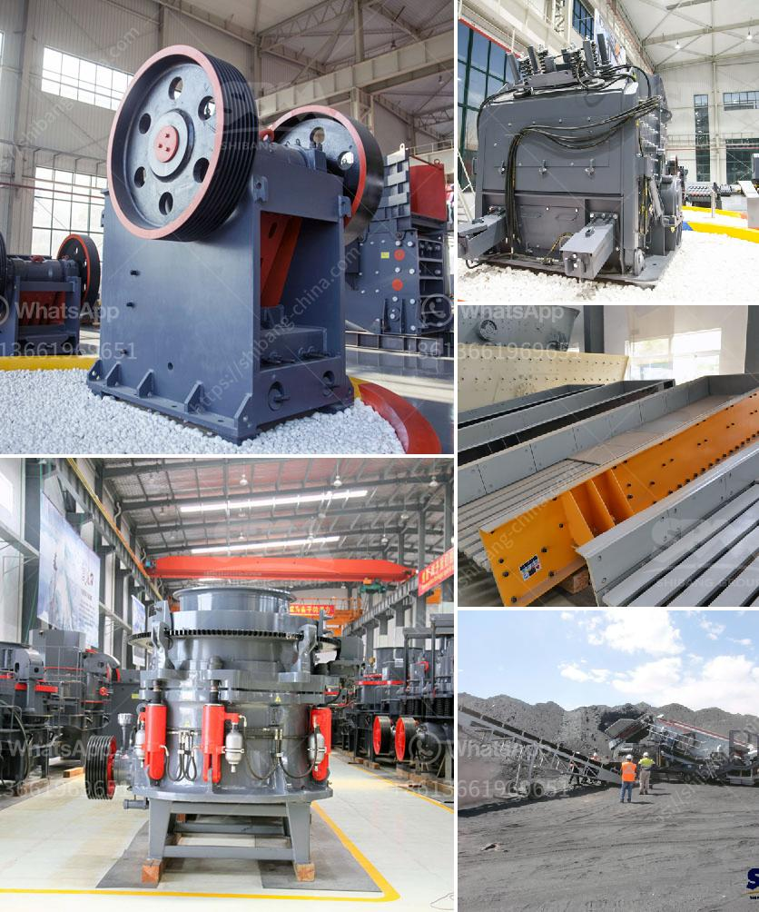

<h3>feldspar mining process</h3>
Feldspar is a mineral found in various rock formations in the earth's crust. It is commonly associated with igneous rocks, sedimentary rocks, and metamorphic rocks. Feldspar is widely used in industrial applications due to its unique properties like durability, electrical conductivity, and resistance to abrasion.

The process of extracting feldspar from the earth involves various methods depending upon the type of ore involved. First, feldspar is quarried from the earth's crust. It is then crushed and grounded into a fine powder, which is referred to as feldspar flour. The powdered feldspar is then sent for further processing to remove impurities and enhance its properties.

In the processing plant, the feldspar mineral undergoes several stages to obtain the desired grade and quality. Initially, the ore is crushed into smaller pieces using crushers or grinders. The crushed feldspar is then passed through a magnetic separator to remove any magnetic impurities.

Next, the feldspar particles are treated with chemicals and froth floatation is used to separate the feldspar from other minerals. This process involves using different reagents to create air bubbles, which attach to the feldspar particles and allow them to float to the surface while other minerals sink.

The froth containing the feldspar is then collected and dried before further processing. The dried concentrate is often subjected to additional grinding or milling to achieve the desired particle size. This step helps in improving the quality of the feldspar powder, making it suitable for various industrial applications such as ceramics, glass, and paints.

The final product is carefully inspected and tested for quality assurance before packaging and distribution for consumption. Feldspar mining processes vary depending on the minerals' composition and the desired end product. However, the overall process involves extracting, crushing, grinding, separating, and refining the feldspar to produce a high-quality product for industrial use.

In conclusion, the feldspar mining process plays a crucial role in providing essential minerals for various industrial applications. It involves several stages of extraction, grinding, separation, and refinement to produce a pure and high-quality feldspar product.
<h3>Contact us</h3><ul><li><strong>Whatsapp:&nbsp;<a href="https://wa.me/8613661969651">+8613661969651</a></strong></li><li><a href="https://swt.shibang-china.com/?git&amp;zhl&amp;feldspar mining process"><strong>Online Service(chat now)</strong></a></li></ul><h3>Related</h3><ul><li><a href='ballast crushing machinery.md'>ballast crushing machinery</a></li><li><a href='mobile stone crushing machine.md'>mobile stone crushing machine</a></li><li><a href='silica sand ball mill.md'>silica sand ball mill</a></li><li><a href='drawing for sand washing machines crusher mill.md'>drawing for sand washing machines crusher mill</a></li><li><a href='production process clinker zurich switzerland.md'>production process clinker zurich switzerland</a></li></ul>