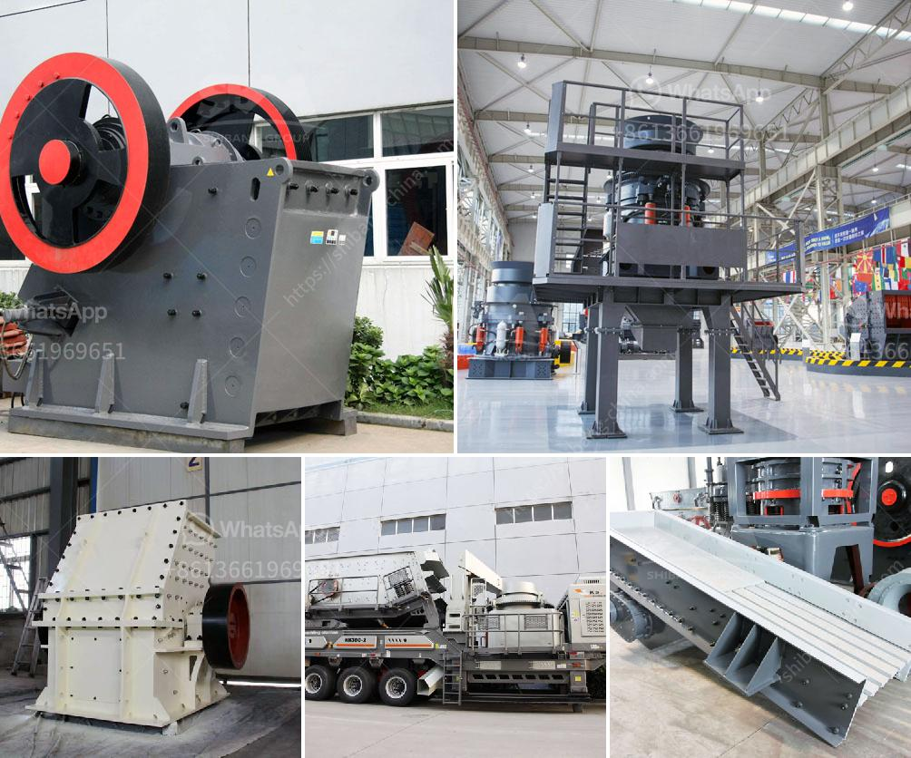

<h3>feldspar powder making machine in india</h3>
Feldspar is a common mineral found in igneous, sedimentary, and metamorphic rocks worldwide. It is also known as a Feldspar Group mineral due to its abundance and wide range of colors. Feldspar is used in various industries, including ceramics, glass manufacturing, and as a filler in paints, plastics, and rubber. In order to meet the growing demand for feldspar powder in India, various machines have been developed to efficiently process and produce high-quality feldspar powder.

One of the key machines used in this process is the feldspar powder making machine. It is a vertical roller mill that enables efficient grinding and separation of feldspar from other minerals. It uses a centrifugal force to grind materials, and the grinding roller and grinding ring are designed with a unique curved design, which increases the grinding efficiency and reduces the energy consumption.

The feldspar powder making machine is equipped with a pulse dust collector, which effectively collects dust and prevents pollution during the production process. The machine also has a sound-proofing device that reduces noise pollution, making it environmentally friendly.

Besides its excellent grinding performance, the feldspar powder making machine is also highly automated. It has a digital control system that monitors and adjusts the grinding process, ensuring consistent and uniform particle size distribution. The machine is also equipped with an automatic feeding and conveying system, which makes it suitable for continuous production.

The feldspar powder produced by this machine has a wide range of applications. It can be used as a raw material for ceramics, glass manufacturing, and chemical industries. It is also used as a flux in the production of welding electrodes and as a filler in the textile, rubber, and paint industries.

In conclusion, the feldspar powder making machine in India plays a vital role in the feldspar processing industry. It efficiently grinds and separates feldspar from other minerals, resulting in high-quality feldspar powder. The machine is not only efficient but also environmentally friendly, making it suitable for large-scale production in various industries. With the growing demand for feldspar powder in India, the development and utilization of this machine will contribute to the country's economic growth and industrial development.
<h3>Contact us</h3><ul><li><strong>Whatsapp:&nbsp;<a href="https://wa.me/8613661969651">+8613661969651</a></strong></li><li><a href="https://swt.shibang-china.com/?git&amp;zhl&amp;feldspar powder making machine in india"><strong>Online Service(chat now)</strong></a></li></ul><h3>Related</h3><ul><li><a href='layout design for stone crushing plant.md'>layout design for stone crushing plant</a></li><li><a href='used jaw mobile crusher in uae.md'>used jaw mobile crusher in uae</a></li><li><a href='thailand granite quarry crusher.md'>thailand granite quarry crusher</a></li><li><a href='types of vibratory screens.md'>types of vibratory screens</a></li><li><a href='china processing plants for sale.md'>china processing plants for sale</a></li></ul>