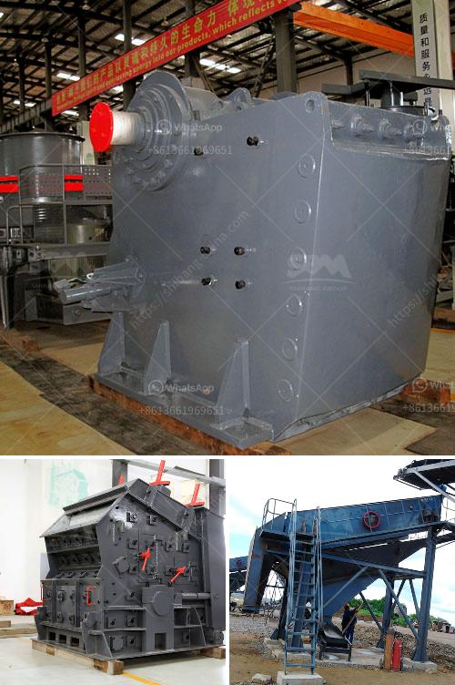

<h3>find a portable hand operated rock crusher</h3>
Are you tired of relying on a subcontractor to crush rocks in your construction site? Or maybe you need to crush rocks for your landscaping project but don't want to spend money on renting heavy machinery? Look no further than a portable hand-operated rock crusher. With this compact and efficient device, you can easily crush rocks wherever you need to, saving time and money.

The first advantage of a portable hand-operated rock crusher is its portability. Thanks to its small size and lightweight design, it can easily be taken from one location to another. Whether you are working on a demolition project or a landscaping job, you can quickly move the crusher to the site where it's needed. This means no more waiting for a subcontractor or spending time and money on transportation costs.

Another benefit of a portable hand-operated rock crusher is its simplicity. This is a simple device that requires minimal maintenance and no specialized training to operate. It typically consists of a metal plate with two handles. You place the rock between the plates, grip the handles, and apply pressure to break the rock. This straightforward operation makes it accessible to anyone, from novice DIYers to experienced professionals.

The portability and simplicity of a portable hand-operated rock crusher are complemented by its efficiency. This device is designed to crush rocks quickly and effectively. With a strong and durable construction, it can handle even the toughest rocks. Whether you are crushing limestone, granite, or other hard materials, this crusher can get the job done efficiently.

Furthermore, a portable hand-operated rock crusher is environmentally friendly. Unlike larger crushers that require electricity or fuel to operate, this rock crusher is powered by your own strength. It requires no energy consumption, therefore reducing your carbon footprint. Additionally, since it doesn't produce any harmful emissions, it provides a safer working environment for you and your crew.

When searching for a portable hand-operated rock crusher, it's important to consider the capacity. A crusher with a capacity of crushing rocks between 300 and 500 grams per minute is ideal for most small-scale operations. This capacity allows you to crush enough rocks in a short period, ensuring you stay productive without straining yourself.

In conclusion, finding a portable hand-operated rock crusher is a wise investment for anyone in need of crushing rocks. Its portability, simplicity, efficiency, and environmentally friendly nature make it a versatile tool that can be used in various industries. Whether you are a construction worker, a landscaper, or a DIY enthusiast, this rock crusher can help you accomplish your tasks with ease. So say goodbye to subcontractors and heavy machinery rentals, and start crushing rocks on your own terms.
<h3>Contact us</h3><ul><li><strong>Whatsapp:&nbsp;<a href="https://wa.me/8613661969651">+8613661969651</a></strong></li><li><a href="https://swt.shibang-china.com/?git&amp;zhl&amp;find a portable hand operated rock crusher"><strong>Online Service(chat now)</strong></a></li></ul><h3>Related</h3><ul><li><a href='gypsum production plant suppliers in pakistan.md'>gypsum production plant suppliers in pakistan</a></li><li><a href='used portable stone crushers for sale ontario.md'>used portable stone crushers for sale ontario</a></li><li><a href='rock crusher machine in malaysia.md'>rock crusher machine in malaysia</a></li><li><a href='for sale stone crusher in sri lanka.md'>for sale stone crusher in sri lanka</a></li><li><a href='mobile crushing plant price.md'>mobile crushing plant price</a></li></ul>