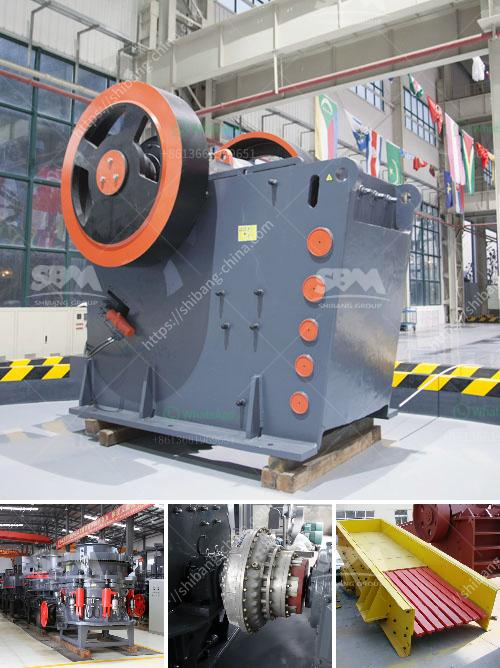

<h3>fine powder grinding machine</h3>
Fine powder grinding machine, also known as powder grinding mill, is a kind of Raymond mill. It is widely used in grinding process of mining materials in metallurgy, building materials, chemicals, mining minerals areas. The material after grinding processing has fine particle size and uniform distribution, which is beneficial to improve material performance, improve product quality and enhance market competitiveness.

The fine powder grinding machine has a simple structure, firmness, stable operation and excellent performance. The size of the finished product can be adjusted between 80-325 meshes, and provides a high-yield and low-energy grinding mill for various non-metallic mineral industries. This powder making machine is suitable for processing materials such as limestone, calcite, calcium carbonate, barite, talc, gypsum, diabase, quartz, bentonite, etc.

The grinding chamber of the machine adopts a unique air flow control ring, which can effectively control the air flow in the chamber, so as to prevent the grinding chamber from being blocked due to excessive airflow. At the same time, there is a grading device in the machine, which can control the particle size of the finished product, so as to achieve the desired fineness. Moreover, the grinding roller and grinding ring of the machine are made of special wear-resistant steel, which can prolong the service life of the machine.

The fine powder grinding machine has the advantages of low investment, low energy consumption, high efficiency, and stable operation. It is an ideal choice for the grinding industry. With the continuous improvement of technology and the development of fine powder market, more and more industries are adopting this grinding machine to produce high-quality powder products.

In conclusion, the fine powder grinding machine is a stable and reliable grinding equipment with high grinding efficiency and low energy consumption. It is widely used in the grinding industry to process various non-metallic minerals. The machine has made great contributions to the development of the fine powder market and has a broad market prospect.
<h3>Contact us</h3><ul><li><strong>Whatsapp:&nbsp;<a href="https://wa.me/8613661969651">+8613661969651</a></strong></li><li><a href="https://swt.shibang-china.com/?git&amp;zhl&amp;fine powder grinding machine"><strong>Online Service(chat now)</strong></a></li></ul><h3>Related</h3><ul><li><a href='used hammer mill.md'>used hammer mill</a></li><li><a href='quicklime production process.md'>quicklime production process</a></li><li><a href='mobile crushing and screening zimbabwe.md'>mobile crushing and screening zimbabwe</a></li><li><a href='crusher for crushing limestone.md'>crusher for crushing limestone</a></li><li><a href='iron ore crushing plant in germany.md'>iron ore crushing plant in germany</a></li></ul>