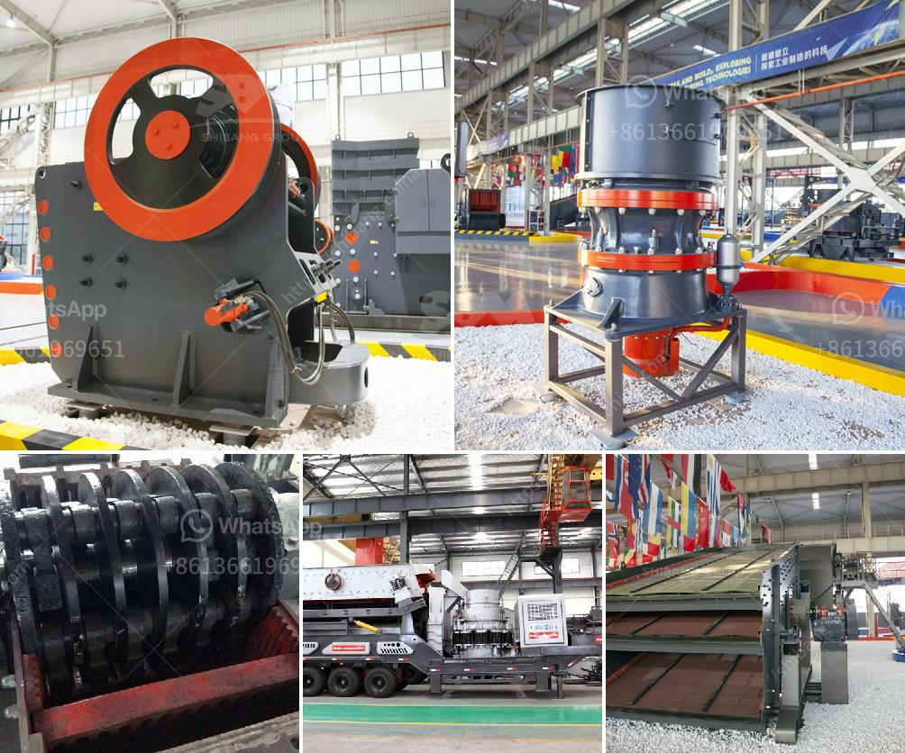

<h3>fine powder milling machines</h3>
Fine powder milling machines are essential in obtaining a high-quality end product in various industries. These machines are known for their ability to finely grind materials into a powder-like consistency, enabling easy dispersion and mixing in subsequent processes. This article will explore the importance of fine powder milling machines and how they function.

One primary application of fine powder milling machines is in the pharmaceutical industry. In this sector, precision is crucial as even slight variations in particle size can impact the efficacy and dosage of medications. Fine powder milling machines excel in achieving consistent particle sizes, ensuring uniformity in dosage and enhancing the dissolution rate of medications. Pharmaceutical manufacturers rely on these machines to produce powders that are easy to encapsulate or integrate into tablets, capsules, or suspensions.

The food industry is another sector that greatly benefits from fine powder milling machines. Many food products, such as spices, flours, and additives, require finely ground particles to enhance taste, texture, and shelf life. Fine powder milling machines allow for precise control over the particle size distribution, resulting in homogenous and finely textured food products. These machines are also vital in the production of powdered beverages, soups, and dessert mixes, as they enable quick dissolution and smooth consistency.

In the chemical industry, fine powder milling machines play a crucial role in producing powders with specific properties. By controlling particle size and distribution, these machines help manufacturers achieve desired characteristics such as improved flowability, increased surface area, and enhanced reactivity. This is essential for applications such as catalysts, pigments, dyes, and fillers.

The functionality of fine powder milling machines is driven by several key mechanisms. Most commonly, these machines utilize grinding or pulverizing techniques to reduce the material size. Impact mills, pin mills, and ball mills are commonly used milling machines in this process. These machines work by subjecting the material to high-speed rotating elements that break down the particles through repetitive impact, friction, and compression forces.

To achieve the desired particle size, fine powder milling machines often incorporate various size reduction strategies. These include screens, air classifiers, and mechanical separators that help control the size and distribution of the final product. By employing these techniques, manufacturers can refine their powders to meet precise specifications.

It is worth noting that selecting the right fine powder milling machine is crucial to achieving optimal results. Factors such as the type of material, desired particle size, production capacity, and maintenance requirements need to be considered. Consulting with a knowledgeable supplier is vital to ensure the machine aligns with specific processing needs.

In conclusion, fine powder milling machines are indispensable in a range of industries. From pharmaceuticals to food and chemicals, these machines enable precise control over particle size and distribution, resulting in high-quality, consistent products. They offer numerous benefits, including improved dissolution rates, enhanced texture, and optimized reactivity. Selecting the right milling machine is essential for achieving desired results, and manufacturers should consult experts to ensure the machine meets their specific requirements.
<h3>Contact us</h3><ul><li><strong>Whatsapp:&nbsp;<a href="https://wa.me/8613661969651">+8613661969651</a></strong></li><li><a href="https://swt.shibang-china.com/?git&amp;zhl&amp;fine powder milling machines"><strong>Online Service(chat now)</strong></a></li></ul><h3>Related</h3><ul><li><a href='bentonite clay crusher for sale.md'>bentonite clay crusher for sale</a></li><li><a href='price hammer crusher nigeria.md'>price hammer crusher nigeria</a></li><li><a href='material composition for coal screen.md'>material composition for coal screen</a></li><li><a href='new crushing machines in oman.md'>new crushing machines in oman</a></li><li><a href='used 900 cone crusher for sale.md'>used 900 cone crusher for sale</a></li></ul>