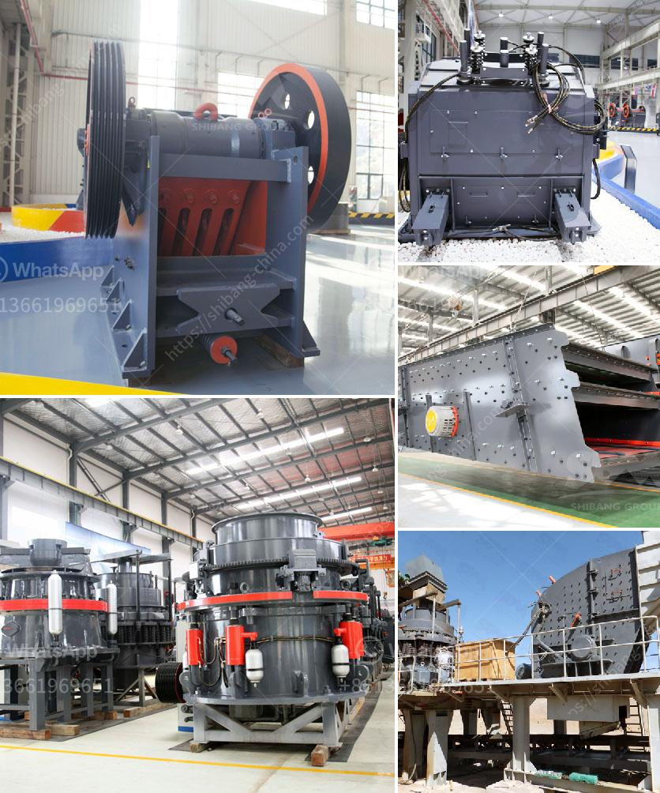

<h3>flow sheet diagram for ceramic industry</h3>
A flow sheet diagram is an essential tool in the ceramic industry as it outlines the various steps involved in the production of ceramics. This diagram provides a visual representation of the manufacturing process, allowing industry professionals to understand the sequence of operations and make informed decisions.

The flow sheet diagram typically begins with the raw materials, which can include clay, feldspar, silica, and other additives. These materials are often sourced from different locations, so the diagram illustrates the transportation and storage of the raw materials in the initial stages.

The next step in the flow sheet is the preparation of the raw materials. This may involve grinding, crushing, or milling to achieve the desired particle size. The diagram showcases the equipment and machinery used in this stage and helps in identifying potential bottlenecks or inefficiencies.

Once the raw materials are prepared, they are mixed together in a process known as blending. The flow sheet diagram highlights the mixing equipment and the sequence of operations involved in ensuring a homogenous mixture.

After blending, the material is shaped into the desired form, such as tiles, bricks, or sanitaryware. This shaping process is often achieved through techniques like extrusion, pressing, or casting. The flow sheet diagram depicts these shaping methods, including the equipment used and any additional steps, such as drying or glazing.

The final stages of the ceramic production process are firing and finishing. The flow sheet diagram illustrates the kilns or furnaces used for firing, as well as the temperature and duration required for the specific ceramic products. Finishing processes, such as polishing or painting, are also included in the diagram.

In conclusion, a flow sheet diagram is an invaluable tool in the ceramic industry. It provides a comprehensive overview of the production process, ensuring clarity and efficiency in the manufacturing of ceramics. By using this visual representation, stakeholders can identify areas for improvement, enhance productivity, and optimize the quality of the final ceramic products.
<h3>Contact us</h3><ul><li><strong>Whatsapp:&nbsp;<a href="https://wa.me/8613661969651">+8613661969651</a></strong></li><li><a href="https://swt.shibang-china.com/?git&amp;zhl&amp;flow sheet diagram for ceramic industry"><strong>Online Service(chat now)</strong></a></li></ul><h3>Related</h3><ul><li><a href='gypsum mines in orissa india.md'>gypsum mines in orissa india</a></li><li><a href='crusher plant project cost.md'>crusher plant project cost</a></li><li><a href='mica powder machine in pakistan.md'>mica powder machine in pakistan</a></li><li><a href='ton crushing machine.md'>ton crushing machine</a></li><li><a href='nigeria stone grinder mill.md'>nigeria stone grinder mill</a></li></ul>