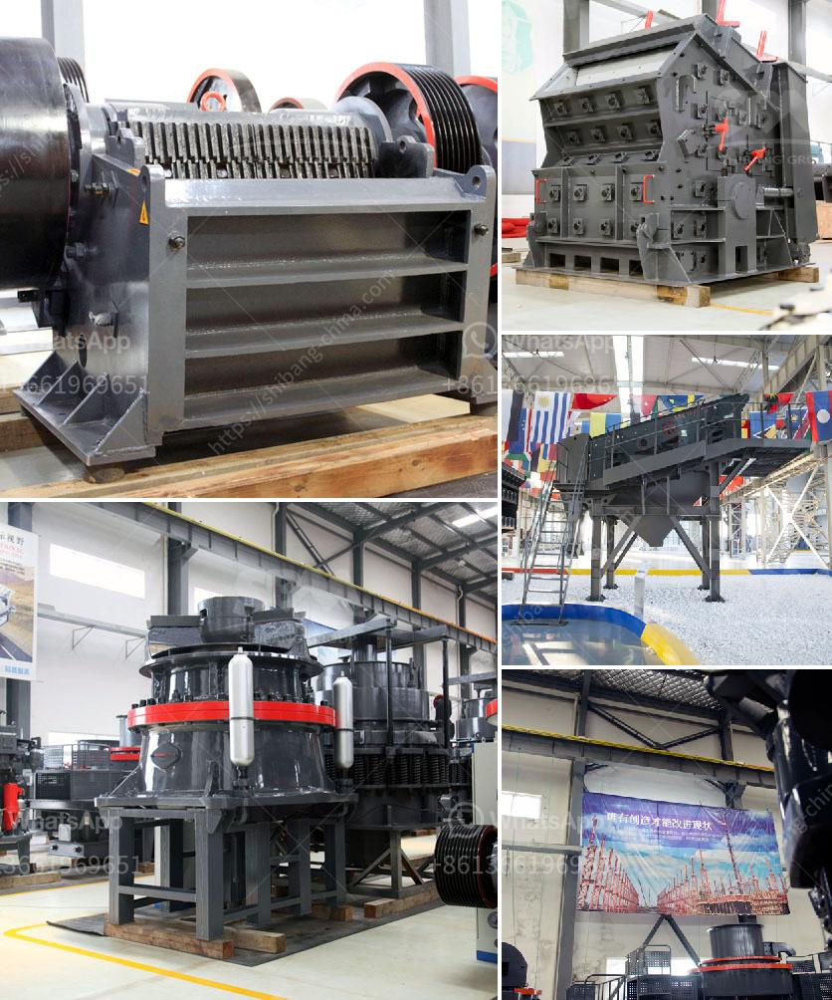

<h3>flowchart for beneficiation of iron ore</h3>
Iron ore is one of the vital raw materials used in various steel manufacturing industries. It is the key component of steel which helps in delivering strength, ductility, and durability to the final product. As a result, it is imperative to ensure that this mineral is processed effectively and efficiently to obtain the desired iron content.

A flowchart is a visual representation of a process that helps in planning, execution, and monitoring of complex tasks. In the context of iron ore beneficiation, the importance of flowcharts in the beneficiation process cannot be understated. The flowchart is a critical component in the planning and execution of beneficiation projects as it provides an overview of the entire beneficiation process, including the flow of materials, equipment requirements, and anticipated outputs.

The iron ore beneficiation process consists of several stages, each designed to provide the maximum possible yield and purity in terms of iron content. The stages of beneficiation are as follows:

1. Crushing and grinding: The primary step involves passing the raw ore through a crusher to reduce its size to manageable particles. This is followed by grinding the ore to fine powder to increase the surface area for further processing.

2. Washing and screening: The fine powder obtained from grinding is then passed through a washing and screening process to remove impurities such as silica and alumina. This step helps in enhancing the grade of the ore by eliminating unwanted materials.

3. Gravity separation: Gravity separation techniques are utilized to separate the iron ore from other gangue materials based on their specific gravity. This involves using water and gravity forces to separate the heavier iron ore particles from the lighter gangue minerals.

4. Magnetic separation: Magnetic separation techniques are employed to separate magnetic materials, such as magnetite, from non-magnetic materials. This process is particularly useful in removing impurities present in the iron ore, thereby raising its quality.

5. Flotation: Flotation is a process that utilizes differences in the surface properties of minerals to separate valuable minerals from the gangue minerals. In the context of iron ore beneficiation, flotation is used to separate iron-bearing minerals from silicate minerals.

6. Drying and conditioning: Once the iron ore has been successfully separated from the gangue materials, it needs to be dried to remove any remaining moisture. This is followed by conditioning, where the ore is mixed with certain chemicals to enhance its market value.

7. Pelletization: Pelletization is the process of converting fine iron ore particles into pellets, which serve as a valuable feedstock for steel production. This involves adding binders to the iron ore to form pelletized agglomerates that can resist high temperatures in the blast furnace.

By following a well-designed flowchart for the beneficiation of iron ore, an organization can achieve optimum efficiency, reduced costs, and enhanced profitability. The flowchart provides a clear roadmap for the entire beneficiation process, from raw material handling to pelletization. It helps in identifying potential bottlenecks, optimizing equipment utilization, and streamlining operations.

In conclusion, a well-designed flowchart plays a crucial role in effective and efficient beneficiation of iron ore. It serves as a planning tool, enabling organizations to understand the entire process and make informed decisions. By following the flowchart, an organization can maximize the yield and quality of the final product, thereby improving its market competitiveness and profitability.
<h3>Contact us</h3><ul><li><strong>Whatsapp:&nbsp;<a href="https://wa.me/8613661969651">+8613661969651</a></strong></li><li><a href="https://swt.shibang-china.com/?git&amp;zhl&amp;flowchart for beneficiation of iron ore"><strong>Online Service(chat now)</strong></a></li></ul><h3>Related</h3><ul><li><a href='business plan for small scale gold processing plant.md'>business plan for small scale gold processing plant</a></li><li><a href='ball mill grinding manufacturer in india.md'>ball mill grinding manufacturer in india</a></li><li><a href='milling equipment ball mill.md'>milling equipment ball mill</a></li><li><a href='ethiopia gypsum machinery supplier.md'>ethiopia gypsum machinery supplier</a></li><li><a href='ball mill 5 tonnes.md'>ball mill 5 tonnes</a></li></ul>