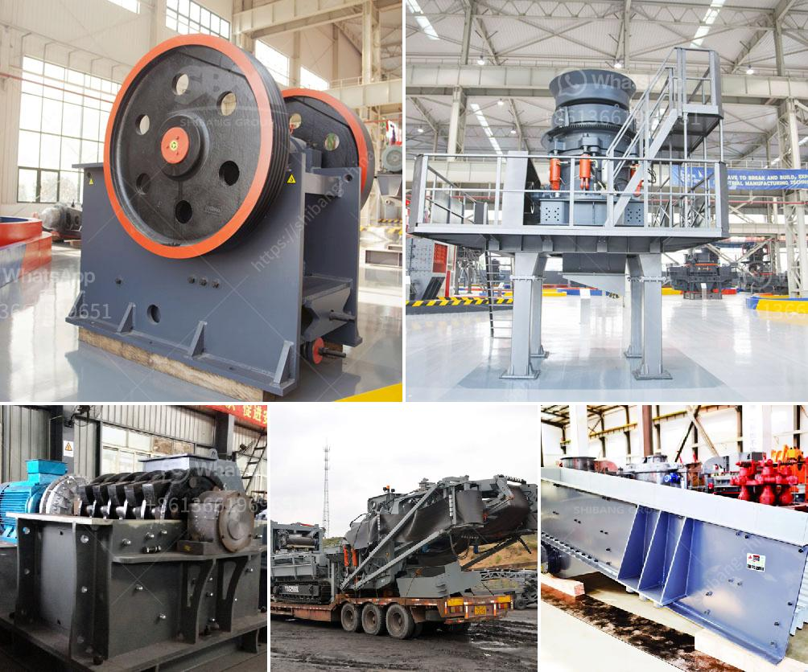

<h3>fly ash introduction in cement ball mill</h3>
Fly ash is a byproduct of coal burning power plants, and it is used as a substitute for traditional cement in concrete mixtures. The use of fly ash in concrete has been found to increase the strength and durability of the material, making it an ideal ingredient for construction projects.

One popular method of using fly ash in concrete is by incorporating it into the cement ball mill. With the addition of fly ash, the particles are ground into a fine powder before being mixed with water and other materials into a concrete mixture. This process ensures the even distribution of fly ash particles throughout the entire mixture, resulting in a more consistent and stronger concrete product.

There are several benefits to using fly ash in cement ball mill. First and foremost, it is an eco-friendly alternative to traditional cement. By reusing a byproduct of coal burning power plants, the use of fly ash reduces the need for extracting and processing raw materials, thus reducing the environmental impact of cement production.

Additionally, the incorporation of fly ash in cement ball mill has been found to improve the workability of the concrete mixture. This means that it is easier to mix, pour, and shape, making it a preferred choice for construction projects. The increased workability also allows for more efficient construction processes, saving time and reducing labor costs.

Moreover, fly ash in cement ball mill enhances the strength and durability of the concrete. Due to its unique chemical composition, fly ash reacts with calcium hydroxide to form additional compounds within the concrete mixture. These compounds serve as fillers, filling in gaps and voids in the concrete matrix, resulting in a denser and stronger material.

Furthermore, the use of fly ash in cement ball mill can improve the long-term performance of concrete structures. Fly ash has been found to reduce the risk of early-age cracking and improve resistance to chemical attack, such as from sulfates found in soil or water. This can extend the service life of concrete structures, reducing the need for costly repairs or replacement.

In conclusion, the use of fly ash in cement ball mill has shown tremendous potential in the construction industry. It is a sustainable and cost-effective alternative to traditional cement, offering numerous benefits such as increased workability, strength, and durability. As the demand for environmentally friendly construction materials continues to grow, the incorporation of fly ash into concrete mixtures will likely become more prevalent.
<h3>Contact us</h3><ul><li><strong>Whatsapp:&nbsp;<a href="https://wa.me/8613661969651">+8613661969651</a></strong></li><li><a href="https://swt.shibang-china.com/?git&amp;zhl&amp;fly ash introduction in cement ball mill"><strong>Online Service(chat now)</strong></a></li></ul><h3>Related</h3><ul><li><a href='stone crusher plant in punjab.md'>stone crusher plant in punjab</a></li><li><a href='used ball mill for calcium carbonate sell india.md'>used ball mill for calcium carbonate sell india</a></li><li><a href='gravel stone crusher plant.md'>gravel stone crusher plant</a></li><li><a href='chrome concentrate wash plant for sale.md'>chrome concentrate wash plant for sale</a></li><li><a href='rock crusher production screen mesh.md'>rock crusher production screen mesh</a></li></ul>