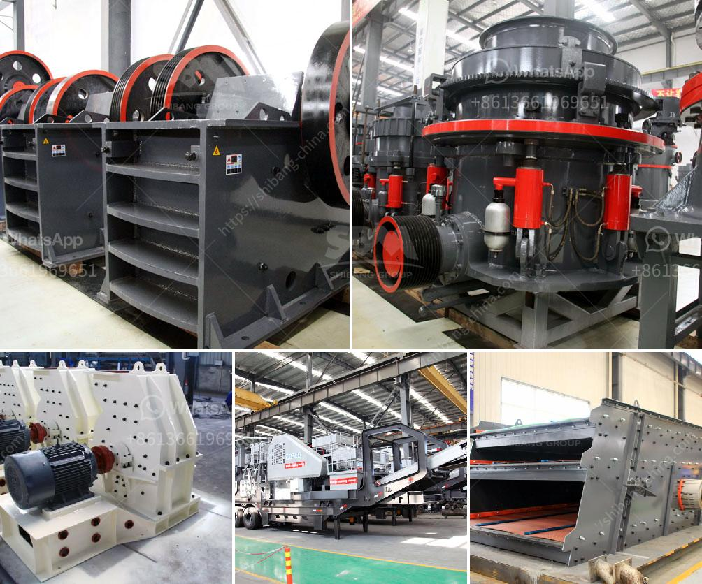

<h3>for a new stone quarry crusher in uganda</h3>
Uganda, a landlocked country in East Africa, is renowned for its natural beauty and diverse wildlife. However, the country is struggling to address its growing infrastructure and housing needs. With a population of over 45 million people, there is a high demand for construction materials, including stones. To meet this demand, the government has embarked on an ambitious plan to establish a new stone quarry crusher within the vicinity of the proposed Namanve Industrial Park.

The crusher, capable of handling 1,000 tonnes of stones per hour, will be installed at the Namanve site adjacent to where the government has steadily been building an industrial park. This new crusher is set to provide exceptional processing capacity, enabling the quarry to produce high volumes of aggregate materials to cater to the needs of the construction industry.

One of the primary advantages of the new crusher is its mobility. Being a mobile unit, it can be easily transported to different sites, ensuring a continuous supply of crushed stones to various construction projects across the country. This will significantly reduce the cost and time required to transport materials from distant quarries, benefiting both the suppliers and the consumers.

Furthermore, this new stone quarry crusher will help provide sustainable employment opportunities to the local community. The existing quarry sites in the country are poorly equipped and offer limited job opportunities. The crusher, therefore, will provide an alternative source of income to the local community, reducing dependency on low-paying manual labor jobs.

Additionally, the establishment of a new stone quarry crusher in Uganda will contribute to the ongoing efforts to develop the economy by shifting towards a more industrialized, modernized and mechanized sector. Revenue generated from the crushing of stones will be used to develop other infrastructure projects in the country, thereby improving the country's infrastructure network.

In conclusion, investing in the establishment of a new stone quarry crusher in Uganda is a win-win opportunity for both the government and the local community. It provides a much-needed boost to the construction industry, which will stimulate economic growth and create jobs. Moreover, it ensures the availability of a vital construction material while also reducing transportation costs and environmental impact. By embracing this new project, Uganda is taking a significant step towards its development goals.
<h3>Contact us</h3><ul><li><strong>Whatsapp:&nbsp;<a href="https://wa.me/8613661969651">+8613661969651</a></strong></li><li><a href="https://swt.shibang-china.com/?git&amp;zhl&amp;for a new stone quarry crusher in uganda"><strong>Online Service(chat now)</strong></a></li></ul><h3>Related</h3><ul><li><a href='sand wash plant for sale in india.md'>sand wash plant for sale in india</a></li><li><a href='cost of a hammer mill.md'>cost of a hammer mill</a></li><li><a href='stone crushing contractors california.md'>stone crushing contractors california</a></li><li><a href='mini concrete crusher in united kingdom.md'>mini concrete crusher in united kingdom</a></li><li><a href='talcum powder manufacturing process.md'>talcum powder manufacturing process</a></li></ul>