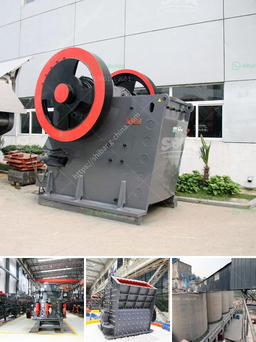

<h3>for sale stone crusher in sri lanka</h3>
Stone crushers are used to crush large size stones into smaller size particles. They are widely used in various industries, such as mining, construction, metallurgy, chemical, and so on. Different types of crushers can be used for different crushing needs.

The most common types of stone crushers are jaw crusher, impact crusher, cone crusher, and vertical shaft impact crusher. Jaw crusher, also known as primary crusher, is mainly used for crushing various rock materials. Impact crusher is used for crushing larger rocks into smaller particles for secondary crushing. Cone crusher is a kind of advanced crusher with high power, large crushing ratio, and high productivity. Vertical shaft impact crusher is commonly used for processing medium-hard materials, such as limestone, basalt, and granite.

In Sri Lanka, crusher machines are widely used for crushing hard and brittle materials, such as granite, limestone, coal, iron ore, mica, quartz, and so on. The stone crusher machines in Sri Lanka are sold by many professional manufacturers around the world. Different manufacturers have different types of crushing equipment for sale.

Stone crusher machines mainly include jaw crusher, impact crusher, cone crusher, and vertical shaft impact crusher. The jaw crusher is used for primary crushing and the impact crusher is used for secondary crushing. The cone crusher and vertical shaft impact crusher are used for tertiary crushing.

Nowadays, many customers from Sri Lanka prefer to import stone crusher machines instead of buying locally. This is mainly because of the high quality and affordable price of the imported machines. In addition, imported machines often have better performance, longer service life, and lower maintenance costs compared to locally manufactured machines.

When choosing a stone crusher machine, customers need to consider various factors, such as the required final product size, the capacity of the machine, the input size of the raw material, and the desired output size. Different machines have different specifications and features to meet different crushing needs.

It is worth mentioning that in Sri Lanka, crusher machines are widely used in the mining industry. Mining is one of the most important industries in Sri Lanka, and it has contributed significantly to the country's economic growth. The demand for various minerals, including precious metals, gemstones, and industrial minerals, has driven the growth of the mining industry, which in turn has increased the demand for stone crusher machines.

In conclusion, stone crusher machines in Sri Lanka are widely used in the mining, construction, metallurgy, chemical, and other industries for crushing various rocks and ores. Different types of stone crusher machines can be chosen according to the requirements of customers. The imported machines often provide better performance and lower maintenance costs. Therefore, it is advisable for customers in Sri Lanka to consider importing stone crusher machines for their crushing needs.
<h3>Contact us</h3><ul><li><strong>Whatsapp:&nbsp;<a href="https://wa.me/8613661969651">+8613661969651</a></strong></li><li><a href="https://swt.shibang-china.com/?git&amp;zhl&amp;for sale stone crusher in sri lanka"><strong>Online Service(chat now)</strong></a></li></ul><h3>Related</h3><ul><li><a href='mini rock crushers for sale.md'>mini rock crushers for sale</a></li><li><a href='working of ball mill in hindi.md'>working of ball mill in hindi</a></li><li><a href='stone crusher machine pakistan.md'>stone crusher machine pakistan</a></li><li><a href='dolomite crushing machine.md'>dolomite crushing machine</a></li><li><a href='nigeria stone grinder mill.md'>nigeria stone grinder mill</a></li></ul>