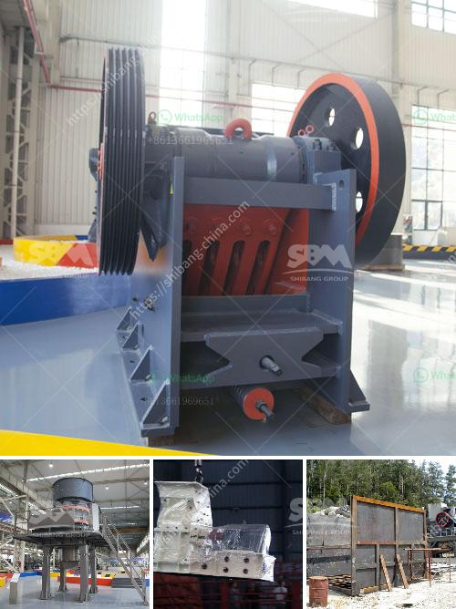

<h3>for selection of coal mill</h3>
When it comes to selecting the right coal mill for your industrial facility, several factors need to be considered in order to ensure efficient and reliable operation. The coal mill plays a crucial role in the coal-fired power generation process, as it helps to grind and dry the coal particles before they are fed into the boiler furnace.

One of the primary considerations in selecting a coal mill is its grinding capacity. The grindability of the coal determines the ease with which it can be ground and hence, the energy consumption of the mill. It is important to choose a coal mill that can handle the required grinding capacity, especially during periods of peak demand. A mill with a higher grinding capacity will enable you to meet the power generation needs of your facility efficiently.

Another important factor to consider is the reliability and availability of the coal mill. A reliable mill is crucial for uninterrupted power generation, as any breakdown or unscheduled maintenance can lead to downtime and loss of productivity. It is recommended to select a mill that has a proven track record of reliability, with minimal instances of breakdowns and high availability.

The level of automation and control is also an important consideration when selecting a coal mill. Mills with advanced control systems can help optimize the grinding process and achieve greater efficiency. These systems can monitor and control variables such as coal flow, air flow, and temperature, ensuring optimal conditions for grinding. Additionally, advanced control systems can also facilitate preventive maintenance by providing real-time data on the mill's performance.

The overall cost of ownership is another critical factor to consider. This includes the initial investment cost, as well as the operational and maintenance costs associated with the mill. It is important to select a mill that offers a good balance between cost and performance. While a lower upfront cost may seem attractive, it is essential to consider the long-term operational and maintenance costs. A high-quality mill may have a higher initial investment, but it can offer lower operational and maintenance costs over its lifetime.

Lastly, it is important to consider the environmental impact of the coal mill. As the world is increasingly focused on sustainable energy solutions, it is essential to select a mill that meets the latest environmental standards. This includes ensuring low emissions and efficient combustion of coal. Mills with advanced combustion systems and emission control technologies can help reduce the environmental impact of coal-fired power generation.

In conclusion, selecting the right coal mill is vital for efficient and reliable power generation. Factors such as grinding capacity, reliability and availability, level of automation and control, overall cost of ownership, and environmental impact should be carefully considered when making a decision. By choosing a mill that meets these criteria, industrial facilities can ensure smooth and efficient operations, while also reducing their environmental footprint.
<h3>Contact us</h3><ul><li><strong>Whatsapp:&nbsp;<a href="https://wa.me/8613661969651">+8613661969651</a></strong></li><li><a href="https://swt.shibang-china.com/?git&amp;zhl&amp;for selection of coal mill"><strong>Online Service(chat now)</strong></a></li></ul><h3>Related</h3><ul><li><a href='calcium carbonate crusher.md'>calcium carbonate crusher</a></li><li><a href='ball mill grinder canada.md'>ball mill grinder canada</a></li><li><a href='machinery for talc manufacturing.md'>machinery for talc manufacturing</a></li><li><a href='portable jaw crushers.md'>portable jaw crushers</a></li><li><a href='list iron ore pellet plants in india.md'>list iron ore pellet plants in india</a></li></ul>