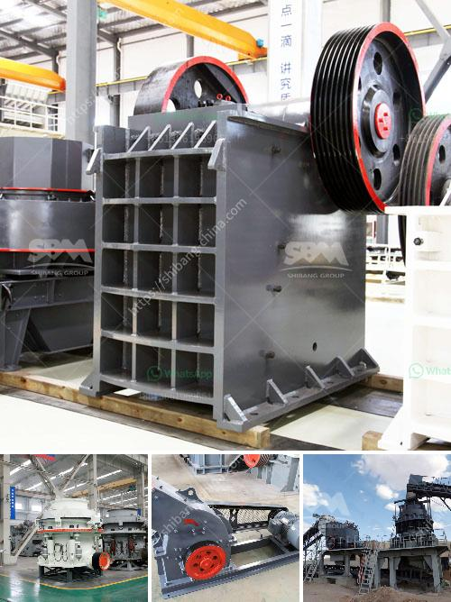

<h3>functions of the part of a hammer mill</h3>
A hammer mill is a versatile machine that is used in various industries. One of the key functions of this machine is to shred and crush material into smaller pieces. This article explains various functions of hammer mills and their benefits.

- Shredding and Crushing: The primary function of a hammer mill is to shred and crush material into smaller pieces. It achieves this by repeatedly hitting the material against a series of hammers, which are mounted on a rotating shaft. The material is fed into the mill through a feed hopper, and as it enters the grinding chamber, the hammers strike and break it into smaller particles.

- Size Reduction: Hammer mills are widely used in industries like agriculture, forestry, and food processing, where the raw material needs to be reduced in size for various purposes. For example, in the agricultural industry, hammer mills are used to grind grain into flour or animal feed. In forestry, they are used to reduce wood chips and other biomass materials into smaller particles for processing.

- Mixing and Blending: Another function of a hammer mill is mixing and blending different materials. Some industries require a homogeneous mixture of various components, and a hammer mill can effectively combine different materials. The hammers agitate the materials, ensuring proper mixing and blending. This function is particularly useful in the feed industry when different ingredients need to be mixed to create a balanced animal feed.

- Pulverizing: Hammer mills are also used for pulverizing or grinding materials into fine particles. It is widely used in chemical and pharmaceutical industries where fine grinding of powders is required. The hammers strike the material with high impact force, reducing it to a fine powder. This pulverizing function is crucial in industries where particle size distribution is important for product quality.

- Biomass Conversion: Hammer mills play a crucial role in the conversion of biomass into renewable energy sources. In the biomass industry, bulky raw materials like wood chips, straw, and corn stalks need to be reduced in size to improve their handling and combustion properties. Hammer mills efficiently break down these biomass materials into smaller particles, making them suitable for further processing, such as pelletization or gasification.

- Recycling: Hammer mills are extensively used in recycling operations to process various materials like e-waste, plastic, and rubber. These materials often require size reduction before they can be recycled. A hammer mill can efficiently process these materials, reducing them to smaller particles that can be easily separated and recycled.

In conclusion, a hammer mill is a versatile machine that performs several important functions in various industries. From shredding and crushing to mixing and blending, a hammer mill is an indispensable machine for many processes. It is widely used in industries like agriculture, forestry, food processing, chemical, and recycling. Its ability to reduce material size, pulverize, and create homogeneous mixtures makes it a valuable asset in any industrial setting.
<h3>Contact us</h3><ul><li><strong>Whatsapp:&nbsp;<a href="https://wa.me/8613661969651">+8613661969651</a></strong></li><li><a href="https://swt.shibang-china.com/?git&amp;zhl&amp;functions of the part of a hammer mill"><strong>Online Service(chat now)</strong></a></li></ul><h3>Related</h3><ul><li><a href='crusher plant distributor in saudi arabia.md'>crusher plant distributor in saudi arabia</a></li><li><a href='how to remove gold dust from sand.md'>how to remove gold dust from sand</a></li><li><a href='to buy medium mounted stone crusher in uk.md'>to buy medium mounted stone crusher in uk</a></li><li><a href='list of equipments needed to start gold mining.md'>list of equipments needed to start gold mining</a></li><li><a href='stone processing equipment in south africa.md'>stone processing equipment in south africa</a></li></ul>