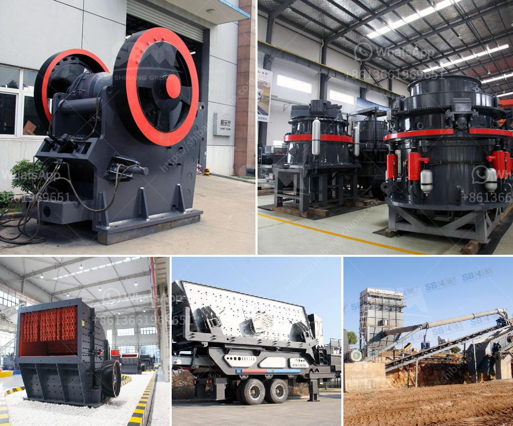

<h3>georgia cement mini plant</h3>
The construction industry plays a vital role in the growth and development of any country. One of the key components in construction activities is cement, which is used extensively in the production of concrete. In the beautiful country of Georgia, a new project has been initiated to meet the increasing demand for cement – the Georgia Cement Mini Plant.

Located in a strategic area, the Georgia Cement Mini Plant has been established to cater to the growing needs of the construction sector in the region. With a capacity to produce a significant quantity of cement, this plant is poised to contribute to the country's infrastructure development.

One of the main advantages of having a mini plant is its ability to offer a localized solution. By establishing a cement production facility within the country, Georgia will reduce its dependence on imported cement. This will not only save valuable foreign exchange reserves but also promote the growth of local industries and create new employment opportunities for the people.

The Georgia Cement Mini Plant aims to provide high-quality cement that meets international standards. By utilizing advanced technology and modern machinery, the plant is capable of producing cement with superior strength and durability. This will ensure that the construction projects in Georgia are completed efficiently and stand the test of time.

The establishment of a mini plant also brings environmental benefits. With the use of cleaner and more efficient production methods, the Georgia Cement Mini Plant aims to reduce its carbon footprint. Strict adherence to environmental regulations and the implementation of sustainable practices will contribute to a greener and more sustainable future for the country.

The Georgia Cement Mini Plant is also expected to have a positive impact on the local economy. Apart from creating direct employment opportunities, the plant will also drive indirect employment by supporting other industries in the supply chain. This includes the transportation sector, raw material suppliers, and various service providers. The increased economic activity will lead to an overall improvement in the standard of living for the people of Georgia.

Foreign investors have shown immense interest in the Georgia Cement Mini Plant, which demonstrates the confidence in the country's potential for growth. This project not only attracts investment but also fosters collaboration between local and international players. The exchange of knowledge and expertise will contribute to the development of Georgia's manufacturing sector.

Moreover, the establishment of a mini plant provides an opportunity for Georgia to become self-sufficient in cement production. The availability of locally produced cement will ensure a steady supply for ongoing and future construction projects, eliminating the risk of supply shortages or price fluctuations due to external factors.

In conclusion, the Georgia Cement Mini Plant is a significant step towards the development of the construction industry in the country. With its local solution, high-quality output, environmental benefits, and contribution to the economy, this project is poised to have a far-reaching impact on Georgia's infrastructure development. As the country progresses towards self-sufficiency in cement production, it will pave the way for a brighter and more prosperous future.
<h3>Contact us</h3><ul><li><strong>Whatsapp:&nbsp;<a href="https://wa.me/8613661969651">+8613661969651</a></strong></li><li><a href="https://swt.shibang-china.com/?git&amp;zhl&amp;georgia cement mini plant"><strong>Online Service(chat now)</strong></a></li></ul><h3>Related</h3><ul><li><a href='stone crushing production line.md'>stone crushing production line</a></li><li><a href='vertical cement mill grinding plant.md'>vertical cement mill grinding plant</a></li><li><a href='carbon black processing machine in delhi.md'>carbon black processing machine in delhi</a></li><li><a href='milling equipment ball mill.md'>milling equipment ball mill</a></li><li><a href='how much does a crusher.md'>how much does a crusher</a></li></ul>