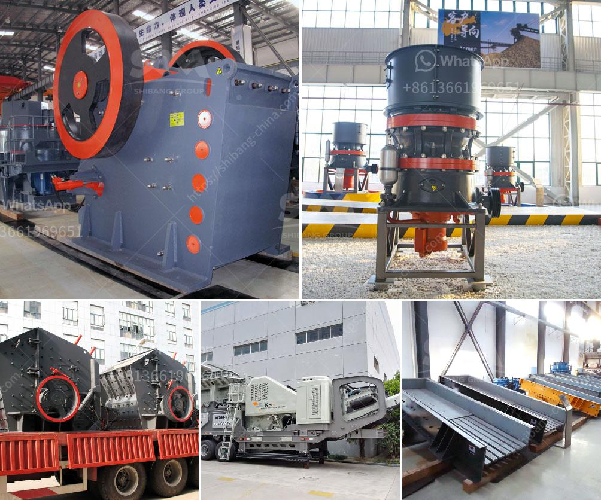

<h3>germany stone crusher 30tph</h3>
Germany stone crusher is a powerful crushing machine for stone crushing industry in Germany. It has seven expansion plans in Germany: three new mills in Lengerich, Bünde, and Uetersen, a new quarry plant in Walterplatz, and a fast-growing suburb of Stolberg and Quierscheid. 

The stone crusher plant in Germany is built with flexible price, simple structure, and large crushing ratio, with high crushing efficiency and uniform product size. It can crush various types of ores and rocks, such as limestone, granite, marble, basalt, iron ore, river pebbles, construction waste, etc. The stone crusher machine is widely used in mining, metallurgy, building materials, road, railway, water conservancy, and chemical industry.

The 30tph stone crusher in Germany includes HPT hydraulic cone crusher, VSI crusher (sand making machine), vibrating screen, belt conveyor, and other auxiliary equipment. The HPT cone crusher has the advantages of high crushing efficiency, strong production capacity, and good finished particles. It can effectively process various hard and medium-hard materials, such as granite, limestone, basalt, iron ore, etc.

The VSI crusher, also known as the sand making machine, is the key equipment for the artificial sand production. It can crush and shape the stone materials, which has the advantages of uniform particle size and good grain shape. The VSI crusher is widely used in crushing and shaping of various rocks, ores, and building aggregates.

The Germany stone crusher 30tph is equipped with excellent performance hydraulic control system. It is easy to operate, and the operator can quickly adjust the discharge size and clear the cavity. The maintenance and operation of the machine are also very convenient. The production capability is greatly improved with the adoption of intelligent control system.

In addition to the stone crusher machine, Germany also has a reputable stone crusher manufacturer. They provide various stone crushers with different specifications and performance to meet the needs of different customers. The products are of high quality and competitive price, which has been widely recognized by customers both at home and abroad.

The Germany stone crusher 30tph is an excellent crusher machine for stone crushing industry in Germany. It can produce aggregates in different specifications and qualities, which meets the needs of various construction projects. The Germany stone crusher 30tph can ensure the reliable production. The overall investment price has been greatly reduced. In addition, it has excellent environmental protection performance and low operating cost, making it an ideal choice for stone crushing operations.

In conclusion, the Germany stone crusher 30tph is a reliable and efficient crushing machine. It is an ideal choice for stone crushing industry in Germany. The machine is stable and easy to operate, and it has a large production capacity. With intelligent control system and low operating cost, it has become the preferred equipment for stone crushing in Germany. Whether it is mining, metallurgy, building materials, or other industries, the Germany stone crusher 30tph can meet the requirements of various crushing operations and greatly improve the overall production efficiency.
<h3>Contact us</h3><ul><li><strong>Whatsapp:&nbsp;<a href="https://wa.me/8613661969651">+8613661969651</a></strong></li><li><a href="https://swt.shibang-china.com/?git&amp;zhl&amp;germany stone crusher 30tph"><strong>Online Service(chat now)</strong></a></li></ul><h3>Related</h3><ul><li><a href='second hand mobile crusher plant.md'>second hand mobile crusher plant</a></li><li><a href='portable crushing equipment.md'>portable crushing equipment</a></li><li><a href='used stone crusher machine for sale in uae.md'>used stone crusher machine for sale in uae</a></li><li><a href='limestone small crusher machine.md'>limestone small crusher machine</a></li><li><a href='how to 100tph stone crushing plant.md'>how to 100tph stone crushing plant</a></li></ul>