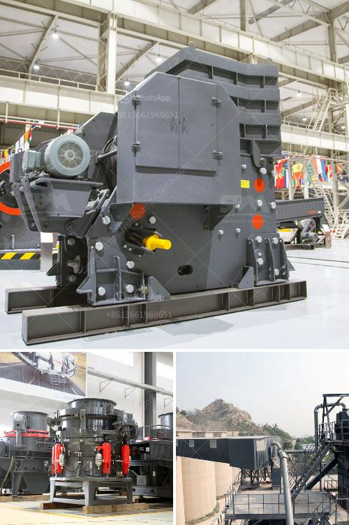

<h3>gold crusher machine</h3>
Gold is a precious metal that has been highly valued throughout history. It has been used in various forms for different purposes, ranging from jewelry to currency and industrial applications. To extract gold from its ores, mining operations often utilize crushing machines to break down the rock into smaller pieces. These machines, known as gold crushers, are robust and powerful enough to reduce the size of the ore particles down to a few millimeters. In this article, we will explore the importance of gold crusher machines and their role in the gold mining process.

One of the primary objectives of the gold mining industry is to find and extract gold deposits from the earth. Gold is usually found embedded within quartz veins or other hard rock formations. Before gold can be extracted, the rock must be broken down into smaller pieces. This is where gold crusher machines come into play.

Gold crushers are heavy-duty machines that are designed to break down the rock and allow for easier extraction of gold from the ores. They come in different types, including jaw crushers, cone crushers, and impact crushers. Each of these machines has its own unique features and advantages, depending on the specific requirements of the mining operation.

Jaw crushers are commonly used in gold mining operations due to their ability to crush large pieces of ore into smaller particles. They are widely used in primary crushing stages and have a high processing capacity. Jaw crushers use compressive force to break down the rock by applying pressure to it.

Cone crushers, on the other hand, are commonly used in secondary and tertiary crushing stages. They are efficient in reducing the size of the ore particles and have a higher crushing ratio compared to jaw crushers. Cone crushers operate by squeezing the rock between an eccentrically gyrating spindle and a concave surface.

Impact crushers are versatile machines that can be used in both primary and secondary crushing stages. They are particularly effective in cases where the ore particles are soft or friable. Impact crushers work by throwing the ore against a solid plate, causing it to break into smaller pieces.

In addition to their primary function of crushing the ore, gold crushers also play a crucial role in ensuring the efficiency and productivity of the overall mining process. By breaking down the rock into smaller particles, these machines make it easier for gold to be extracted from the ores. Furthermore, the crushed ore can be transported and processed more efficiently through subsequent stages, such as milling and leaching.

In conclusion, gold crusher machines are essential equipment in the gold mining industry. They are designed to break down the rock into smaller particles, allowing for easier extraction of gold from the ores. These machines come in different types and have their own unique features and advantages. By using gold crushers, mining operations can increase their efficiency and productivity, ultimately leading to higher yields of gold.
<h3>Contact us</h3><ul><li><strong>Whatsapp:&nbsp;<a href="https://wa.me/8613661969651">+8613661969651</a></strong></li><li><a href="https://swt.shibang-china.com/?git&amp;zhl&amp;gold crusher machine"><strong>Online Service(chat now)</strong></a></li></ul><h3>Related</h3><ul><li><a href='crusher plant for sale in usa.md'>crusher plant for sale in usa</a></li><li><a href='iron processing machine.md'>iron processing machine</a></li><li><a href='raymond grinding machine.md'>raymond grinding machine</a></li><li><a href='gold ore hammer mills prices mining supplies in zimbabwe.md'>gold ore hammer mills prices mining supplies in zimbabwe</a></li><li><a href='fine powder grinding machine.md'>fine powder grinding machine</a></li></ul>