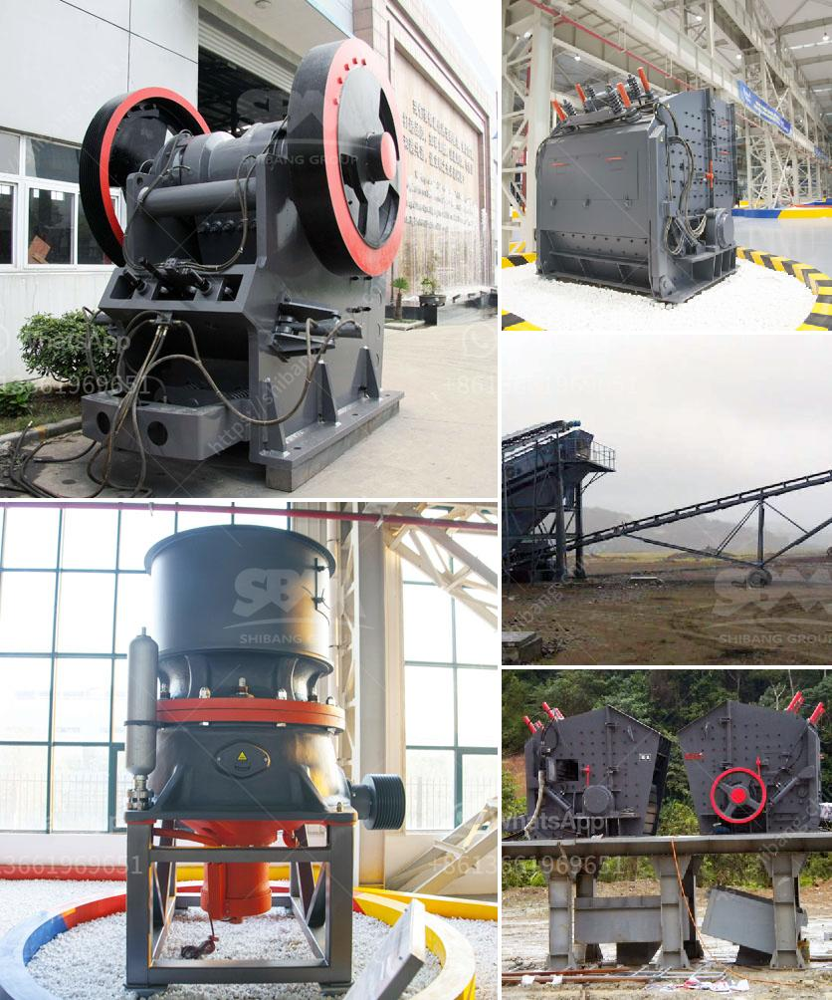

<h3>gold crusher plant for sale australia</h3>
Are you in the market for a gold crusher plant in Australia? Look no further as we bring you all the information you need to know about gold crusher plants for sale in Australia. Gold mining is a booming industry in Australia, and having the right equipment to efficiently extract gold from the ground is crucial for success. A gold crusher plant plays a crucial role in the gold mining process by breaking down large pieces of ore into smaller, more manageable sizes, allowing for easier extraction.

When it comes to purchasing a gold crusher plant in Australia, there are a few factors to consider. Firstly, determine the capacity you require for your mining operations. Typically, gold crusher plants in Australia range from 50 to 500 tons per hour. You need to assess the size and scale of your mining operations to determine the capacity that suits your needs. 

Secondly, consider the type of crusher plant that would best suit your operations. There are various types of crusher plants, including jaw crushers, impact crushers, cone crushers, and combination crushers. Each type has its own advantages and disadvantages, so it's essential to evaluate them based on your specific requirements. Jaw crushers are commonly used for primary crushing, while impact crushers are suitable for secondary or tertiary crushing.

Furthermore, it's crucial to choose a gold crusher plant that is durable and reliable. The crusher plant should be made of high-quality materials that can withstand the harsh conditions of gold mining. Additionally, consider the reputation and reliability of the manufacturer or seller. Look for trusted brands that have a track record of producing top-notch equipment in the mining industry. 

In Australia, there are several reputable companies that offer gold crusher plants for sale. These companies provide a wide range of options to suit various budgets and requirements. Some companies even offer customizable solutions, allowing you to tailor the crusher plant to meet your specific needs. It's advisable to contact these companies directly to discuss your requirements and get a quote.

Another factor to consider is the after-sales support provided by the manufacturer or seller. Gold crusher plants involve complex machinery that may require maintenance or repairs in the future. Ensure that the manufacturer or seller offers reliable customer support and has a service network in Australia. This will ensure that any issues or concerns can be addressed promptly, minimizing downtime and maximizing the productivity of your mining operations.

Finally, take into account the cost of purchasing a gold crusher plant. Prices can vary significantly depending on the capacity, type, and brand of the crusher plant. It's important to compare prices from different sellers to ensure that you are getting the best value for your investment. However, also consider the long-term costs, such as maintenance and operational expenses, as these can significantly impact the overall profitability of your mining operations.

In conclusion, a gold crusher plant is a vital piece of equipment for any gold mining operation in Australia. When purchasing a gold crusher plant, consider factors such as capacity, type, durability, after-sales support, and cost. Conduct thorough research and contact reputable sellers to ensure that you make an informed decision and maximize the efficiency and profitability of your gold mining operations.
<h3>Contact us</h3><ul><li><strong>Whatsapp:&nbsp;<a href="https://wa.me/8613661969651">+8613661969651</a></strong></li><li><a href="https://swt.shibang-china.com/?git&amp;zhl&amp;gold crusher plant for sale australia"><strong>Online Service(chat now)</strong></a></li></ul><h3>Related</h3><ul><li><a href='nigeria ball mill pakistan.md'>nigeria ball mill pakistan</a></li><li><a href='crusher for quarry.md'>crusher for quarry</a></li><li><a href='used stone crusher mini plant india.md'>used stone crusher mini plant india</a></li><li><a href='used portable crushing plant for sale philippines.md'>used portable crushing plant for sale philippines</a></li><li><a href='crusher plant distributor in saudi arabia.md'>crusher plant distributor in saudi arabia</a></li></ul>