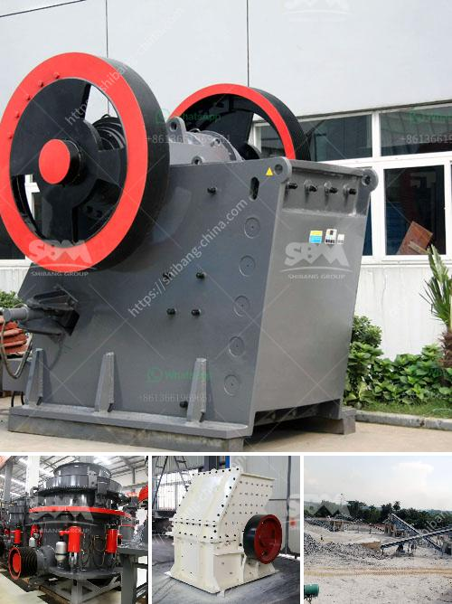

<h3>gold hammer mill suppliers in dubai</h3>
Gold mining in Dubai has been a lucrative business for many years. With vast gold reserves and a stable political environment, Dubai has become one of the world's leading gold trading hubs. However, mining gold comes with its fair share of challenges, and gold hammer mill suppliers in Dubai are crucial in overcoming these challenges.

A gold hammer mill is a mining machine used to crush gold ore into small particles. These machines are widely used in the mining industry, especially in gold, copper, and silver mines. They are also used in the construction industry for crushing gravel and stone to produce aggregates and building materials. Hammer mills have revolutionized the mining industry by significantly improving the efficiency and productivity of gold mining operations.

Dubai is home to several gold hammer mill suppliers who cater to the needs of local and international gold mining companies. These suppliers provide a wide range of hammer mills and related equipment that are used in gold mining operations. They offer different types of hammer mills, including portable hammer mills, electric hammer mills, and diesel hammer mills. Each type of hammer mill is designed to meet specific mining requirements, depending on factors such as the ore type, desired particle size, and processing capacity.

Suppliers in Dubai are known for their high-quality products and excellent customer service. They source their machinery from top manufacturers worldwide, ensuring their hammer mills are durable, reliable, and efficient. These suppliers also provide consulting services and technical support to help mining companies optimize their operations and maximize their gold recovery.

One notable supplier in Dubai is XYZ Machinery. With years of experience in the mining industry, XYZ Machinery has earned a solid reputation as a reliable supplier of gold hammer mills. They offer a range of hammer mills suitable for various mining applications, including small-scale mining operations and large-scale industrial mining projects.

Another renowned supplier in Dubai is ABC Mining Equipment. They specialize in providing high-capacity hammer mills for large-scale gold mining operations. Their hammer mills are known for their robust construction, high performance, and long lifespan. ABC Mining Equipment also offers customization options to meet specific customer requirements.

Gold hammer mill suppliers in Dubai not only provide quality machinery but also contribute to the local economy. They create job opportunities, promote technological advancements in the mining industry, and support various community development projects. Furthermore, these suppliers play a vital role in ensuring responsible and sustainable mining practices by providing efficient and environmentally friendly equipment.

In conclusion, gold hammer mill suppliers in Dubai are essential partners in the gold mining industry. They supply high-quality machinery that enhances the efficiency and productivity of gold mining operations. With their wide range of hammer mills and support services, these suppliers contribute to the success and growth of the mining sector in Dubai.
<h3>Contact us</h3><ul><li><strong>Whatsapp:&nbsp;<a href="https://wa.me/8613661969651">+8613661969651</a></strong></li><li><a href="https://swt.shibang-china.com/?git&amp;zhl&amp;gold hammer mill suppliers in dubai"><strong>Online Service(chat now)</strong></a></li></ul><h3>Related</h3><ul><li><a href='technical specs 400mm x 600mm jaw crusher.md'>technical specs 400mm x 600mm jaw crusher</a></li><li><a href='design calculation of jaw crusher pdf.md'>design calculation of jaw crusher pdf</a></li><li><a href='project cost of a cement plant.md'>project cost of a cement plant</a></li><li><a href='mini concrete crusher in united kingdom.md'>mini concrete crusher in united kingdom</a></li><li><a href='calcium carbonate machine.md'>calcium carbonate machine</a></li></ul>